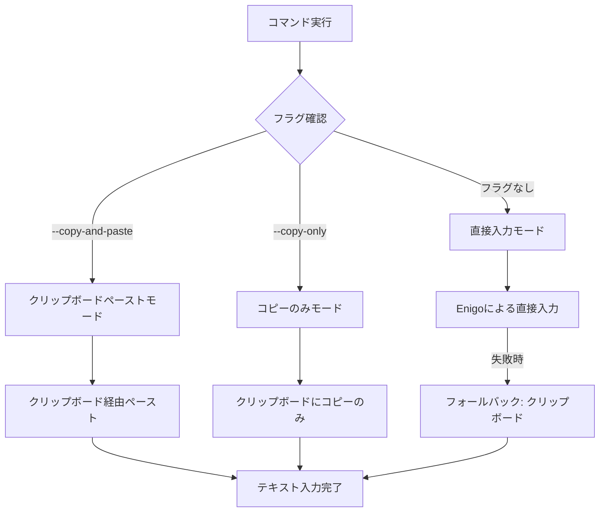

# 直接入力方式デフォルト化 開発設計書

## Why - 概要、目的

### 概要
現在のvoice_inputツールでは、テキスト入力方式として「クリップボード経由のペースト」がデフォルトとなっており、「直接入力方式」を使用するには`--direct-input`フラグを指定する必要がある。この設計を変更し、直接入力方式をデフォルトとし、従来のクリップボード方式をオプトイン（フラグ指定）にする。

### 目的
1. **ユーザビリティの向上**: 直接入力方式はクリップボードを汚染せず、より自然な入力体験を提供
2. **日本語入力の改善**: 直接入力方式は日本語を含む多言語入力をネイティブにサポート
3. **モダンな動作**: 最新の実装である直接入力をデフォルトとすることで、より良いユーザー体験を標準で提供

## What - アーキテクチャ図とフロー図

### アーキテクチャ図

```
┌─────────────────┐
│   CLI (main)    │
│  ┌───────────┐  │
│  │ Args解析  │  │ ← --copy-and-paste / --copy-only フラグ
│  └───────────┘  │
└────────┬────────┘
         │
         ▼
┌─────────────────┐
│  voice_inputd   │
│   (daemon)      │
└────────┬────────┘
         │
    ┌────┴────┐
    ▼         ▼
┌─────────┐ ┌──────────────┐
│直接入力 │ │クリップボード│
│(default)│ │  (opt-in)    │
└─────────┘ └──────────────┘
```

### フロー図



### 成果物（機能、非機能）

#### 機能要件
1. **デフォルト動作の変更**
   - フラグなしの場合、直接入力方式を使用
   - 直接入力失敗時のフォールバック機構は維持

2. **新しいCLIフラグ**
   - `--copy-and-paste`: クリップボード経由のペースト方式を使用
   - `--copy-only`: クリップボードにコピーのみ（ペーストしない）
   - 既存の`--direct-input`と`--no-direct-input`フラグは廃止

3. **後方互換性**
   - 開発段階のため考慮不要

#### 非機能要件
1. **パフォーマンス**: 既存の性能を維持
2. **信頼性**: フォールバック機構により安定性を確保
3. **保守性**: コードの簡潔性を向上

## How - フェーズ別実装計画

| Phase | 目的 | 成果物 | 完了条件 | 除外項目 |
|-------|------|--------|----------|----------|
| Phase 1 | CLIインターフェース更新 | - main.rs (引数定義)<br>- 新フラグ追加<br>- デフォルト動作変更 | - 新フラグが動作<br>- フラグなしで直接入力 | - 古いフラグの削除<br>- ドキュメント更新 |
| Phase 2 | IPC通信層の更新 | - ipc.rs (コマンド定義)<br>- デーモン側の対応 | - IPCで新しいモード指定可能<br>- 互換性テスト合格 | - エラーハンドリング詳細 |
| Phase 3 | デーモン実装更新 | - voice_inputd.rs<br>- モード判定ロジック | - 各モードが正しく動作<br>- フォールバック維持 | - パフォーマンス最適化 |
| Phase 4 | テスト更新 | - 既存テストの修正<br>- 新規テスト追加 | - 全テストが合格<br>- カバレッジ維持 | - E2Eテスト |
| Phase 5 | クリーンアップ | - 古いフラグ削除<br>- コード整理 | - 不要コード削除<br>- リファクタリング完了 | - ドキュメント更新 |
| Phase 6 | ドキュメント更新 | - README.md<br>- CLAUDE.md<br>- ヘルプメッセージ | - 新仕様の記載<br>- 使用例の更新 | - 詳細な技術文書 |

### 実装時の注意事項

1. **実装の簡潔性**
   - 開発段階のため、既存ユーザーへの配慮は不要
   - クリーンな実装を優先

2. **エラーハンドリング**
   - 直接入力失敗時のフォールバックは必須
   - ユーザーへの適切なフィードバック

3. **テストカバレッジ**
   - 新旧両方の動作を網羅的にテスト
   - 境界値テストの実施