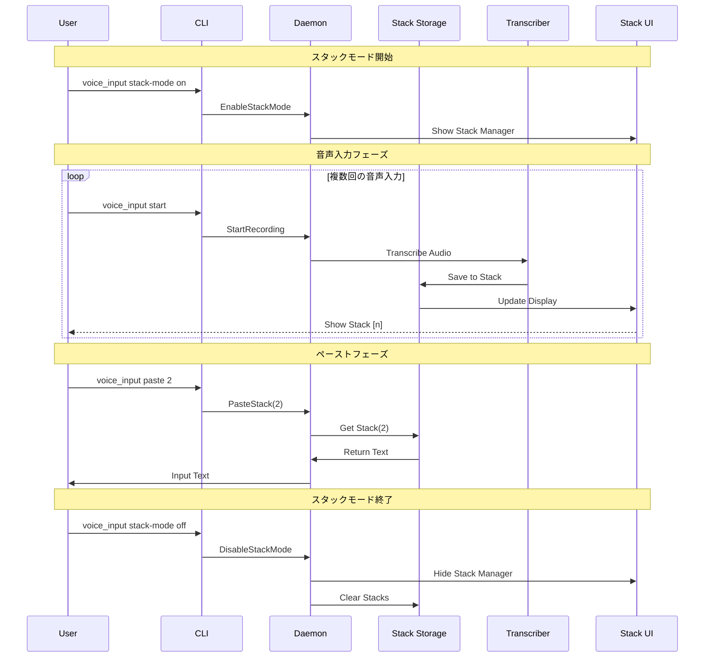

# マルチスタッキング＆ペースト機能 全体設計書

## Why - 概要と目的

### 概要
音声入力を複数回実行して番号付きで一時保存し、後から番号を指定して任意の順序でペーストできる機能を実装する。これにより、音声入力とテキスト編集のワークフローを分離し、より効率的な文書作成を可能にする。

### 目的
1. **思考とテキスト化の分離**: ユーザーは最初に話したいことを自由に音声入力し、後から整理しながらペーストできる
2. **編集効率の向上**: 複数の音声入力結果を保持し、必要な順序で配置できることで、文書構成の柔軟性が向上
3. **ワークフローの最適化**: 音声入力フェーズと編集フェーズを明確に分離することで、各作業に集中できる

## What - 実装詳細

### アーキテクチャ図

```
┌─────────────────────────────────────────────────────────────────┐
│                           User Interface                         │
├─────────────────────────────────────────────────────────────────┤
│  CLI (voice_input)          │        Stack Manager UI            │
│  - stack mode on/off        │   ┌────────────────────────────┐  │
│  - paste <number>           │   │  [1] 最初の音声入力...      │  │
│  - list-stacks              │   │  [2] 次の音声入力...        │  │
│                             │   │  [3] さらに音声入力...      │  │
│                             │   └────────────────────────────┘  │
└─────────────────────────────┬───────────────────────────────────┤
                              │                                    │
                         Unix Socket                               │
                              │                                    │
┌─────────────────────────────┴───────────────────────────────────┤
│                      Daemon (voice_inputd)                       │
├──────────────────────────────────────────────────────────────────┤
│  ┌──────────────────┐    ┌─────────────────┐                   │
│  │  Audio Recorder  │    │  Stack Storage  │                   │
│  │  & Transcriber   │───▶│   - Vec<Stack>  │                   │
│  └──────────────────┘    └─────────────────┘                   │
│                                    │                             │
│                          ┌─────────▼──────────┐                 │
│                          │  Text Input/Paste  │                 │
│                          │    Controller      │                 │
│                          └────────────────────┘                 │
└──────────────────────────────────────────────────────────────────┘
```

### ディレクトリ構成

```
src/
├── domain/
│   ├── mod.rs
│   ├── recorder.rs
│   ├── dict.rs
│   └── stack.rs                    # 新規: スタック管理ドメインモデル
├── infrastructure/
│   ├── audio/
│   ├── external/
│   ├── storage/                    # 新規: スタック永続化層
│   │   └── stack_storage.rs
│   └── ui/                         # 新規: UI関連
│       └── stack_manager_ui.rs
├── application/                    # 新規: アプリケーション層
│   ├── mod.rs
│   └── stack_service.rs            # スタック操作のビジネスロジック
└── main.rs
```

### フロー図



### 成果物

#### 機能要件
1. **スタックモード制御**
   - `stack-mode on/off`: スタックモードの有効化/無効化
   - スタックモード有効時は音声入力結果を自動保存
   
2. **スタック管理**
   - 音声入力結果を番号付きで保存（最大保存数は設定可能）
   - スタック一覧表示コマンド: `list-stacks`
   - スタッククリアコマンド: `clear-stacks`
   
3. **ペースト機能**
   - 番号指定ペースト: `paste <number>`
   - 複数ペースト: `paste 1,3,5` または `paste 1-5`
   - ペースト時は直接入力（Enigoライブラリ使用）
   
4. **UI表示**
   - 小型フローティングウィンドウでスタック一覧を表示
   - 各スタックの冒頭部分をプレビュー表示
   - アクティブなスタックのハイライト表示

#### 非機能要件
1. **パフォーマンス**
   - スタック保存はメモリ内で管理（既存の設計思想を踏襲）
   - UI更新は非同期で実行し、音声入力処理をブロックしない
   
2. **ユーザビリティ**
   - CLIコマンドによる完全な操作制御
   - スタック番号は1から開始（ユーザーフレンドリー）
   - 長いテキストは適切に省略表示
   
3. **拡張性**
   - スタック永続化オプション（将来的な機能追加を考慮）
   - プラグイン可能なUI実装（egui、tauri等への対応）
