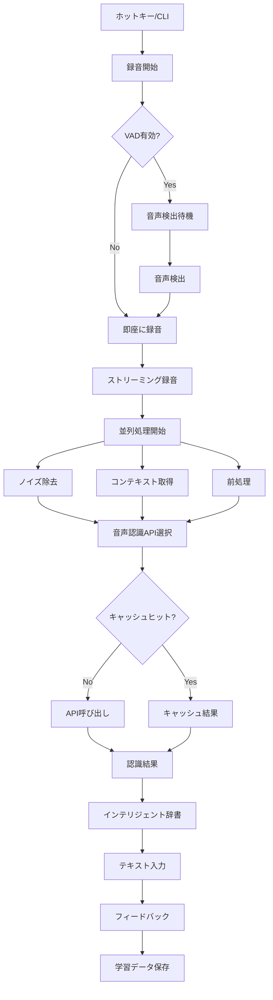

# 音声入力システム改善 開発設計書

## Why - 概要、目的

### 概要
voice_inputツールをより素早く正確に利用できるようにするための包括的な改善案。現在の基本機能（録音→音声認識→テキスト入力）を維持しながら、応答速度、認識精度、ユーザビリティを大幅に向上させる。

### 目的
1. **応答速度の向上**: 録音開始から結果出力までの遅延を最小化
2. **認識精度の改善**: コンテキスト認識と学習機能による誤認識の削減
3. **ユーザビリティの強化**: 直感的な操作と豊富なフィードバック
4. **スケーラビリティ**: 将来の機能拡張を見据えたアーキテクチャ

## What - アーキテクチャ図とフロー図

### 改善後のアーキテクチャ図

```
┌─────────────────┐     ┌──────────────┐
│  グローバル     │     │ メニューバー │
│  ホットキー     │     │    表示      │
└────────┬────────┘     └──────┬───────┘
         │                     │
         ▼                     ▼
┌─────────────────────────────────────┐
│         CLI / GUI Client            │
└────────────────┬────────────────────┘
                 │ Unix Socket
                 ▼
┌─────────────────────────────────────┐
│         voice_inputd (daemon)       │
│  ┌─────────────┐ ┌───────────────┐ │
│  │ VAD         │ │コンテキスト   │ │
│  │(音声検出)   │ │マネージャー   │ │
│  └─────────────┘ └───────────────┘ │
│  ┌─────────────┐ ┌───────────────┐ │
│  │ストリーミング│ │インテリジェント│ │
│  │録音エンジン  │ │辞書エンジン   │ │
│  └─────────────┘ └───────────────┘ │
└────────────────┬────────────────────┘
                 │
    ┌────────────┼────────────┐
    ▼            ▼            ▼
┌─────────┐ ┌─────────┐ ┌─────────┐
│OpenAI   │ │Google   │ │Whisper  │
│API      │ │Speech   │ │Local    │
└─────────┘ └─────────┘ └─────────┘
```

### 改善フロー図



### 成果物（機能、非機能）

#### 機能要件

1. **高速起動機能**
   - グローバルホットキー対応（例: Cmd+Shift+V）
   - デーモン常時待機による即座の応答
   - メニューバーアイコンからのワンクリック起動

2. **音声活動検出（VAD）**
   - 音声の開始/終了を自動検出
   - 無音時の自動停止オプション
   - 環境ノイズレベルの自動調整

3. **ストリーミング処理**
   - WAVファイル生成を介さないメモリ直接処理
   - チャンク単位でのリアルタイム処理
   - 録音と同時に前処理を開始

4. **マルチ音声認識エンジン**
   - OpenAI Whisper API（デフォルト）
   - Google Speech-to-Text API
   - ローカルWhisperモデル
   - 自動フォールバック機構

5. **インテリジェント辞書**
   - 文脈依存の置換ルール
   - 機械学習による自動パターン認識
   - 専門分野別辞書（プログラミング、医療、法律等）
   - ユーザー修正からの自動学習

6. **高度なフィードバック**
   - 録音状態のメニューバー表示
   - 音声による開始/停止通知
   - エラー時の即座の通知
   - 認識信頼度の表示

#### 非機能要件

1. **パフォーマンス**
   - 録音開始まで: 50ms以内
   - 音声認識開始まで: 100ms以内
   - 平均処理時間: 現行比50%削減
   - メモリ使用量: 100MB以内

2. **信頼性**
   - 99.9%の可用性
   - 自動リトライ機構
   - グレースフルデグレード
   - クラッシュ時の自動復旧

3. **拡張性**
   - プラグインアーキテクチャ
   - カスタム認識エンジン対応
   - サードパーティ辞書対応
   - REST API提供

## How - フェーズ別実装計画

### 改善優先度マトリクス

| 機能 | 効果 | 実装難易度 | 優先度 |
|------|------|------------|--------|
| VAD（音声活動検出） | 高 | 中 | P0 |
| ストリーミング処理 | 高 | 高 | P0 |
| グローバルホットキー | 高 | 低 | P0 |
| メニューバー表示 | 中 | 低 | P1 |
| インテリジェント辞書 | 高 | 高 | P1 |
| マルチ認識エンジン | 中 | 中 | P2 |
| 音声フィードバック | 低 | 低 | P2 |
| 学習機能 | 高 | 高 | P3 |

### 実装フェーズ

| Phase | 目的 | 成果物 | 完了条件 | 見積もり |
|-------|------|--------|----------|----------|
| Phase 1 | コア高速化 | - VAD実装<br>- ストリーミング録音<br>- メモリ処理 | - 録音遅延50%削減<br>- メモリ上での処理完了 | 2週間 |
| Phase 2 | UX基盤 | - ホットキー対応<br>- メニューバー統合<br>- 音声フィードバック | - グローバルホットキー動作<br>- 状態表示の実装 | 1週間 |
| Phase 3 | 認識精度向上 | - コンテキスト管理<br>- キャッシュ機構<br>- 基本的な学習 | - 文脈考慮の実装<br>- キャッシュヒット率20% | 2週間 |
| Phase 4 | 辞書高度化 | - 文脈依存置換<br>- 専門辞書<br>- 自動学習基盤 | - 置換精度90%以上<br>- 3分野の辞書実装 | 3週間 |
| Phase 5 | マルチエンジン | - API抽象化<br>- 複数エンジン対応<br>- 自動選択 | - 3種類のエンジン対応<br>- フォールバック動作 | 2週間 |
| Phase 6 | 最適化 | - 並列処理最適化<br>- メモリ効率化<br>- 起動時間短縮 | - 全体遅延70%削減<br>- メモリ使用量50%削減 | 1週間 |

### 技術選定

#### 新規導入技術
1. **webrtc-vad**: 音声活動検出
2. **rodio**: 低レベル音声処理
3. **tauri**: メニューバー/GUI統合
4. **rdev**: グローバルホットキー
5. **candle**: ローカルML推論

#### 既存技術の活用
1. **cpal**: 音声入力（ストリーミング対応に拡張）
2. **tokio**: 非同期処理（並列化の強化）
3. **serde**: データシリアライズ
4. **reqwest**: API通信

### リスクと対策

| リスク | 影響 | 対策 |
|--------|------|------|
| VAD精度不足 | 誤検出による使い勝手低下 | 手動モードの維持、調整可能な閾値 |
| API遅延 | 応答速度の悪化 | ローカルモデルのフォールバック |
| メモリリーク | 長時間使用での不安定化 | 定期的なメモリプロファイリング |
| 互換性問題 | 既存ユーザーへの影響 | 段階的な移行、旧モードの維持 |

### 評価指標（KPI）

1. **速度指標**
   - 平均応答時間: 500ms → 150ms
   - 録音開始遅延: 100ms → 50ms
   - 結果表示まで: 2s → 0.8s

2. **精度指標**
   - 認識精度: 85% → 95%
   - 辞書置換精度: 70% → 90%
   - 誤認識率: 15% → 5%

3. **ユーザビリティ指標**
   - 1日あたり使用回数: +50%
   - エラー発生率: -70%
   - ユーザー満足度: 4.0 → 4.5

### 実装上の注意事項

1. **後方互換性**
   - 既存のCLIインターフェースは維持
   - 設定ファイルの自動マイグレーション
   - 旧機能へのフォールバックオプション

2. **プライバシー配慮**
   - 学習データはローカル保存
   - オプトインでのデータ収集
   - 音声データの即座の破棄

3. **テスト戦略**
   - 各フェーズでのE2Eテスト
   - パフォーマンステストの自動化
   - A/Bテストによる効果測定