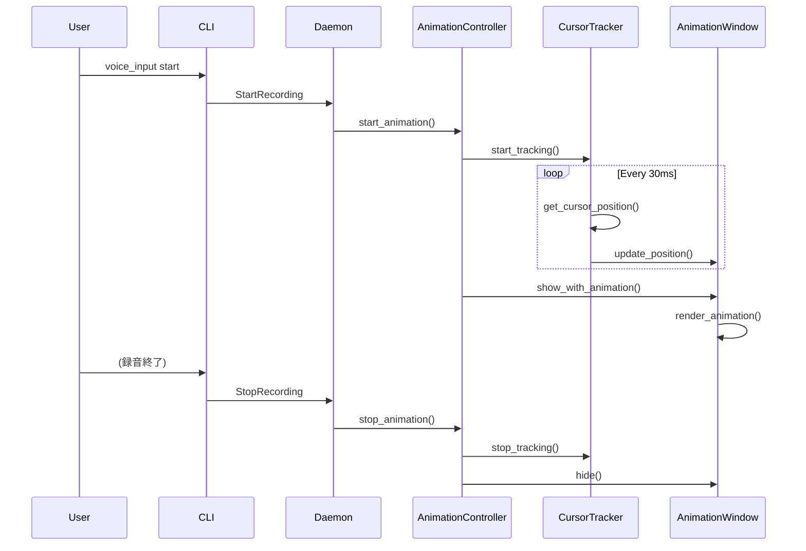

# 音声入力アニメーションインジケーター設計書

## Why

### 概要
音声入力中に、入力カーソル位置の上部（10-20px上）に視覚的な波紋アニメーションインジケーターを表示する機能を実装します。録音中にカーソルが移動した場合、アニメーションは30ms間隔でカーソル位置を追跡し、スムーズに追従します。

### 目的
- 音声入力が進行中であることを視覚的にフィードバック
- ユーザーが録音状態を直感的に把握できるようにする
- 入力位置を明確にし、操作ミスを防ぐ

## What

### アーキテクチャ図

```
┌─────────────────────┐     ┌──────────────────┐
│   voice_inputd      │     │  Animation       │
│    (Daemon)         │────▶│  Controller      │
└──────┬──────────────┘     └─────────┬────────┘
       │                              │
       │ Recording Start/Stop         │
       │                              ▼
       ▼                     ┌──────────────────┐     ┌─────────────────┐
┌─────────────────────┐     │ Cursor Position  │     │ Animation       │
│ Recording Service   │     │ Tracker          │────▶│ Window          │
└─────────────────────┘     └──────────────────┘     └─────────────────┘
                                     │                         │
                                     │                         ▼
                            ┌────────▼─────────┐     ┌─────────────────┐
                            │ Accessibility    │     │ Core Animation  │
                            │ API              │     │ Layer           │
                            └──────────────────┘     └─────────────────┘
```

### ディレクトリ構成

```
src/
├── infrastructure/
│   ├── animation/
│   │   ├── mod.rs              # アニメーションモジュール
│   │   ├── controller.rs       # アニメーション制御
│   │   ├── window.rs           # 透明ウィンドウ管理
│   │   └── cursor_tracker.rs   # カーソル位置追跡
│   └── external/
│       ├── accessibility_sys.rs # 既存: Accessibility API（カーソル位置取得機能を追加）
│       └── core_animation.rs   # Core Animation連携
└── application/
    └── animation_service.rs    # アニメーションサービス
```

### フロー図



### 成果物

#### 機能要件
- カーソル位置のリアルタイム追跡（30ms間隔）
- カーソル移動への動的追従（録音中もアニメーション位置を更新）
- カーソル上部10-20pxの位置にアニメーション表示
- 録音状態と連動したアニメーション表示/非表示
- スタッキングモードのon/off両方で動作（録音中は常に表示）
- 波紋アニメーションパターン
- マウスイベントを透過する透明ウィンドウ
- 非同期処理による主処理への影響最小化

#### 非機能要件
- レスポンス時間: アニメーション開始/停止 < 30ms
- CPU使用率: アニメーション実行時の追加負荷 < 5%
- メモリ使用量: 追加メモリ < 2MB
- フレームレート: 60fps維持
- macOS 10.15以降対応

## How

### Phase分割

| Phase | 目的 | 成果物 | 完了条件 | 除外項目 |
|-------|------|--------|----------|----------|
| **Phase 1: 基盤構築** | カーソル追跡と透明ウィンドウの基本実装 | - `accessibility_sys.rs`へのカーソル位置取得機能追加<br>- `cursor_tracker.rs`<br>- `window.rs`<br>- `infrastructure/animation/mod.rs` | - カーソル位置を30ms間隔で取得可能<br>- 透明ウィンドウの表示/非表示が動作<br>- マウスイベントが透過される | - アニメーション描画<br>- 録音プロセスとの連携 |
| **Phase 2: アニメーション実装** | Core Animationを使用したアニメーション描画 | - `core_animation.rs`<br>- `controller.rs`<br>- 波紋アニメーションパターン実装 | - 波紋アニメーション実装<br>- 60fpsでスムーズな描画<br>- GPU加速の有効化 | - 設定UI<br>- 他のアニメーションパターン |
| **Phase 3: システム統合** | 録音プロセスとアニメーションの連携 | - `animation_service.rs`<br>- `voice_inputd`への統合コード<br>- IPCメッセージ拡張 | - 録音開始/終了と同期<br>- 非同期処理でのパフォーマンス維持<br>- エラーハンドリング完備 | - ユーザー設定機能<br>- アニメーションのカスタマイズ |
| **Phase 4: 設定と最適化** | ユーザー設定とパフォーマンス最適化 | - 設定ファイル拡張<br>- アニメーション選択機能<br>- パフォーマンスチューニング | - 設定によるアニメーション切り替え<br>- CPU使用率5%以下達成<br>- メモリリーク検証完了 | - 新規アニメーションパターン<br>- Windows/Linux対応 |

### 技術的制約事項

- macOS専用実装（Accessibility APIとCore Animationに依存）
- アクセシビリティ権限が必要
- 全画面アプリケーションでは表示制限の可能性あり