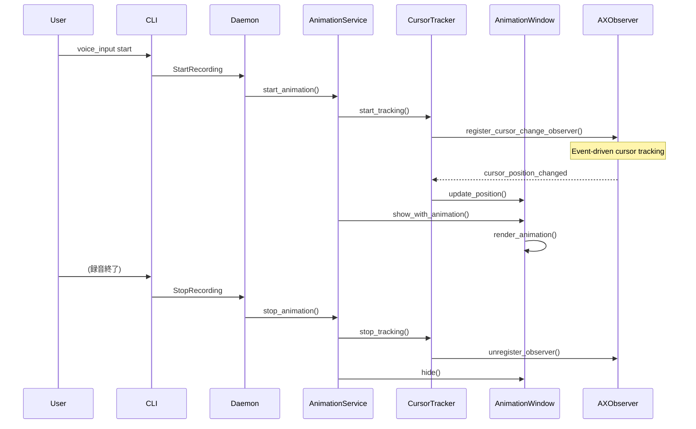

# 音声入力アニメーションインジケーター設計書

## Why

### 概要
音声入力中に、入力カーソル位置の上部（10-20px上）に視覚的な波紋アニメーションインジケーターを表示する機能を実装します。録音中にカーソルが移動した場合、アニメーションは30ms間隔でカーソル位置を追跡し、スムーズに追従します。

### 目的
- 音声入力が進行中であることを視覚的にフィードバック
- ユーザーが録音状態を直感的に把握できるようにする
- 入力位置を明確にし、操作ミスを防ぐ

## What

### アーキテクチャ図

```
┌─────────────────────┐     ┌──────────────────┐
│   voice_inputd      │     │  Animation       │
│    (Daemon)         │────▶│  Service         │
└──────┬──────────────┘     └─────────┬────────┘
       │                              │
       │ Recording Start/Stop         │
       │                              ▼
       ▼                     ┌──────────────────┐     ┌─────────────────┐
┌─────────────────────┐     │ Cursor Position  │     │ Animation       │
│ Recording Service   │     │ Tracker          │────▶│ Window          │
└─────────────────────┘     └──────────────────┘     └─────────────────┘
                                     │                         │
                                     │                         ▼
                            ┌────────▼─────────┐     ┌─────────────────┐
                            │ Accessibility    │     │ Core Animation  │
                            │ API (AXObserver) │     │ Layer           │
                            └──────────────────┘     └─────────────────┘
```

### ディレクトリ構成

```
src/
├── infrastructure/
│   ├── animation/
│   │   ├── mod.rs              # アニメーションモジュール
│   │   ├── animation_window.rs # 統合: 透明ウィンドウ管理 + Core Animation
│   │   └── cursor_tracker.rs   # カーソル位置追跡
│   └── external/
│       └── accessibility_sys.rs # 既存: Accessibility API（カーソル位置取得機能を追加）
└── application/
    └── animation_service.rs    # アニメーションサービス（制御ロジック含む）
```

### フロー図



### 成果物

#### 機能要件
- カーソル位置のイベントドリブン追跡（AXObserver API使用）
- カーソル移動への動的追従（録音中もアニメーション位置を更新）
- カーソル上部10-20pxの位置にアニメーション表示
- 録音状態と連動したアニメーション表示/非表示
- スタッキングモードのon/off両方で動作（録音中は常に表示）
- 波紋アニメーションパターン
- マウスイベントを透過する透明ウィンドウ
- 非同期処理による主処理への影響最小化

#### 非機能要件
- レスポンス時間: アニメーション開始/停止 < 30ms
- メモリ使用量: 追加メモリ < 2MB
- フレームレート: 60fps維持
- macOS 10.15以降対応

## How

### Phase分割

| Phase | 目的 | 成果物 | 完了条件 | 除外項目 |
|-------|------|--------|----------|----------|
| **Phase 1: カーソル追跡基盤** | カーソル位置追跡機能の実装と技術検証 | - `accessibility_sys.rs`へのカーソル位置取得API追加<br>- `cursor_tracker.rs`（AXObserver実装 or ポーリング）<br>- 技術検証を含む単体テスト | - カーソル位置取得が動作<br>- AXObserver実装の可否判定<br>- フォールバック方式の決定 | - ウィンドウ表示<br>- アニメーション描画 |
| **Phase 2: アニメーションウィンドウ** | 透明ウィンドウとCore Animationの実装 | - `animation_window.rs`（透明ウィンドウ + Core Animation）<br>- 波紋アニメーションパターン実装<br>- アニメーション単体テスト | - 透明ウィンドウの表示/非表示<br>- 波紋アニメーション動作<br>- 60fps描画の確認 | - サービス層統合<br>- 設定機能 |
| **Phase 3: アニメーションサービス** | アニメーション制御サービスの実装 | - `animation_service.rs`<br>- `infrastructure/animation/mod.rs`<br>- サービス層の統合テスト | - カーソル追跡とウィンドウの連携<br>- エラーハンドリング実装<br>- リソース管理の確認 | - デーモン統合<br>- 録音連携 |
| **Phase 4: デーモン統合** | 録音プロセスとの統合 | - `voice_inputd`への統合コード<br>- 録音イベントフック実装<br>- E2Eテスト | - 録音開始/終了との同期<br>- 非同期処理の動作確認<br>- 統合テスト合格 | - ユーザー設定<br>- UI設定画面 |
| **Phase 5: 設定機能** | ユーザー設定と最適化 | - 設定ファイル拡張<br>- アニメーション選択機能<br>- 設定UIテスト | - 設定による有効/無効切り替え<br>- アニメーションパターン選択<br>- メモリリーク検証 | - 新規パターン追加<br>- 他OS対応 |

### プロセス・スレッド設計

- **新規プロセスは作成しない**（既存のvoice_inputdデーモン内で完結）
- **AXObserverはメインスレッド**でイベント受信（イベントドリブン）
- **ウィンドウ管理はメインスレッド**で実行（macOSのUI制約）
- **Core Animationは自動的に別スレッド**でGPUレンダリング実行
- **MainThread制約への対応**：`tokio::task::spawn_blocking`でUI操作を適切に処理
- **スレッド間通信**：mpscチャネルでカーソル位置情報を伝達

### エラーハンドリング戦略

- **アクセシビリティ権限エラー**：アニメーション機能を無効化（録音は継続）
- **ウィンドウ作成失敗**：エラーログ出力後、機能を無効化
- **カーソル位置取得失敗**：前回の位置を使用して継続
- **リソース管理**：`Drop`トレイトでカーソル追跡スレッドを確実に終了

### システム統合方針

- **IPCメッセージ拡張は不要**：既存の録音開始/終了イベントにフック
- **録音状態との同期**：録音サービスの状態変更時にアニメーションサービスへ通知
- **デーモン再起動**：ステートレス設計のため特別な対応不要

### フォールバック戦略

**Phase 1終了時にAXObserver実装が技術的に困難と判明した場合**：
- 30ms間隔のポーリング方式に切り替え
- カーソル追跡専用スレッドを追加
- 以降のPhaseはポーリング方式で実装

### テスト戦略

- **UIコンポーネントのテスト**：
  - モックオブジェクトを使用したユニットテスト
  - 実際のウィンドウ生成を伴わない機能テスト
- **CI環境での扱い**：
  - `#[cfg_attr(feature = "ci-test", ignore)]`で実機依存テストをスキップ
  - Core AnimationとAXObserver関連はCI環境でスキップ
- **手動テストガイドライン**：
  - Phase完了毎に手動テストチェックリストを作成
  - カーソル移動、録音開始/終了の動作確認
  - 各種エラーケースの確認

### 技術的制約事項

- macOS専用実装（Accessibility APIとCore Animationに依存）
- アクセシビリティ権限が必要
- 全画面アプリケーションでは表示制限の可能性あり