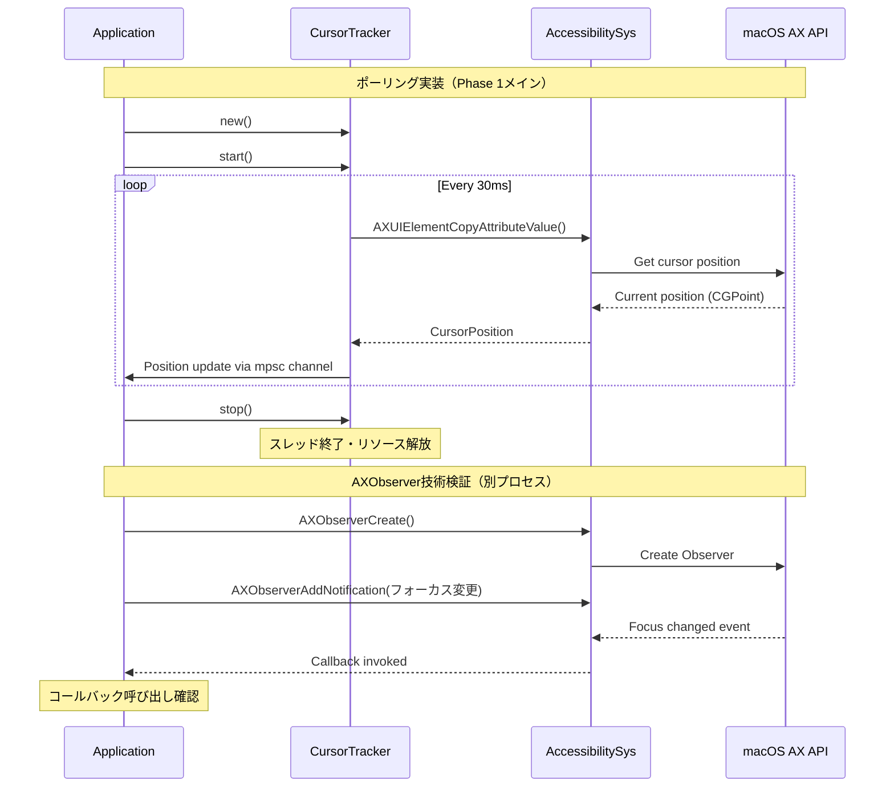

# Phase 1: カーソル追跡基盤 - 詳細設計書

## Why

### Phase 概要
音声入力アニメーション機能の基盤となるカーソル位置追跡機能を実装し、技術検証を行います。まずポーリング方式で確実に動作する実装を行い、その後AXObserverの最小限の技術検証を実施します。

### 目的
- Accessibility APIを使用したカーソル位置取得の実装（ポーリング方式）
- AXObserverによるイベントドリブン方式の最小限の技術検証
- 技術的実現可能性の判定とフォールバック戦略の決定
- 後続フェーズで使用する安定したカーソル追跡基盤の確立

## What

### アーキテクチャ図

```
┌──────────────────────┐     ┌─────────────────────┐
│  CursorTracker       │────▶│ accessibility_sys   │
│  (Polling実装)        │     │ (Extended FFI)      │
└──────────────────────┘     └─────────────────────┘
         │                            │
         │                            ▼
         │                   ┌─────────────────────┐
         │                   │ macOS Accessibility │
         │                   │ API                 │
         │                   └─────────────────────┘
         ▼
┌──────────────────────┐
│ Cursor Position      │
│ Stream (mpsc)        │
└──────────────────────┘

[技術検証用]
┌──────────────────────┐     ┌─────────────────────┐
│ AXObserver検証コード  │────▶│ accessibility_sys   │
│ (最小限実装)          │     │ (AXObserver FFI)    │
└──────────────────────┘     └─────────────────────┘
```

### ディレクトリ構成

```
src/
├── infrastructure/
│   ├── mod.rs                  # 更新: pub mod animation; を追加
│   ├── external/
│   │   └── accessibility_sys.rs  # 拡張: AXObserver API追加（カーソル位置取得は既存）
│   └── animation/               # 新規ディレクトリ
│       ├── mod.rs              # 新規: モジュール定義とエラー型定義
│       └── cursor_tracker.rs    # 新規: カーソル追跡実装（ポーリングのみ）
└── tests/
    ├── cursor_tracker_test.rs   # 新規: 単体テスト
    └── axobserver_poc.rs        # 新規: AXObserver技術検証コード
```

### フロー図



### 成果物

#### 機能（インターフェースと型定義）

**1. accessibility_sys.rs の拡張**

```rust
use std::os::raw::c_int;
use core_foundation_sys::runloop::CFRunLoopSourceRef;

// 追加する型定義
pub type pid_t = c_int;
pub type AXObserverRef = *mut c_void;
pub type AXObserverCallback = unsafe extern "C" fn(
    observer: AXObserverRef,
    element: AXUIElementRef,
    notification: CFStringRef,
    user_info: *mut c_void,
);

// 追加するFFI関数（AXUIElementCopyAttributeValueは既存のため除外）
unsafe extern "C" {
    // AXObserver関連（技術検証用最小限）
    pub fn AXObserverCreate(
        application: pid_t,
        callback: AXObserverCallback,
        out_observer: *mut AXObserverRef,
    ) -> AXError;
    
    pub fn AXObserverAddNotification(
        observer: AXObserverRef,
        element: AXUIElementRef,
        notification: CFStringRef,
        refcon: *mut c_void,
    ) -> AXError;
    
    pub fn AXObserverGetRunLoopSource(observer: AXObserverRef) -> CFRunLoopSourceRef;
}

// 定数定義（技術検証用に1つのみ）
pub const kAXFocusedUIElementChangedNotification: &str = "AXFocusedUIElementChanged";
```

**2. animation/mod.rs のエラー型定義**

```rust
use std::fmt;

/// アニメーション関連のエラー型
#[derive(Debug, Clone)]
pub enum AnimationError {
    /// アクセシビリティAPIエラー
    AccessibilityError(String),
    /// スレッド関連エラー
    ThreadError(String),
    /// リソース取得エラー
    ResourceError(String),
}

impl fmt::Display for AnimationError {
    fn fmt(&self, f: &mut fmt::Formatter<'_>) -> fmt::Result {
        match self {
            AnimationError::AccessibilityError(msg) => write!(f, "Accessibility error: {}", msg),
            AnimationError::ThreadError(msg) => write!(f, "Thread error: {}", msg),
            AnimationError::ResourceError(msg) => write!(f, "Resource error: {}", msg),
        }
    }
}

impl std::error::Error for AnimationError {}

pub mod cursor_tracker;
```

**3. cursor_tracker.rs の実装**

```rust
use super::AnimationError;
use crate::infrastructure::external::accessibility_sys::*;
use std::sync::mpsc::{channel, Receiver, Sender};
use std::sync::{Arc, Mutex};
use std::thread;
use std::time::Duration;

/// カーソル位置
#[derive(Debug, Clone, Copy, PartialEq)]
pub struct CursorPosition {
    pub x: f64,
    pub y: f64,
}

/// カーソル追跡器の実装（ポーリング方式のみ）
pub struct CursorTracker {
    sender: Sender<CursorPosition>,
    receiver: Receiver<CursorPosition>,
    tracking_thread: Option<thread::JoinHandle<()>>,
    should_stop: Arc<Mutex<bool>>,
}

impl CursorTracker {
    /// 新しいカーソル追跡器を作成（30ms間隔のポーリング）
    pub fn new() -> Self {
        let (sender, receiver) = channel();
        Self {
            sender,
            receiver,
            tracking_thread: None,
            should_stop: Arc::new(Mutex::new(false)),
        }
    }
    
    /// 追跡を開始
    pub fn start(&mut self) -> Result<(), AnimationError> {
        if self.tracking_thread.is_some() {
            return Err(AnimationError::ThreadError("Already tracking".to_string()));
        }
        
        let sender = self.sender.clone();
        let should_stop = self.should_stop.clone();
        *should_stop.lock().unwrap() = false;
        
        let handle = thread::spawn(move || {
            while !*should_stop.lock().unwrap() {
                if let Ok(position) = Self::get_cursor_position_sync() {
                    let _ = sender.send(position);
                }
                thread::sleep(Duration::from_millis(30));
            }
        });
        
        self.tracking_thread = Some(handle);
        Ok(())
    }
    
    /// 追跡を停止
    pub fn stop(&mut self) -> Result<(), AnimationError> {
        *self.should_stop.lock().unwrap() = true;
        
        if let Some(handle) = self.tracking_thread.take() {
            handle.join()
                .map_err(|_| AnimationError::ThreadError("Failed to join thread".to_string()))?;
        }
        
        Ok(())
    }
    
    /// 現在のカーソル位置を同期的に取得
    fn get_cursor_position_sync() -> Result<CursorPosition, AnimationError> {
        // FFIを使用したカーソル位置取得の実装
        // TODO: 実装
        Err(AnimationError::AccessibilityError("Not implemented".to_string()))
    }
    
    /// 位置更新を受信するためのレシーバーを取得
    pub fn get_receiver(&self) -> &Receiver<CursorPosition> {
        &self.receiver
    }
}

impl Drop for CursorTracker {
    fn drop(&mut self) {
        let _ = self.stop();
    }
}
```

#### 非機能要件

- **レスポンス時間**: カーソル位置更新 < 16ms（60fps対応）
- **CPU使用率**: ポーリングモードで1%未満
- **メモリ使用量**: 追加メモリ < 512KB
- **エラーハンドリング**: アクセシビリティ権限エラーの適切な処理

## How

### タスク一覧

#### Task 1: accessibility_sys.rs の拡張 
- [ ] AXObserver関連のFFI関数定義を追加（最小限3つ）
- [ ] 必要な型定義を追加（pid_t, AXObserverRef, AXObserverCallback, CFRunLoopSourceRef）
- [ ] 技術検証用の定数を1つ追加（kAXFocusedUIElementChangedNotification）
- [ ] コンパイルチェック

#### Task 2: animation モジュールの作成
- [ ] infrastructure/mod.rs に `pub mod animation;` を追加
- [ ] infrastructure/animation/mod.rs を作成（エラー型定義含む）
- [ ] cursor_tracker.rs の基本構造を実装
- [ ] CursorPosition 型を定義
- [ ] CursorTracker 構造体の基本実装（Drop トレイト含む）

#### Task 3: ポーリング方式の実装
- [ ] get_cursor_position_sync() 関数の実装
- [ ] ポーリングスレッドの実装
- [ ] 30ms間隔でのタイマー処理
- [ ] スレッド間通信（mpsc channel）の実装
- [ ] 単体テストの作成

#### Task 4: AXObserver方式の技術検証（tests/axobserver_poc.rs）
- [ ] 最小限のAXObserver作成コード
- [ ] フォーカス変更通知の登録
- [ ] コールバック呼び出しの確認
- [ ] RunLoop統合の動作確認
- [ ] 技術的実現可能性の判定文書作成

#### Task 5: 統合テストと性能検証
- [ ] ポーリング実装の動作テスト
- [ ] CPU使用率の測定（1%未満の確認）
- [ ] レスポンス時間の測定（30ms間隔の確認）
- [ ] メモリリークチェック（長時間実行）
- [ ] アクセシビリティ権限エラーのテスト

#### Task 6: ドキュメンテーションと最終判断
- [ ] 技術検証結果のまとめ
- [ ] **ポーリング vs AXObserverの最終判断実施**
- [ ] AXObserver実装の可否判定文書
- [ ] フォールバック戦略の決定文書
- [ ] Phase 2への引き継ぎ事項

### 各タスクの詳細

#### Task 1: accessibility_sys.rs の拡張

**目的**: AXObserver技術検証用の最小限のFFIバインディングを追加

**成果物**: `src/infrastructure/external/accessibility_sys.rs` の更新

**完了条件**:
- AXObserver関連API（3関数）が定義済み
- 必要な型定義が追加済み
- コンパイルエラーがない

**手動でのチェック項目**:
- [ ] cargo check でコンパイルエラーがない
- [ ] FFI関数のシグネチャがAppleのドキュメントと一致

**除外項目**:
- 高レベルなラッパー実装
- エラーハンドリングロジック
- 使用しない通知タイプの定義

#### Task 2: animation モジュールの作成

**目的**: アニメーション機能の基本構造とエラー型を確立

**成果物**: 
- `src/infrastructure/mod.rs` の更新
- `src/infrastructure/animation/mod.rs`
- `src/infrastructure/animation/cursor_tracker.rs`

**完了条件**:
- モジュール構造が定義済み
- AnimationError型が定義済み
- CursorTracker構造体の基本実装（スタブ）
- Dropトレイトの実装

**手動でのチェック項目**:
- [ ] cargo clippy でwarningがない
- [ ] ドキュメントコメントが適切

**除外項目**:
- 実際の追跡ロジック（Task 3で実装）

#### Task 3: ポーリング方式の実装

**目的**: 確実に動作するポーリング方式を実装し、基本的な追跡機能を確立

**成果物**: cursor_tracker.rs のポーリング実装

**完了条件**:
- 30ms間隔でカーソル位置を取得
- スレッド間通信が正常動作
- 開始・停止が適切に動作
- 単体テストが通過

**手動でのチェック項目**:
- [ ] cargo test でテストが通過
- [ ] 実際にカーソルを動かして位置が更新されることを確認
- [ ] CPU使用率が1%未満

**除外項目**:
- AXObserver実装
- UI統合

#### Task 4: AXObserver方式の技術検証

**目的**: AXObserverの最小限実装で技術的実現可能性を検証

**成果物**: 
- `tests/axobserver_poc.rs`（独立した検証プログラム）
- 技術検証レポート

**完了条件**:
- AXObserverが作成できる
- フォーカス変更通知でコールバックが呼ばれる
- カーソル位置が取得できる
- 実装可能性の判定文書

**手動でのチェック項目**:
- [ ] cargo test --test axobserver_poc -- --ignored --nocapture で実行
- [ ] 別アプリにフォーカスを移してコールバック確認
- [ ] カーソル位置の値が妥当

**除外項目**:
- production品質の実装
- 複数通知タイプの対応
- エラーリカバリー

#### Task 5: 統合テストと性能検証

**目的**: 実装の品質と性能を検証

**成果物**: 
- 統合テストコード
- 性能測定レポート

**完了条件**:
- 全テストが通過
- 性能要件を満たす
- メモリリークがない

**手動でのチェック項目**:
- [ ] 長時間実行してもメモリ使用量が増加しない
- [ ] アクセシビリティ権限がない場合の動作確認
- [ ] 異なるアプリケーション間でカーソル追跡が動作

**除外項目**:
- CI環境でのテスト（ローカルのみ）

#### Task 6: ドキュメンテーション

**目的**: Phase 1の成果をまとめ、技術方式の最終判断を行い、Phase 2への引き継ぎを準備

**成果物**: 
- `dev-docs/input_animation/phases/p1-completion-report.md`
- 技術検証結果のドキュメント
- **ポーリング vs AXObserverの最終判断書**

**完了条件**:
- 実装内容が文書化されている
- 技術的決定事項が記録されている
- **以下の判断基準に基づいて最終方式を決定**:
  - AXObserverのコールバックが安定して動作するか
  - カーソル位置取得の精度と遅延が許容範囲内か
  - CPU使用率の比較（ポーリング < 1% vs AXObserver）
  - 実装の複雑性とメンテナンス性
- Phase 2への推奨事項が明確

**最終判断の基準**:
- **AXObserver採用の条件**: 
  - コールバックが確実に呼ばれる
  - CPU使用率がポーリングより低い
  - 実装の複雑性が許容範囲内
- **ポーリング採用の条件**:
  - AXObserverが不安定または実装困難
  - CPU使用率1%未満を達成
  - 実装がシンプルで保守しやすい

**手動でのチェック項目**:
- [ ] ドキュメントの内容が実装と一致
- [ ] 判断理由が明確に記載されている
- [ ] 次フェーズの開発者が理解できる内容

**除外項目**:
- ユーザー向けドキュメント

## 手動でのチェック項目

### 基本動作確認
- [ ] アクセシビリティ権限の要求ダイアログが表示される
- [ ] カーソル位置が正確に取得できる
- [ ] 複数モニター環境で正しく動作する
- [ ] フルスクリーンアプリケーションで動作する

### エラーケース確認  
- [ ] アクセシビリティ権限拒否時の適切なエラーメッセージ
- [ ] システムリソース不足時の動作
- [ ] 不正な座標値の処理

### パフォーマンス確認
- [ ] CPU使用率が許容範囲内（ポーリング時1%未満）
- [ ] メモリ使用量が安定している
- [ ] レスポンス遅延が16ms未満

### 互換性確認
- [ ] macOS 10.15以降で動作
- [ ] M1/M2 Macで動作
- [ ] Intel Macで動作

## テスト駆動開発（TDD）アプローチ

1. **Task 1**: FFIラッパーの単体テストを先に作成
2. **Task 3**: ポーリング実装の前にインターフェーステストを作成
3. **Task 4**: AXObserver動作確認用のテストケースを先に定義
4. **Task 5**: 性能ベンチマークテストを先に作成

## 技術的リスクと対策

1. **AXObserver実装の困難性**
   - リスク: RunLoop統合やコールバック管理の複雑性
   - 対策: 最小限の技術検証に留め、困難な場合はポーリング方式を採用

2. **アクセシビリティ権限**
   - リスク: ユーザーが権限を拒否する可能性
   - 対策: 適切なエラーメッセージと機能の無効化

3. **パフォーマンス問題**
   - リスク: ポーリング方式でのCPU使用率
   - 対策: 30ms間隔の設定とスレッド効率化

## AXObserver技術検証の最小限実装内容

**実装する機能（tests/axobserver_poc.rs）:**
```rust
// 1. AXObserver作成とコールバック設定
unsafe extern "C" fn observer_callback(
    observer: AXObserverRef,
    element: AXUIElementRef,
    notification: CFStringRef,
    user_info: *mut c_void,
) {
    println!("Callback invoked!");
    // カーソル位置取得を試みる
}

// 2. システム全体のフォーカス変更を監視
let system_wide = AXUIElementCreateSystemWide();
AXObserverAddNotification(observer, system_wide, kAXFocusedUIElementChangedNotification, null_mut());

// 3. RunLoop統合
let run_loop_source = AXObserverGetRunLoopSource(observer);
CFRunLoopAddSource(CFRunLoopGetCurrent(), run_loop_source, kCFRunLoopDefaultMode);

// 4. 5秒間実行して動作確認
CFRunLoopRunInMode(kCFRunLoopDefaultMode, 5.0, false);
```

**検証ポイント:**
- コールバックが呼ばれるか（YES/NO）
- カーソル位置が取得できるか（YES/NO）
- メインスレッドでの実行が必要か（YES/NO）
- リソースが適切に解放されるか（YES/NO）