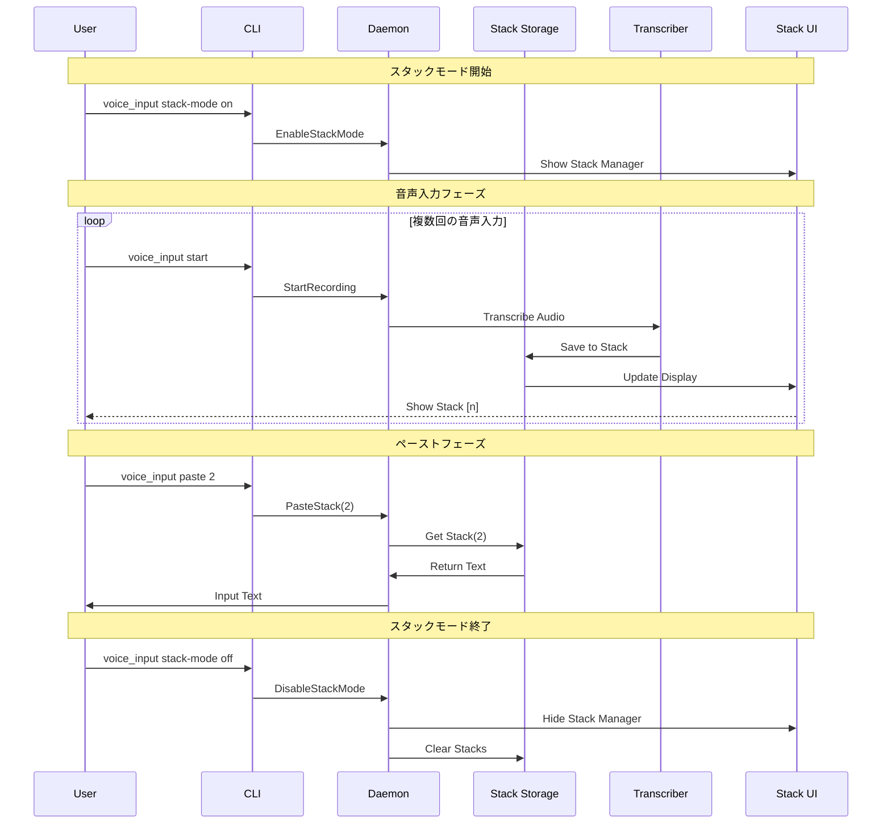

# マルチスタッキング＆ペースト機能 全体設計書

## Why - 概要と目的

### 概要
音声入力を複数回実行して番号付きで一時保存し、後から番号を指定して任意の順序でペーストできる機能を実装する。これにより、音声入力とテキスト編集のワークフローを分離し、より効率的な文書作成を可能にする。

### 目的
1. **思考とテキスト化の分離**: ユーザーは最初に話したいことを自由に音声入力し、後から整理しながらペーストできる
2. **編集効率の向上**: 複数の音声入力結果を保持し、必要な順序で配置できることで、文書構成の柔軟性が向上
3. **ワークフローの最適化**: 音声入力フェーズと編集フェーズを明確に分離することで、各作業に集中できる

## What - 実装詳細

### アーキテクチャ図

```
┌─────────────────────────────────────────────────────────────────┐
│                           User Interface                         │
├─────────────────────────────────────────────────────────────────┤
│  CLI (voice_input)          │        Stack Manager UI            │
│  - stack mode on/off        │   ┌────────────────────────────┐  │
│  - paste <number>           │   │  [1] 最初の音声入力...      │  │
│  - list-stacks              │   │  [2] 次の音声入力...        │  │
│                             │   │  [3] さらに音声入力...      │  │
│                             │   └────────────────────────────┘  │
└─────────────────────────────┬───────────────────────────────────┤
                              │                                    │
                         Unix Socket                               │
                              │                                    │
┌─────────────────────────────┴───────────────────────────────────┤
│                      Daemon (voice_inputd)                       │
├──────────────────────────────────────────────────────────────────┤
│  ┌──────────────────┐    ┌─────────────────┐                   │
│  │  Audio Recorder  │    │  Stack Storage  │                   │
│  │  & Transcriber   │───▶│   - Vec<Stack>  │                   │
│  └──────────────────┘    └─────────────────┘                   │
│                                    │                             │
│                          ┌─────────▼──────────┐                 │
│                          │  Text Input/Paste  │                 │
│                          │    Controller      │                 │
│                          └────────────────────┘                 │
└──────────────────────────────────────────────────────────────────┘
```

### ディレクトリ構成

```
src/
├── domain/
│   ├── mod.rs
│   ├── recorder.rs
│   ├── dict.rs
│   └── stack.rs                    # 新規: スタック管理ドメインモデル
├── infrastructure/
│   ├── audio/
│   ├── external/
│   ├── storage/                    # 新規: スタック永続化層
│   │   └── stack_storage.rs
│   └── ui/                         # 新規: UI関連
│       └── stack_manager_ui.rs
├── application/                    # 新規: アプリケーション層
│   ├── mod.rs
│   └── stack_service.rs            # スタック操作のビジネスロジック
└── main.rs
```

### フロー図



### 成果物

#### 機能要件
1. **スタックモード制御**
   - `stack-mode on/off`: スタックモードの有効化/無効化
   - スタックモード有効時は音声入力結果を自動保存
   
2. **スタック管理**
   - 音声入力結果を番号付きで保存（最大10個）
   - スタック一覧表示コマンド: `list-stacks`
   - スタッククリアコマンド: `clear-stacks`
   - 最大数到達時は自動的にペーストモードへ移行
   
3. **ペースト機能**
   - 番号指定ペースト: `paste <number>`
   - ペースト時は直接入力（Enigoライブラリ使用）
   
4. **UI表示**
   - 画面下部に固定された小型フローティングウィンドウ
   - スタック数に応じて縦に拡張（可変サイズ）
   - 各スタックの冒頭30文字をプレビュー表示
   - アクティブなスタックのハイライト表示

#### 非機能要件
1. **パフォーマンス**
   - スタック保存はメモリ内で管理（既存の設計思想を踏襲）
   - UI更新は非同期で実行し、音声入力処理をブロックしない
   
2. **ユーザビリティ**
   - CLIコマンドによる完全な操作制御
   - スタック番号は1から開始（ユーザーフレンドリー）
   - 長いテキストは30文字で省略表示
   
3. **データ管理**
   - スタックモード状態とデータは非永続的（再起動で初期化）
   - デーモン再起動時に全スタックデータは消去
   
4. **拡張性**
   - スタック永続化オプション（将来的な機能追加を考慮）
   - プラグイン可能なUI実装（egui、tauri等への対応）

## How - 実装フェーズ

### Phase S1-1: 基礎モデルとIPC定義

| 項目 | 内容 |
|------|------|
| **目的** | スタック管理の基本的なデータ構造とIPCメッセージを定義 |
| **成果物** | - `src/domain/stack.rs`: Stackモデル定義<br>- `src/ipc.rs`: IPC拡張（EnableStackMode, DisableStackMode, PasteStack等） |
| **完了条件** | - コンパイルが通る<br>- IPCメッセージのシリアライズ/デシリアライズテストが成功 |
| **除外項目** | - 実際のスタック保存処理<br>- UI実装 |

### Phase S1-2: CLIコマンド拡張

| 項目 | 内容 |
|------|------|
| **目的** | スタックモード制御用のCLIコマンドを追加 |
| **成果物** | - `src/main.rs`: コマンド追加（stack-mode, paste, list-stacks, clear-stacks）<br>- `src/bin/voice_input.rs`: CLIハンドラー実装 |
| **完了条件** | - `voice_input stack-mode on/off`が実行できる<br>- `voice_input paste 1`等のコマンドが認識される<br>- ヘルプにコマンドが表示される |
| **除外項目** | - 実際のスタック操作処理<br>- デーモン側の処理実装 |

### Phase S2-1: デーモン側スタック管理基盤

| 項目 | 内容 |
|------|------|
| **目的** | デーモン側でスタックを管理する基本機能を実装 |
| **成果物** | - `src/application/mod.rs`: アプリケーション層の初期化<br>- `src/application/stack_service.rs`: スタック管理サービス<br>- `voice_inputd`のスタックモード状態管理 |
| **完了条件** | - スタックモードのON/OFF切り替えが動作<br>- スタック保存/取得の基本APIが実装される |
| **除外項目** | - 音声入力との連携<br>- UI表示 |

### Phase S2-2: 音声入力とスタック連携

| 項目 | 内容 |
|------|------|
| **目的** | スタックモード時に音声入力結果を自動保存する機能を実装 |
| **成果物** | - 既存の転写完了処理にスタック保存ロジック追加<br>- スタックモード判定処理 |
| **完了条件** | - スタックモードON時、音声入力結果が番号付きで保存される<br>- `list-stacks`で保存されたスタックが確認できる |
| **除外項目** | - ペースト処理<br>- UI表示 |

### Phase S3-1: 基本ペースト機能

| 項目 | 内容 |
|------|------|
| **目的** | 番号指定による単一スタックのペースト機能を実装 |
| **成果物** | - ペーストコマンドのデーモン側処理<br>- 既存のtext_input機能との連携 |
| **完了条件** | - `voice_input paste 1`で1番目のスタックがペーストされる<br>- 存在しない番号指定時にエラーメッセージが表示される |
| **除外項目** | - 複数ペースト<br>- 範囲指定ペースト |

### Phase S3-2: スタック管理コマンド

| 項目 | 内容 |
|------|------|
| **目的** | スタックの一覧表示とクリア機能を実装 |
| **成果物** | - `list-stacks`の実装（番号とテキストプレビュー表示）<br>- `clear-stacks`の実装 |
| **完了条件** | - スタック一覧が見やすい形式で表示される<br>- クリアコマンドで全スタックが削除される |
| **除外項目** | - UI表示<br>- 個別スタック削除 |

### Phase S4-1: 基本UI実装

| 項目 | 内容 |
|------|------|
| **目的** | スタック一覧を表示する基本的なUIウィンドウを実装 |
| **成果物** | - `src/infrastructure/ui/mod.rs`: UI基盤<br>- `src/infrastructure/ui/stack_manager_ui.rs`: スタック表示UI<br>- 選択したUIライブラリ（egui等）の統合 |
| **完了条件** | - スタックモードON時に小型ウィンドウが表示される<br>- スタック一覧がリアルタイムで更新される |
| **除外項目** | - 高度なUI機能（ドラッグ&ドロップ等）<br>- UI経由の操作 |

