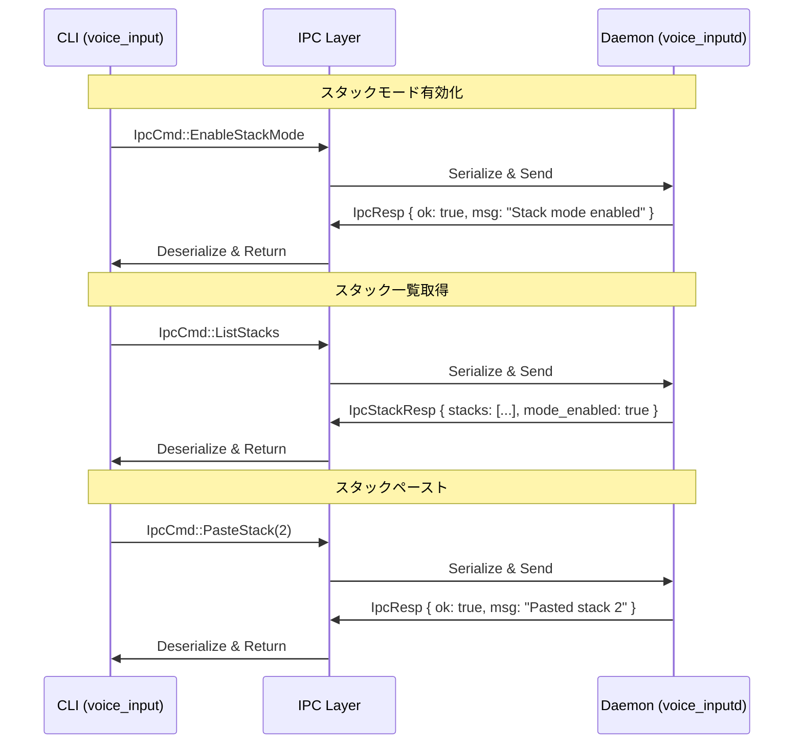

# Phase S1-1: 基礎モデルとIPC定義 詳細設計書

## Why

### Phase 概要
Phase S1-1は、マルチスタッキング＆ペースト機能の基盤となるデータ構造とIPCメッセージを定義するフェーズです。これにより、CLIとデーモン間でスタック関連の通信を行うための基礎が確立されます。

### 目的
1. **データモデル定義**: スタックの基本的なデータ構造を定義し、音声入力結果を番号付きで管理可能にする
2. **IPC拡張**: 既存のIPCメッセージに、スタックモード制御とスタック操作のためのコマンドを追加
3. **型安全性の確保**: Rustの型システムを活用して、スタック関連の操作を型安全に実装

## What

### アーキテクチャ図

```
┌─────────────────────────────────────────────────────────────┐
│                        IPC Layer                             │
├────────────────┬────────────────────────────────────────────┤
│   IpcCmd       │                  IpcResp                    │
│                │                                             │
│  既存:         │  既存:                                      │
│  - Start       │  - ok: bool                                │
│  - Stop        │  - msg: String                             │
│  - Toggle      │                                             │
│  - Status      │  新規:                                      │
│  - ListDevices │  - IpcStackResp                            │
│  - Health      │    - stacks: Vec<StackInfo>                │
│                │    - mode_enabled: bool                     │
│  新規:         │                                             │
│  - EnableStackMode                                           │
│  - DisableStackMode                                          │
│  - PasteStack(number)                                        │
│  - ListStacks                                                │
│  - ClearStacks                                               │
└────────────────┴────────────────────────────────────────────┘
                                │
                                ▼
┌─────────────────────────────────────────────────────────────┐
│                      Domain Layer                            │
├─────────────────────────────────────────────────────────────┤
│  Stack                    │  StackInfo                      │
│  - id: u32               │  - number: u32                   │
│  - text: String          │  - preview: String               │
│  - created_at: SystemTime│  - created_at: String            │
└─────────────────────────────────────────────────────────────┘
```

### ディレクトリ構成

```
src/
├── domain/
│   ├── mod.rs          # stack モジュールの追加
│   └── stack.rs        # 新規: Stack, StackInfo モデル定義
└── ipc.rs              # 既存: IpcCmd, IpcResp の拡張
```

### フロー図



### 成果物（機能、非機能）

#### 1. domain/stack.rs

```rust
use std::time::SystemTime;
use serde::{Deserialize, Serialize};

/// 音声入力結果を保持するスタック
#[derive(Debug, Clone, Serialize, Deserialize)]
pub struct Stack {
    /// スタック番号（1-based）
    pub id: u32,
    /// 転写されたテキスト
    pub text: String,
    /// 作成日時
    pub created_at: SystemTime,
}

/// CLI表示用のスタック情報
#[derive(Debug, Clone, Serialize, Deserialize)]
pub struct StackInfo {
    /// スタック番号（1-based）
    pub number: u32,
    /// テキストのプレビュー（最大30文字）
    pub preview: String,
    /// 作成日時（フォーマット済み）
    pub created_at: String,
}

impl Stack {
    pub fn new(id: u32, text: String) -> Self {
        Self {
            id,
            text,
            created_at: SystemTime::now(),
        }
    }

    pub fn to_info(&self) -> StackInfo {
        StackInfo {
            number: self.id,
            preview: self.text.chars().take(30).collect::<String>()
                + if self.text.len() > 30 { "..." } else { "" },
            created_at: format!("{:?}", self.created_at), // 簡易実装
        }
    }
}
```

#### 2. ipc.rs 拡張

```rust
/// CLI からデーモンへ送るコマンド列挙。
#[derive(Debug, Serialize, Deserialize)]
pub enum IpcCmd {
    // 既存のコマンド...
    
    /// スタックモードを有効化
    EnableStackMode,
    /// スタックモードを無効化
    DisableStackMode,
    /// 指定番号のスタックをペースト
    PasteStack { number: u32 },
    /// スタック一覧を取得
    ListStacks,
    /// 全スタックをクリア
    ClearStacks,
}

/// スタック関連のレスポンス
#[derive(Debug, Serialize, Deserialize)]
pub struct IpcStackResp {
    pub stacks: Vec<StackInfo>,
    pub mode_enabled: bool,
}
```

## How

### 内容

#### 目的
マルチスタッキング機能の基礎となるデータモデルとIPCメッセージを定義し、CLIとデーモン間でスタック操作を可能にする型定義を実装する。

#### 成果物（モジュールorファイル）
- `src/domain/stack.rs`: Stack, StackInfo モデル
- `src/ipc.rs`: IpcCmd の拡張、IpcStackResp の追加
- `src/domain/mod.rs`: stack モジュールの公開

#### 完了条件
- [ ] 全ての型定義がコンパイルエラーなく実装される
- [ ] 全てのユニットテストが成功する
- [ ] シリアライズ/デシリアライズが正常に動作する
- [ ] `cargo clippy -- -D warnings` でwarningがない

#### 手動でのチェック項目
- [ ] `cargo check` でコンパイルエラーがないこと
- [ ] `cargo test` で全テストが成功すること
- [ ] `cargo clippy -- -D warnings` でwarningがないこと

#### 除外項目（やらないこと）
- 実際のスタック保存処理
- UI実装
- デーモン側のコマンドハンドラー実装
- CLIコマンドの実装

### タスク分割（TDD形式）

#### Task 1: Stack モデルの実装

- [ ] **1-1: Stack構造体のテスト作成**
  ```rust
  // src/domain/stack.rs
  #[test]
  fn test_stack_creation() {
      let stack = Stack::new(1, "Hello, world!".to_string());
      assert_eq!(stack.id, 1);
      assert_eq!(stack.text, "Hello, world!");
  }
  ```

- [ ] **1-2: Stack構造体の実装**
  - 基本的なフィールド定義
  - new() メソッドの実装

- [ ] **1-3: StackInfo変換テストの作成**
  ```rust
  #[test]
  fn test_stack_to_info_preview() {
      let stack = Stack::new(1, "This is a very long text that should be truncated".to_string());
      let info = stack.to_info();
      assert_eq!(info.preview, "This is a very long text that ...");
  }
  ```

- [ ] **1-4: to_info() メソッドの実装**
  - プレビュー文字列の生成（30文字制限）
  - 日時フォーマット

- [ ] **1-5: シリアライズテストの追加**
  ```rust
  #[test]
  fn test_stack_serialization() {
      let stack = Stack::new(1, "Test".to_string());
      let json = serde_json::to_string(&stack).unwrap();
      let deserialized: Stack = serde_json::from_str(&json).unwrap();
      assert_eq!(deserialized.id, stack.id);
  }
  ```

#### Task 2: IPC拡張の実装

- [ ] **2-1: IpcCmd拡張のテスト作成**
  ```rust
  // src/ipc.rs
  #[test]
  fn test_stack_mode_commands_serialization() {
      let cmd = IpcCmd::EnableStackMode;
      let json = serde_json::to_string(&cmd).unwrap();
      let deserialized: IpcCmd = serde_json::from_str(&json).unwrap();
      matches!(deserialized, IpcCmd::EnableStackMode);
  }
  ```

- [ ] **2-2: IpcCmd enum への新規コマンド追加**
  - EnableStackMode
  - DisableStackMode
  - PasteStack { number: u32 }
  - ListStacks
  - ClearStacks

- [ ] **2-3: IpcStackResp構造体のテスト作成**
  ```rust
  #[test]
  fn test_ipc_stack_resp_serialization() {
      let resp = IpcStackResp {
          stacks: vec![],
          mode_enabled: true,
      };
      let json = serde_json::to_string(&resp).unwrap();
      let deserialized: IpcStackResp = serde_json::from_str(&json).unwrap();
      assert!(deserialized.mode_enabled);
  }
  ```

- [ ] **2-4: IpcStackResp構造体の実装**

#### Task 3: モジュール統合

- [ ] **3-1: domain/mod.rs の更新**
  ```rust
  pub mod stack;
  pub use stack::{Stack, StackInfo};
  ```

- [ ] **3-2: 統合テストの作成**
  - domain モジュールからの正しいエクスポート確認
  - ipc モジュールでの Stack 型の利用可能性確認

- [ ] **3-3: 後方互換性テストの追加**
  ```rust
  #[test]
  fn test_backward_compatibility() {
      // 既存のIPCコマンドが引き続き動作することを確認
      let cmd = IpcCmd::Start { paste: true, prompt: None, direct_input: false };
      let json = serde_json::to_string(&cmd).unwrap();
      assert!(json.contains("Start"));
  }
  ```

#### Task 4: 品質保証

- [ ] **4-1: cargo fmt の実行**
- [ ] **4-2: cargo clippy の実行と修正**
- [ ] **4-3: cargo test の実行**
- [ ] **4-4: ドキュメントコメントの追加**

### 手動でのチェック項目

1. **コンパイルチェック**
   - [ ] `cargo check` でエラーがないこと
   - [ ] `cargo check --tests` でテストコードもエラーがないこと

2. **テスト実行**
   - [ ] `cargo test domain::stack` でStackモデルのテストが成功
   - [ ] `cargo test ipc` でIPC拡張のテストが成功
   - [ ] `cargo test` で全テストが成功

3. **品質チェック**
   - [ ] `cargo fmt -- --check` でフォーマット違反がないこと
   - [ ] `cargo clippy -- -D warnings` でwarningがないこと

4. **統合確認**
   - [ ] src/lib.rs から domain::stack モジュールが参照可能であること
   - [ ] 既存のIPCコマンドとの互換性が保たれていること