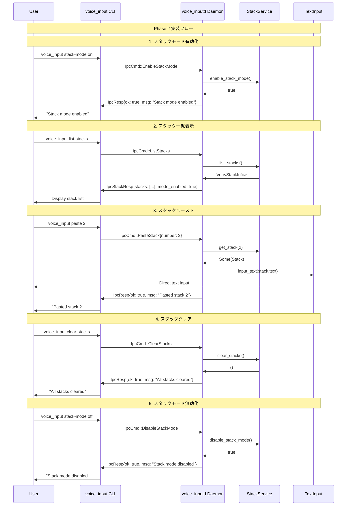

# Phase 2: CLIコマンド拡張 & デーモン側スタック管理基盤 詳細設計書

## Why

### Phase 概要

Phase 2は、マルチスタッキング機能の実用化に向けた重要な段階で、CLIコマンドの実装とデーモン側のスタック管理基盤を構築するフェーズです。Phase S1-1で定義したデータモデルとIPCメッセージを基に、実際にユーザーが操作可能なコマンドインターフェースとデーモン側の処理基盤を実装します。

### 目的

1. **CLIコマンドの実装**: ユーザーがスタック機能を操作するためのコマンドライン周インターフェースを提供
2. **デーモン側基盤構築**: スタックの永続化、管理、操作を行う基本的なサービス層を実装
3. **IPC連携の完成**: CLI-デーモン間でスタック操作が正常に動作する完全な通信基盤を確立
4. **スタックモード制御**: スタックモードのON/OFF切り替えとそれに伴う状態管理を実装

## What

### アーキテクチャ図

```
┌─────────────────────────────────────────────────────────────────┐
│                     CLI Layer (voice_input)                     │
├─────────────────────────────────────────────────────────────────┤
│  New CLI Commands:                                              │
│  - stack-mode on/off                                            │
│  - paste <number>                                               │
│  - list-stacks                                                  │
│  - clear-stacks                                                 │
└─────────────────────────┬───────────────────────────────────────┘
                          │ IPC (Unix Socket)
                          │
┌─────────────────────────▼───────────────────────────────────────┐
│                  Daemon Layer (voice_inputd)                    │
├─────────────────────────────────────────────────────────────────┤
│  IPC Handler Updates:                                           │
│  - EnableStackMode/DisableStackMode → StackService            │
│  - PasteStack → StackService + TextInput                      │
│  - ListStacks/ClearStacks → StackService                      │
│                                                                 │
│  ┌───────────────────────────────────────────────────────────┐ │
│  │              Application Service Layer                    │ │
│  │  ┌─────────────────────────────────────────────────────┐ │ │
│  │  │           StackService                             │ │ │
│  │  │  - enable_stack_mode() / disable_stack_mode()     │ │ │
│  │  │  - save_stack(text: String) -> u32                │ │ │
│  │  │  - get_stack(number: u32) -> Option<Stack>        │ │ │
│  │  │  - list_stacks() -> Vec<StackInfo>                │ │ │
│  │  │  - clear_stacks()                                  │ │ │
│  │  │  - is_stack_mode_enabled() -> bool                │ │ │
│  │  └─────────────────────────────────────────────────────┘ │ │
│  └───────────────────────────────────────────────────────────┘ │
│                                                                 │
│  ┌───────────────────────────────────────────────────────────┐ │
│  │                   Domain Layer                            │ │
│  │  - Stack (既存: src/domain/stack.rs)                     │ │
│  │  - StackInfo (既存: src/domain/stack.rs)                 │ │
│  └───────────────────────────────────────────────────────────┘ │
└─────────────────────────────────────────────────────────────────┘
```

### ディレクトリ構成

```
src/
├── main.rs                           # 修正: 新規CLIコマンド追加
├── bin/
│   └── voice_inputd.rs               # 修正: StackService統合
├── application/                      # 新規: アプリケーション層
│   ├── mod.rs                        # 新規: アプリケーション層エクスポート
│   └── stack_service.rs              # 新規: スタック管理サービス
├── domain/
│   ├── mod.rs                        # 既存: stackモジュール公開済み
│   └── stack.rs                      # 既存: Stack, StackInfo定義済み
└── ipc.rs                            # 既存: IPC定義済み
```

### フロー図



### 成果物（機能、非機能）

#### 1. CLIコマンド拡張 (src/main.rs)

```rust
#[derive(Subcommand)]
enum Cmd {
    // 既存のコマンド...

    /// スタックモード制御
    #[command(name = "stack-mode")]
    StackMode {
        #[command(subcommand)]
        action: StackModeCmd,
    },
    /// スタックをペースト
    Paste {
        /// ペーストするスタック番号 (1-based)
        number: u32,
    },
    /// スタック一覧表示
    #[command(name = "list-stacks")]
    ListStacks,
    /// 全スタックをクリア
    #[command(name = "clear-stacks")]
    ClearStacks,
}

#[derive(Subcommand)]
enum StackModeCmd {
    /// スタックモードを有効化
    On,
    /// スタックモードを無効化
    Off,
}
```

#### 2. StackService (src/application/stack_service.rs)

```rust
use crate::domain::stack::{Stack, StackInfo};
use std::collections::HashMap;

/// スタック管理サービス
///
/// **重要**: 完全にオンメモリ管理。スタックモード無効化またはデーモン再起動時に全データ消失。
#[derive(Debug, Default)]
pub struct StackService {
    /// スタックモードが有効かどうか
    mode_enabled: bool,
    /// スタック保存用（番号 -> Stack）**オンメモリのみ**
    stacks: HashMap<u32, Stack>,
    /// 次に割り当てるスタック番号
    next_id: u32,
}

impl StackService {
    pub fn new() -> Self {
        Self {
            mode_enabled: false,
            stacks: HashMap::new(),
            next_id: 1,
        }
    }

    /// スタックモードを有効化
    pub fn enable_stack_mode(&mut self) -> bool {
        self.mode_enabled = true;
        true
    }

    /// スタックモードを無効化
    pub fn disable_stack_mode(&mut self) -> bool {
        self.mode_enabled = false;
        self.stacks.clear();
        self.next_id = 1;
        true
    }

    /// スタックモードが有効かどうか
    pub fn is_stack_mode_enabled(&self) -> bool {
        self.mode_enabled
    }

    /// 新しいスタックを保存
    pub fn save_stack(&mut self, text: String) -> u32 {
        let id = self.next_id;
        let stack = Stack::new(id, text);
        self.stacks.insert(id, stack);
        self.next_id += 1;
        id
    }

    /// 指定番号のスタックを取得
    pub fn get_stack(&self, number: u32) -> Option<&Stack> {
        self.stacks.get(&number)
    }

    /// 全スタックの情報を取得
    pub fn list_stacks(&self) -> Vec<StackInfo> {
        let mut infos: Vec<_> = self.stacks.values()
            .map(|stack| stack.to_info())
            .collect();
        infos.sort_by_key(|info| info.number);
        infos
    }

    /// 全スタックをクリア
    pub fn clear_stacks(&mut self) {
        self.stacks.clear();
        self.next_id = 1;
    }
}
```

#### 3. デーモン側IPC処理更新 (src/bin/voice_inputd.rs)

```rust
// 修正: StackServiceの統合
use voice_input::application::stack_service::StackService;

// グローバル状態にStackServiceを追加
struct DaemonState {
    // 既存のフィールド...
    stack_service: Arc<Mutex<StackService>>,
}

// IPC処理の更新
async fn handle_ipc_cmd(
    cmd: IpcCmd,
    // 既存のパラメータ...
    stack_service: &Arc<Mutex<StackService>>,
) -> Result<IpcResp, Box<dyn Error>> {
    match cmd {
        // 既存のコマンド処理...

        IpcCmd::EnableStackMode => {
            let mut service = stack_service.lock().map_err(|e| e.to_string())?;
            service.enable_stack_mode();
            Ok(IpcResp {
                ok: true,
                msg: "Stack mode enabled".to_string(),
            })
        }
        IpcCmd::DisableStackMode => {
            let mut service = stack_service.lock().map_err(|e| e.to_string())?;
            service.disable_stack_mode();
            Ok(IpcResp {
                ok: true,
                msg: "Stack mode disabled".to_string(),
            })
        }
        IpcCmd::PasteStack { number } => {
            let service = stack_service.lock().map_err(|e| e.to_string())?;
            if let Some(stack) = service.get_stack(number) {
                // 既存のtext_input機能を使用
                text_input::input_text(&stack.text, true).await?;
                Ok(IpcResp {
                    ok: true,
                    msg: format!("Pasted stack {}", number),
                })
            } else {
                Ok(IpcResp {
                    ok: false,
                    msg: format!("Stack {} not found", number),
                })
            }
        }
        // ListStacks, ClearStacks処理...
    }
}
```

## How

### 内容

#### 目的

Phase S1-1で定義したスタック機能の基盤を活用し、ユーザーが実際にスタック機能を操作できるCLIインターフェースとデーモン側の管理機能を実装する。

#### 成果物（モジュールorファイル）

- `src/main.rs`: 新規CLIコマンド（stack-mode, paste, list-stacks, clear-stacks）
- `src/application/mod.rs`: アプリケーション層の初期化
- `src/application/stack_service.rs`: スタック管理サービス
- `src/bin/voice_inputd.rs`: StackService統合とIPC処理更新
- `tests/`: 対応する単体・統合テスト

#### 完了条件

- [x] 全てのCLIコマンドが正常に実行できる
- [x] スタックモードのON/OFF切り替えが動作する
- [x] スタックの保存/取得/一覧表示/クリアが動作する
- [x] 番号指定によるペースト機能が動作する
- [x] 全てのユニットテストが成功する
- [x] `cargo clippy -- -D warnings` でwarningがない

#### 手動でのチェック項目

- [ ] `voice_input stack-mode on` でスタックモードが有効化される
- [ ] `voice_input list-stacks` でスタック一覧が表示される
- [ ] `voice_input paste 1` でスタックがペーストされる
- [ ] `voice_input clear-stacks` で全スタックがクリアされる
- [ ] `voice_input stack-mode off` でスタックモードが無効化される
- [ ] 存在しない番号のペースト時にエラーメッセージが表示される

#### 除外項目（やらないこと）

- 音声入力とスタック連携（Phase S2-2で実装）
- UI表示機能（Phase S4-1で実装）
- スタック永続化機能（**注意**: 現在の実装は完全にオンメモリ管理。スタックモード無効化またはデーモン再起動時に全データ消失）
- 複数ペーストや範囲指定ペースト（Phase S3-1以降で実装）

## 実装詳細と技術的対応策

### 1. IPC レスポンス統合戦略

**課題**: `ListStacks`は`IpcStackResp`を返すが、既存の`handle_client`は`IpcResp`のみ対応

**解決策**: `IpcResp`を拡張してオプショナルなスタックデータを包含

```rust
#[derive(Debug, Serialize, Deserialize)]
pub struct IpcResp {
    pub ok: bool,
    pub msg: String,
    #[serde(skip_serializing_if = "Option::is_none")]
    pub stack_data: Option<IpcStackResp>,
}
```

**メリット**: 後方互換性維持、`handle_client`変更不要

### 2. デーモン状態管理統合

**解決策**: 統合状態管理構造体の導入

```rust
struct DaemonState {
    rec_ctx: Arc<Mutex<RecCtx>>,
    stack_service: Arc<Mutex<StackService>>,
}
```

- `handle_client`関数に`DaemonState`を渡す形でリファクタリング
- 段階的に既存の`RecCtx`との統合を進める

### 3. エラーハンドリング方針

**Phase 2での方針**: 最小限エラーハンドリング（後で拡張）

```rust
pub enum StackServiceError {
    StackNotFound(u32),
    StackModeDisabled,
    // 将来の拡張用: MaxStacksReached, etc.
}
```

### 4. CLI コマンド統合方針

**方針**: 既存構造を活用し、フラットにスタックコマンドを配置

- `stack-mode on/off` → `StackMode { action: StackModeAction }`
- `paste <number>` → `Paste { number: u32 }`
- `list-stacks`, `clear-stacks` → 独立コマンド

### 5. 実装順序

1. **StackService基盤** → 基本CRUD + 最小限エラーハンドリング
2. **IpcResp拡張** → 後方互換性維持しつつstack_data追加
3. **CLI拡張** → 新規コマンド追加
4. **デーモン統合** → DaemonState導入
5. **既存API調査** → `text_input`関数の実際のシグネチャ確認
6. **統合テスト** → エンドツーエンドテスト

### 6. 技術制約・設計決定

- **スタック数制限**: `const MAX_STACKS: usize = 100` (メモリ保護)
- **既存コード影響**: 最小化原則（段階的リファクタリング）
- **テスト方針**: テストファーストアプローチ維持

### タスク分割（TDD形式）

#### Task 1: StackServiceの実装

- [x] **1-1: StackService基本構造のテスト作成**

  ```rust
  // src/application/stack_service.rs
  #[test]
  fn test_stack_service_creation() {
      let service = StackService::new();
      assert!(!service.is_stack_mode_enabled());
  }
  ```

- [x] **1-2: StackService基本構造の実装**

  - 基本的なフィールド定義（mode_enabled, stacks, next_id）
  - new() メソッドの実装

- [x] **1-3: スタックモード制御テストの作成**

  ```rust
  #[test]
  fn test_enable_disable_stack_mode() {
      let mut service = StackService::new();
      assert!(service.enable_stack_mode());
      assert!(service.is_stack_mode_enabled());
      assert!(service.disable_stack_mode());
      assert!(!service.is_stack_mode_enabled());
  }
  ```

- [x] **1-4: スタックモード制御メソッドの実装**

  - enable_stack_mode()
  - disable_stack_mode()
  - is_stack_mode_enabled()

- [x] **1-5: スタック保存・取得テストの作成**

  ```rust
  #[test]
  fn test_save_and_get_stack() {
      let mut service = StackService::new();
      let id = service.save_stack("Test text".to_string());
      assert_eq!(id, 1);

      let stack = service.get_stack(1).unwrap();
      assert_eq!(stack.text, "Test text");
      assert_eq!(stack.id, 1);
  }
  ```

- [x] **1-6: スタック保存・取得メソッドの実装**

  - save_stack()
  - get_stack()

- [x] **1-7: スタック一覧・クリアテストの作成**

  ```rust
  #[test]
  fn test_list_and_clear_stacks() {
      let mut service = StackService::new();
      service.save_stack("First".to_string());
      service.save_stack("Second".to_string());

      let list = service.list_stacks();
      assert_eq!(list.len(), 2);
      assert_eq!(list[0].number, 1);
      assert_eq!(list[1].number, 2);

      service.clear_stacks();
      assert_eq!(service.list_stacks().len(), 0);
  }
  ```

- [x] **1-8: スタック一覧・クリアメソッドの実装**
  - list_stacks()
  - clear_stacks()

#### Task 2: CLIコマンド拡張

- [x] **2-1: CLIコマンド構造のテスト作成**

  ```rust
  // tests/cli_integration.rs
  #[test]
  fn test_stack_mode_command_parsing() {
      use clap::Parser;

      let cli = Cli::try_parse_from(&["voice_input", "stack-mode", "on"]).unwrap();
      matches!(cli.cmd, Some(Cmd::StackMode { action: StackModeCmd::On }));
  }
  ```

- [x] **2-2: CLI enum拡張の実装**

  - Cmdへの新規コマンド追加
  - StackModeCmd enum定義

- [x] **2-3: CLIコマンドハンドリングテストの作成**

  ```rust
  #[test]
  fn test_paste_command_parsing() {
      let cli = Cli::try_parse_from(&["voice_input", "paste", "5"]).unwrap();
      if let Some(Cmd::Paste { number }) = cli.cmd {
          assert_eq!(number, 5);
      } else {
          panic!("Expected Paste command");
      }
  }
  ```

- [x] **2-4: CLIコマンドハンドリングの実装**
  - match文での新規コマンド処理
  - 適切なIpcCmd変換

#### Task 3: デーモン側IPC処理更新

- [x] **3-1: StackService統合テストの作成**

  ```rust
  // tests/stack_service_integration.rs
  #[tokio::test]
  async fn test_daemon_stack_service_integration() {
      // DaemonStateにStackServiceが正しく統合されることをテスト
  }
  ```

- [x] **3-2: デーモンstate構造体の更新**

  - StackServiceの追加
  - 初期化処理の修正

- [x] **3-3: IPC処理更新テストの作成**

  ```rust
  #[tokio::test]
  async fn test_enable_stack_mode_ipc() {
      // EnableStackModeコマンドが正常に処理されることをテスト
  }
  ```

- [x] **3-4: IPC処理の実装**
  - EnableStackMode/DisableStackMode処理
  - PasteStack処理（text_input連携）
  - ListStacks/ClearStacks処理

#### Task 4: アプリケーション層統合

- [x] **4-1: applicationモジュール構造のテスト作成**

  ```rust
  // tests/application_module_test.rs
  #[test]
  fn test_application_module_exports() {
      use voice_input::application::StackService;
      let _service = StackService::new();
  }
  ```

- [x] **4-2: application/mod.rsの実装**

  - stack_serviceモジュールの公開
  - 適切なre-export

- [x] **4-3: 統合テストの作成**

  ```rust
  #[test]
  fn test_full_stack_workflow() {
      // CLI -> IPC -> StackService の完全なフローテスト
  }
  ```

- [x] **4-4: 統合動作確認**
  - エンドツーエンドテストの実行
  - 各種エラーケースの確認

#### Task 5: 品質保証

- [x] **5-1: cargo fmt の実行**
- [x] **5-2: cargo clippy の実行と修正**
- [x] **5-3: cargo test の実行**
- [x] **5-4: ドキュメントコメントの追加**
- [ ] **5-5: 手動テストの実行**

### 手動でのチェック項目

1. **コマンドパースチェック**

   - [x] `voice_input stack-mode on` がエラーなく解析される
   - [x] `voice_input paste 1` が適切な番号で解析される
   - [x] `voice_input --help` に新しいコマンドが表示される

2. **IPC通信チェック**

   - [ ] 各コマンドでデーモンとの通信が成功する
   - [ ] エラー時に適切なメッセージが返される
   - [ ] レスポンス形式が正しい

3. **スタック操作チェック**

   - [ ] スタックモードON/OFF切り替えが動作
   - [ ] スタック一覧表示が正しい形式で出力される
   - [ ] 存在しないスタック番号で適切なエラーが表示される

4. **統合動作チェック**

   - [ ] CLI -> デーモン -> StackService の完全なフローが動作
   - [ ] 並行実行時にデータ競合が発生しない
   - [ ] メモリリークが発生しない

5. **エラーハンドリングチェック**
   - [ ] 無効な引数で適切なエラーメッセージが表示される
   - [ ] デーモン停止時に適切なエラーハンドリングが動作する
   - [ ] 型安全性が保たれている
