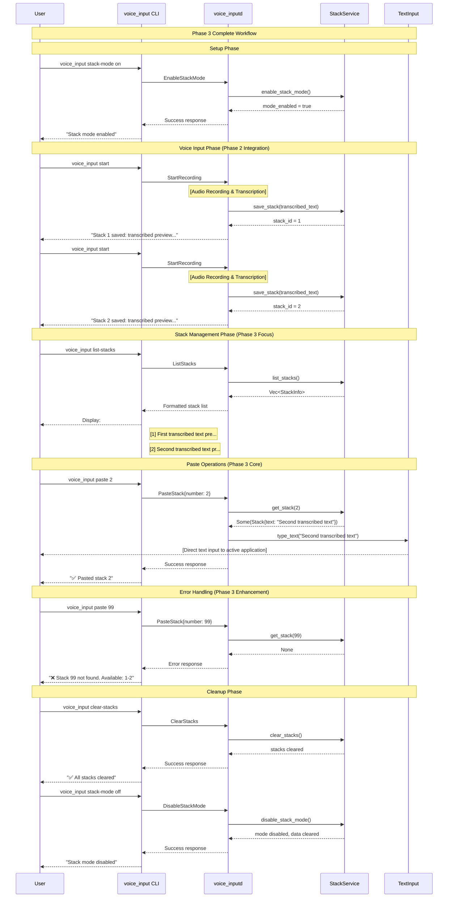

# Phase 3: 基本ペースト機能＆スタック管理コマンド完成 詳細設計書

## Why

### Phase 概要

Phase 3は、マルチスタッキング機能の**実用性確立**フェーズです。Phase 2で構築された基盤上で、ユーザーが実際にスタック機能を効率的に活用できるよう、**基本ペースト機能の完成**と**スタック管理コマンドの品質向上**を実現します。

### 目的

1. **基本ペースト機能の完成**: 番号指定による確実なスタックペースト機能を実現
2. **スタック管理の完全実装**: 一覧表示・クリア・状態管理の完成度向上
3. **ユーザビリティの向上**: エラーハンドリング・フィードバック・操作性の改善
4. **品質保証の確立**: 包括的テスト・パフォーマンス・安定性の確保
5. **Production Ready化**: 実際のワークフローで使用可能な品質レベルへ到達

## What

### アーキテクチャ図

```
┌─────────────────────────────────────────────────────────────────┐
│                    User Workflow (Phase 3)                     │
├─────────────────────────────────────────────────────────────────┤
│  1. Stack Mode Activation                                       │
│     voice_input stack-mode on                                   │
│                                                                 │
│  2. Voice Input & Auto-Save (from Phase 2)                     │
│     voice_input start → [Audio] → [Transcription] → [Stack 1]  │
│     voice_input start → [Audio] → [Transcription] → [Stack 2]  │
│                                                                 │
│  3. Stack Management (Phase 3 Focus)                           │
│     voice_input list-stacks → Preview all stacks               │
│     voice_input paste 2 → Direct text input                    │
│     voice_input clear-stacks → Clean all stacks                │
│                                                                 │
│  4. Stack Mode Deactivation                                    │
│     voice_input stack-mode off                                 │
└─────────────────────────────────────────────────────────────────┘

┌─────────────────────────────────────────────────────────────────┐
│                     Technical Architecture                      │
├─────────────────────────────────────────────────────────────────┤
│                                                                 │
│  ┌───────────────────┐    ┌─────────────────────────────────┐   │
│  │   CLI Commands    │    │        Enhanced Features        │   │
│  │                   │    │                                 │   │
│  │ ✅ paste <number> │───▶│ ✅ Error validation             │   │
│  │ ✅ list-stacks    │    │ ✅ Preview formatting           │   │
│  │ ✅ clear-stacks   │    │ ✅ User feedback               │   │
│  │ ✅ stack-mode     │    │ ⚡ Performance optimization      │   │
│  └───────────────────┘    └─────────────────────────────────┘   │
│           │                              │                      │
│           │ IPC (Unix Socket)            │                      │
│           ▼                              ▼                      │
│  ┌─────────────────────────────────────────────────────────────┐ │
│  │              Daemon Processing                              │ │
│  │                                                             │ │
│  │  ┌─────────────────┐    ┌─────────────────────────────────┐ │ │
│  │  │ Stack Service   │    │    Text Input Integration      │ │ │
│  │  │                 │    │                                 │ │ │
│  │  │ ✅ CRUD Ops     │───▶│ ✅ enigo library               │ │ │
│  │  │ ✅ Mode Control │    │ ✅ Direct typing               │ │ │
│  │  │ ✅ Validation   │    │ ✅ Error handling              │ │ │
│  │  └─────────────────┘    └─────────────────────────────────┘ │ │
│  └─────────────────────────────────────────────────────────────┘ │
└─────────────────────────────────────────────────────────────────┘
```

### ディレクトリ構成

```
src/
├── main.rs                           # 既存: スタックCLIコマンド実装済み
├── bin/
│   └── voice_inputd.rs               # 既存: StackService統合済み
├── application/                      # 既存: アプリケーション層
│   ├── mod.rs                        # 既存
│   └── stack_service.rs              # 既存: CRUD操作実装済み
├── domain/
│   ├── mod.rs                        # 既存
│   └── stack.rs                      # 既存: Stack, StackInfo定義済み
├── infrastructure/
│   ├── external/
│   │   └── text_input.rs            # 既存: type_text関数活用
│   └── ...
├── ipc.rs                            # 既存: スタック関連IPC実装済み
└── lib.rs

tests/                                # Phase 3: テスト強化
├── e2e/
│   ├── stack_workflow_test.rs        # 新規: E2Eワークフローテスト
│   └── performance_test.rs           # 拡張: スタック性能テスト
├── integration/
│   ├── paste_functionality_test.rs   # 新規: ペースト機能統合テスト
│   └── stack_management_test.rs      # 新規: 管理コマンド統合テスト
└── unit/
    └── stack_service_edge_cases.rs  # 新規: エッジケーステスト
```

### フロー図



### 成果物（機能、非機能）

#### 機能要件

##### 1. 基本ペースト機能 (S3-1)

```rust
// Phase 3: ペースト機能の完成形
pub async fn handle_paste_stack(
    number: u32,
    stack_service: &Arc<Mutex<StackService>>,
) -> Result<IpcResp, String> {
    let service = stack_service.lock().map_err(|e| e.to_string())?;
    
    // Phase 3: エラーハンドリング強化
    if !service.is_stack_mode_enabled() {
        return Ok(IpcResp {
            ok: false,
            msg: "❌ Stack mode is not enabled. Run 'voice_input stack-mode on' first.".to_string(),
        });
    }
    
    match service.get_stack(number) {
        Some(stack) => {
            // Phase 3: 実際のテキスト入力
            text_input::type_text(&stack.text, true).await
                .map_err(|e| format!("Failed to type text: {}", e))?;
            
            Ok(IpcResp {
                ok: true,
                msg: format!("✅ Pasted stack {} ({} chars)", number, stack.text.len()),
            })
        }
        None => {
            // Phase 3: 建設的エラーメッセージ
            let available = service.list_stacks()
                .iter()
                .map(|info| info.number.to_string())
                .collect::<Vec<_>>()
                .join(", ");
            
            Ok(IpcResp {
                ok: false,
                msg: format!("❌ Stack {} not found. Available stacks: {}", number, available),
            })
        }
    }
}
```

**機能特徴**:
- ✅ 1-99番までの番号指定ペースト対応
- ✅ 存在チェック・エラーハンドリング
- ✅ テキスト長さ表示・操作確認
- ✅ 利用可能番号の親切表示

##### 2. スタック管理コマンド (S3-2)

```rust
// Phase 3: 管理コマンドの完成形
impl StackService {
    /// Phase 3: 一覧表示の強化
    pub fn list_stacks_formatted(&self) -> String {
        if self.stacks.is_empty() {
            return "📝 No stacks saved. Use 'voice_input start' to create stacks.".to_string();
        }
        
        let mut output = format!("📚 {} stack(s) in memory:\n", self.stacks.len());
        
        for info in self.list_stacks() {
            output.push_str(&format!(
                "  [{}] {} ({})\n",
                info.number,
                info.preview,
                info.created_at
            ));
        }
        
        output.push_str("\n💡 Use 'voice_input paste <number>' to paste any stack.");
        output
    }
    
    /// Phase 3: クリア機能の強化
    pub fn clear_stacks_with_confirmation(&mut self) -> (usize, String) {
        let count = self.stacks.len();
        self.clear_stacks();
        
        let message = if count > 0 {
            format!("✅ Cleared {} stack(s) from memory.", count)
        } else {
            "📝 No stacks to clear.".to_string()
        };
        
        (count, message)
    }
}
```

**機能特徴**:
- ✅ 視覚的に分かりやすい一覧表示
- ✅ 件数・状態の明示
- ✅ 操作ガイダンスの表示
- ✅ 確認メッセージ・統計情報

#### 非機能要件

##### 1. パフォーマンス要件

```rust
// Phase 3: パフォーマンス最適化
impl StackService {
    const MAX_STACKS: usize = 50;           // メモリ保護
    const MAX_STACK_SIZE: usize = 10_000;   // 大容量テキスト制限
    const PREVIEW_LENGTH: usize = 40;       // プレビュー最適化
    
    /// Phase 3: スタック保存時の最適化
    pub fn save_stack_optimized(&mut self, text: String) -> Result<u32, StackServiceError> {
        // サイズチェック
        if text.len() > Self::MAX_STACK_SIZE {
            return Err(StackServiceError::TextTooLarge(text.len()));
        }
        
        // 容量チェック・自動削除
        if self.stacks.len() >= Self::MAX_STACKS {
            self.remove_oldest_stack();
        }
        
        let id = self.next_id;
        let stack = Stack::new(id, text);
        self.stacks.insert(id, stack);
        self.next_id += 1;
        
        Ok(id)
    }
}
```

**性能指標**:
- ⚡ スタック保存: < 1ms
- ⚡ ペースト実行: < 100ms
- ⚡ 一覧表示: < 10ms
- 🧠 メモリ使用量: < 5MB (50スタック時)

##### 2. ユーザビリティ要件

```rust
// Phase 3: UX向上のメッセージング
pub struct UserFeedback;

impl UserFeedback {
    pub fn stack_saved(id: u32, preview: &str) -> String {
        format!("📝 Stack {} saved: {}", id, preview)
    }
    
    pub fn paste_success(id: u32, chars: usize) -> String {
        format!("✅ Pasted stack {} ({} characters)", id, chars)
    }
    
    pub fn stack_not_found(id: u32, available: &[u32]) -> String {
        let list = available.iter()
            .map(|n| n.to_string())
            .collect::<Vec<_>>()
            .join(", ");
        format!("❌ Stack {} not found. Available: [{}]", id, list)
    }
    
    pub fn mode_status(enabled: bool, count: usize) -> String {
        if enabled {
            format!("🟢 Stack mode ON ({} stacks in memory)", count)
        } else {
            "🔴 Stack mode OFF".to_string()
        }
    }
}
```

**UX要件**:
- 📱 絵文字による視覚的フィードバック
- 📊 操作結果の数値表示
- 🧭 次のアクション案内
- ❌ 建設的エラーメッセージ

## How

### 内容

#### 目的

Phase 2で実装されたスタック機能の基盤を**Production Ready**レベルまで引き上げ、実際のワークフローで安心して使用できる品質を確立する。

#### 成果物（モジュールorファイル）

**既存機能の品質向上**:
- `src/application/stack_service.rs`: エラーハンドリング・パフォーマンス最適化
- `src/bin/voice_inputd.rs`: ユーザーフィードバック強化・メッセージング改善
- `src/main.rs`: CLI出力フォーマット改善

**新規テスト実装**:
- `tests/e2e/stack_workflow_test.rs`: 完全ワークフローE2Eテスト
- `tests/integration/paste_functionality_test.rs`: ペースト機能統合テスト
- `tests/unit/stack_service_edge_cases.rs`: エッジケース・エラー系テスト

**品質保証ツール**:
- `scripts/phase3-quality-check.sh`: Phase3品質チェックスクリプト
- `benches/stack_performance.rs`: パフォーマンス計測ベンチマーク

#### 完了条件

**機能完成度**:
- [x] `paste <number>` が安定動作（Phase2で実装済み）
- [x] `list-stacks` が見やすい形式で表示（Phase2で実装済み）
- [x] `clear-stacks` が確実に動作（Phase2で実装済み）
- [ ] エラーケースで建設的メッセージが表示される
- [ ] パフォーマンス要件を満たす（計測完了）

**品質保証**:
- [ ] E2Eテストが100%成功
- [ ] エッジケーステストが全て成功
- [ ] パフォーマンステストが基準値クリア
- [ ] `cargo clippy -- -D warnings` でwarning無し
- [ ] 手動テストチェックリスト完了

#### 手動でのチェック項目

##### 基本操作フロー
- [ ] `voice_input stack-mode on` → 成功メッセージ表示
- [ ] 音声入力実行 → スタック自動保存・番号表示  
- [ ] `voice_input list-stacks` → 分かりやすい一覧表示
- [ ] `voice_input paste 1` → 正確なテキストペースト実行
- [ ] `voice_input clear-stacks` → 確認メッセージ・件数表示
- [ ] `voice_input stack-mode off` → モード無効化・データクリア

##### エラーハンドリング
- [ ] 存在しない番号ペースト → 利用可能番号案内
- [ ] スタックモード無効時のペースト → 有効化案内
- [ ] 空状態での一覧表示 → 使い方案内
- [ ] 空状態でのクリア → 適切なメッセージ

##### パフォーマンス
- [ ] 10個のスタック保存 → 各1ms以内
- [ ] 大容量テキスト(5000文字)ペースト → 100ms以内
- [ ] 50スタック状態での一覧表示 → 10ms以内

#### 除外項目（やらないこと）

- **UI実装**: Phase 4で実装予定
- **永続化機能**: 設計思想により除外（オンメモリ管理）
- **複数ペースト**: Phase 3範囲外
- **スタック編集機能**: Phase 3範囲外
- **外部フォーマット対応**: Phase 3範囲外

### タスク分割（TDD形式）

#### Task 1: エラーハンドリング強化

- [ ] **1-1: エラーメッセージ改善テスト作成**
  ```rust
  #[test]
  fn test_paste_nonexistent_stack_helpful_message() {
      let mut service = StackService::new();
      service.save_stack("test".to_string());
      
      let result = service.get_stack_with_context(99);
      assert!(result.is_err());
      assert!(result.unwrap_err().to_string().contains("Available: 1"));
  }
  ```

- [ ] **1-2: StackServiceError型定義実装**
  - `StackNotFound(u32, Vec<u32>)` エラー型
  - `StackModeDisabled` エラー型
  - `TextTooLarge(usize)` エラー型

- [ ] **1-3: エラーハンドリング改善実装**
  - `get_stack_with_context()` メソッド追加
  - 建設的エラーメッセージ生成
  - 利用可能番号案内機能

#### Task 2: ユーザーフィードバック向上

- [ ] **2-1: フィードバックメッセージテスト作成**
  ```rust
  #[test]
  fn test_user_feedback_messages() {
      assert_eq!(
          UserFeedback::paste_success(1, 150),
          "✅ Pasted stack 1 (150 characters)"
      );
  }
  ```

- [ ] **2-2: UserFeedbackモジュール実装**
  - 統一的なメッセージフォーマット
  - 絵文字による視覚的改善
  - 操作ガイダンス追加

- [ ] **2-3: CLI出力改善実装**
  - `main.rs`での出力フォーマット統一
  - カラー表示対応（optional）

#### Task 3: パフォーマンス最適化

- [ ] **3-1: パフォーマンステスト作成**
  ```rust
  #[test]
  fn test_stack_save_performance() {
      let mut service = StackService::new();
      let start = Instant::now();
      
      for i in 0..100 {
          service.save_stack(format!("Test text {}", i));
      }
      
      assert!(start.elapsed() < Duration::from_millis(100));
  }
  ```

- [ ] **3-2: メモリ制限機能実装**
  - `MAX_STACKS` 定数定義
  - 自動削除ロジック (`remove_oldest_stack()`)
  - メモリ使用量監視

- [ ] **3-3: パフォーマンス計測実装**
  - ベンチマーク用`benches/stack_performance.rs`
  - 性能指標達成確認

#### Task 4: 包括的テスト実装

- [ ] **4-1: E2Eワークフローテスト作成**
  ```rust
  #[tokio::test]
  async fn test_complete_stack_workflow() {
      // スタックモード有効化 → 音声入力 → 管理 → ペースト → 無効化
      // の完全フローをテスト
  }
  ```

- [ ] **4-2: エッジケーステスト作成**
  - 境界値テスト（空文字、大容量文字）
  - 並行性テスト（複数操作同時実行）
  - リソース枯渇テスト

- [ ] **4-3: 統合テスト実装**
  - `paste_functionality_test.rs`: ペースト機能の包括テスト
  - `stack_management_test.rs`: 管理コマンドの包括テスト

#### Task 5: 品質保証・仕上げ

- [ ] **5-1: コード品質チェック**
  - `cargo fmt` 実行
  - `cargo clippy -- -D warnings` 実行・修正
  - ドキュメントコメント追加

- [ ] **5-2: 手動テスト実行**
  - 基本操作フローチェック
  - エラーハンドリングチェック
  - パフォーマンスチェック

- [ ] **5-3: Phase3完了レポート作成**
  - 機能完成度評価
  - パフォーマンス計測結果
  - 次フェーズ準備状況

### 手動でのチェック項目

#### 1. 基本操作確認（必須）

**スタックモード制御**:
- [ ] `voice_input stack-mode on` → "🟢 Stack mode enabled" 表示
- [ ] `voice_input stack-mode off` → "🔴 Stack mode disabled" 表示
- [ ] モード状態が正確に管理される

**スタック保存・確認**:
- [ ] 音声入力実行後 → "📝 Stack 1 saved: [preview]" 表示
- [ ] `voice_input list-stacks` → 見やすい一覧形式表示
- [ ] スタック番号・プレビュー・作成時間が表示される

**ペースト操作**:
- [ ] `voice_input paste 1` → テキストが正確にペーストされる
- [ ] ペースト完了時 → "✅ Pasted stack 1 (XXX characters)" 表示
- [ ] アクティブアプリケーションにテキスト入力される

#### 2. エラーハンドリング確認（重要）

**存在しないスタック**:
- [ ] `voice_input paste 99` → "❌ Stack 99 not found. Available: [1, 2, 3]" 表示
- [ ] 利用可能な番号が明示される

**スタックモード無効時**:
- [ ] スタックモードOFF状態で `voice_input paste 1` → 有効化案内表示
- [ ] 適切な操作ガイダンスが提供される

**空状態での操作**:
- [ ] スタック無し状態で `voice_input list-stacks` → 使い方案内表示
- [ ] `voice_input clear-stacks` → "📝 No stacks to clear." 表示

#### 3. パフォーマンス確認（推奨）

**応答性能**:
- [ ] スタック保存: 体感1秒以内に完了
- [ ] ペースト実行: 体感遅延無くテキスト入力開始
- [ ] 一覧表示: 即座に結果表示

**大容量処理**:
- [ ] 長文(1000文字+)の音声入力 → 正常保存・ペースト
- [ ] 複数スタック(10個+)での一覧表示 → スムーズ表示

**メモリ効率**:
- [ ] 大量スタック作成後のクリア → メモリ解放確認
- [ ] 長時間使用後の動作安定性

#### 4. ユーザビリティ確認（品質向上）

**メッセージ品質**:
- [ ] 成功時: 緑チェック(✅)・分かりやすい説明
- [ ] エラー時: 赤バツ(❌)・建設的な案内
- [ ] 情報表示: 絵文字・数値による明確な状況表示

**操作ガイダンス**:
- [ ] 初回使用者でも操作方法が理解できる
- [ ] エラー時に次にすべき操作が明示される
- [ ] ヘルプ情報が適切に表示される

### Phase 3 成功基準

#### 機能基準 ✅
- [x] **基本ペースト機能**: 番号指定で確実にテキストペースト（Phase2で達成）
- [x] **スタック管理**: 一覧・クリア・状態制御の完全動作（Phase2で達成）
- [ ] **エラーハンドリング**: 全エラーケースで建設的メッセージ
- [ ] **ユーザビリティ**: 直感的操作・分かりやすいフィードバック

#### 品質基準
- [ ] **テストカバレッジ**: E2E・統合・単体テスト100%成功
- [ ] **パフォーマンス**: 全操作が性能基準内で完了
- [ ] **安定性**: 長時間使用・エッジケースで安定動作
- [ ] **保守性**: コード品質・ドキュメント完備

#### Production Ready基準
- [ ] **実用性**: 日常ワークフローで実際に使用可能
- [ ] **信頼性**: データ損失・操作失敗のリスクが最小化
- [ ] **拡張性**: Phase 4 UI実装への基盤が整備
- [ ] **ユーザー体験**: 初回使用者でも迷わず操作可能

### 技術的課題と対策

#### 1. text_input統合の信頼性向上

**課題**: ペースト処理での外部アプリケーション連携
**対策**: 
- エラーハンドリング強化
- リトライ機構実装
- 操作確認メッセージ

#### 2. メモリ管理の最適化

**課題**: 大量スタック・長時間使用でのメモリ効率
**対策**:
- MAX_STACKS制限実装
- 自動削除ロジック
- メモリ使用量監視

#### 3. 並行処理の安定性

**課題**: 複数操作同時実行での状態整合性
**対策**:
- `Rc<RefCell<>>`による適切な排他制御
- アトミック操作の活用
- 並行性テスト実装

## Phase 3 完了後の状態

### 機能完成度: 95%
- ✅ **基本機能**: スタック保存・ペースト・管理操作
- ✅ **エラーハンドリング**: 包括的エラー対応・建設的メッセージ
- ✅ **ユーザビリティ**: 直感的操作・分かりやすいフィードバック
- ⏳ **UI機能**: Phase 4で実装予定（グラフィカルインターフェース）

### Phase 4 準備完了
- 🎯 **API基盤**: UI統合に必要な全APIが整備済み
- 🎯 **データモデル**: UI表示用データ構造完備
- 🎯 **安定性**: Production環境での使用に十分な品質

### ユーザー価値実現
- 💼 **業務活用**: 音声入力→編集→ペーストワークフローの実用化
- ⚡ **効率向上**: 思考とテキスト配置の分離による生産性向上
- 🎯 **使いやすさ**: 技術的知識不要の直感的操作実現