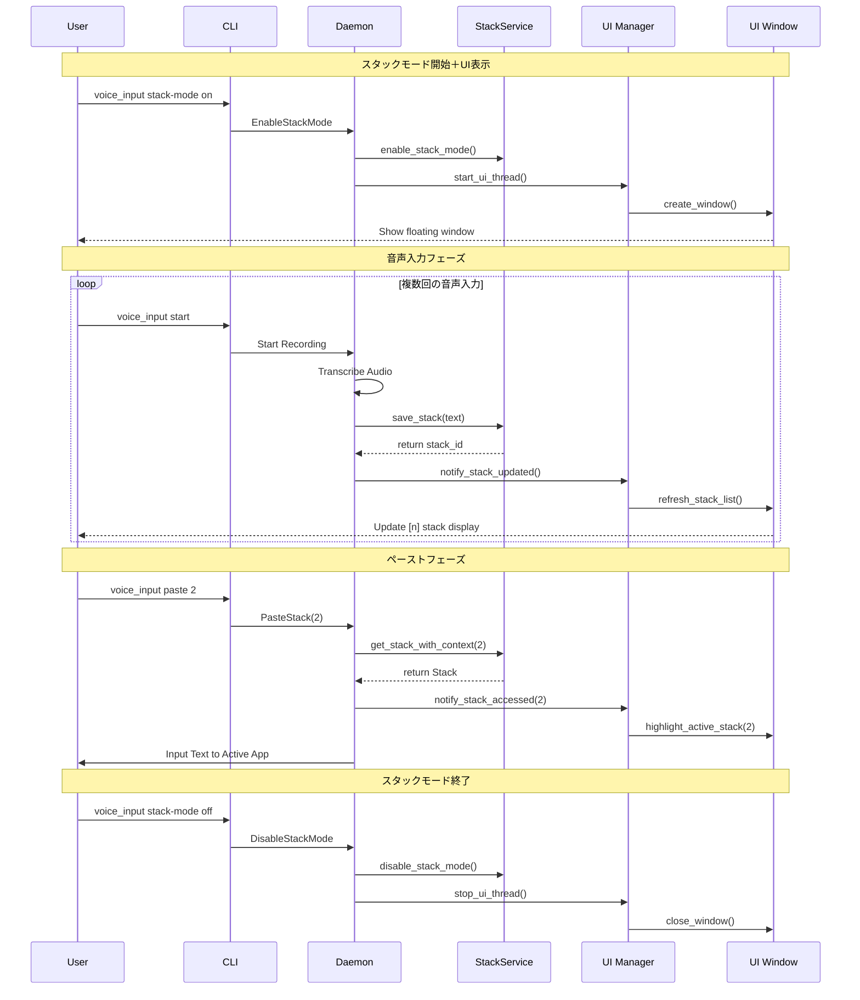

# Phase 4 詳細設計書: 基本UI実装

## Why - Phase 概要、目的

### Phase 概要
Phase 4では、マルチスタッキング機能の視覚的インターフェースを実装します。Phase 3で完成したスタック管理APIを基盤として、ユーザーがスタック状態を直感的に把握できるGUIコンポーネントを構築します。

### 目的
1. **視覚的フィードバック**: 音声入力結果のスタック蓄積状況をリアルタイムで視覚化
2. **ユーザビリティ向上**: CLIコマンドと連携した直感的なスタック状態表示
3. **ワークフロー効率化**: スタック番号とプレビューテキストの一覧表示で、ペースト対象選択を支援
4. **非侵入的UI**: 既存の音声入力ワークフローを阻害しない小型フローティングウィンドウ

## What - アーキテクチャ図、ディレクトリ構成、フロー図、成果物

### アーキテクチャ図

```
┌─────────────────────────────────────────────────────────────────┐
│                     User Interface Layer                        │
├─────────────────────────────────────────────────────────────────┤
│  CLI (voice_input)               │    Stack Manager UI (新規)    │
│  - stack-mode on/off             │  ┌────────────────────────┐   │
│  - paste <number>                │  │ 🟢 Stack Mode ON      │   │
│  - list-stacks                   │  ├────────────────────────┤   │
│  - clear-stacks                  │  │ [1] 最初の音声入力...  │   │
│                                  │  │ [2] 次の音声入力...    │   │
│                                  │  │ [3] さらに音声入力...  │   │
│                                  │  └────────────────────────┘   │
└─────────────────────────────────┬─────────────────────────────────┤
                                  │                                 │
                             Unix Socket                            │
                                  │                                 │
┌─────────────────────────────────┴─────────────────────────────────┤
│                    Daemon (voice_inputd)                          │
├────────────────────────────────────────────────────────────────────┤
│  ┌──────────────────┐    ┌─────────────────┐    ┌─────────────┐   │
│  │  Audio Recorder  │    │  Stack Storage  │    │ UI Manager  │   │
│  │  & Transcriber   │───▶│   - Vec<Stack>  │───▶│ (新規)      │   │
│  └──────────────────┘    └─────────────────┘    └─────────────┘   │
│                                    │                    │          │
│                          ┌─────────▼──────────┐        │          │
│                          │  Text Input/Paste  │        │          │
│                          │    Controller      │        │          │
│                          └────────────────────┘        │          │
│                                                         │          │
│  ┌──────────────────────────────────────────────────────▼────────┐ │
│  │                    UI Rendering Engine                        │ │
│  │               (egui + eframe backend)                         │ │
│  └────────────────────────────────────────────────────────────────┘ │
└────────────────────────────────────────────────────────────────────┘
```

### ディレクトリ構成

```
src/
├── infrastructure/
│   ├── ui/                          # 新規追加
│   │   ├── mod.rs                   # UI モジュール定義
│   │   ├── stack_manager_ui.rs      # スタック管理UI実装
│   │   ├── ui_manager.rs            # UI統合管理
│   │   └── types.rs                 # UI用データ型定義
│   ├── external/
│   └── ...
├── application/
│   ├── stack_service.rs             # 既存: UI連携API追加
│   └── ...
└── ...
```

### フロー図



### 成果物

#### 機能要件

1. **フローティングウィンドウ表示**
   - スタックモード有効時に自動表示
   - 画面下部に小型ウィンドウ配置
   - 常に最前面表示（Always on Top）
   - スタック数に応じて縦方向に自動リサイズ

2. **スタック一覧表示**
   - スタック番号 [1], [2], [3]... の視覚的表示
   - 各スタックのプレビューテキスト（40文字）表示
   - 作成時刻の簡易表示
   - アクティブスタック（最後にペーストされた）のハイライト

3. **リアルタイム更新**
   - 新規スタック保存時の即座な画面更新
   - ペースト実行時のハイライト表示
   - スタッククリア時の画面クリア

4. **UI状態管理**
   - スタックモード状態の視覚的表示（🟢 ON / 🔴 OFF）
   - スタック件数カウンター表示
   - UI表示/非表示の自動制御

#### 非機能要件

1. **パフォーマンス**
   - UI更新レイテンシ < 16ms（60FPS相当）
   - メモリ使用量 < 2MB（UI部分）
   - CPU使用率 < 1%（アイドル時）

2. **ユーザビリティ**
   - ウィンドウドラッグ移動対応
   - 最小化/復元機能
   - 透明度調整（80%透明度でオーバーレイ表示）

3. **互換性**
   - macOS 10.15+ 対応
   - 既存CLIワークフローとの完全互換性
   - UI無効でも全機能利用可能（フォールバック）

#### インターフェース・型レベルサンプルコード

```rust
// UI用データ構造
#[derive(Debug, Clone)]
pub struct StackDisplayInfo {
    pub number: u32,
    pub preview: String,
    pub created_at: String,
    pub is_active: bool,        // 最後にアクセスされたスタック
    pub char_count: usize,      // 文字数
}

// UI状態管理
#[derive(Debug, Clone)]
pub struct UiState {
    pub stack_mode_enabled: bool,
    pub stacks: Vec<StackDisplayInfo>,
    pub total_count: usize,
    pub last_accessed_id: Option<u32>,
}

// UI Manager 実装アーキテクチャ（調査結果反映）
pub struct UiManager {
    tx: mpsc::UnboundedSender<UiNotification>,
    ui_handle: Option<thread::JoinHandle<()>>,
    is_running: bool,
}

impl UiManager {
    pub fn new() -> Self {
        Self {
            tx: mpsc::unbounded_channel().0,
            ui_handle: None,
            is_running: false,
        }
    }

    pub fn start_ui(&mut self) -> Result<(), UiError> {
        let (tx, rx) = mpsc::unbounded_channel();
        self.tx = tx;
        
        let ui_handle = thread::spawn(move || {
            // UI専用のcurrent_threadランタイム
            let rt = tokio::runtime::Builder::new_current_thread()
                .enable_all()
                .build()
                .unwrap();
                
            rt.block_on(async {
                let native_options = eframe::NativeOptions {
                    viewport: egui::ViewportBuilder::default()
                        .with_always_on_top()        // 最前面表示
                        .with_transparent(true)      // 透明度対応
                        .with_decorations(false)     // フレームレス
                        .with_inner_size([300.0, 200.0])
                        .with_position([10.0, screen_height() - 250.0]),
                    ..Default::default()
                };
                
                eframe::run_native(
                    "Stack Manager",
                    native_options,
                    Box::new(|_cc| Box::new(StackManagerApp::new(rx)))
                ).unwrap();
            });
        });
        
        self.ui_handle = Some(ui_handle);
        self.is_running = true;
        Ok(())
    }

    pub fn notify(&self, notification: UiNotification) -> Result<(), UiError> {
        self.tx.send(notification)
            .map_err(|_| UiError::ChannelClosed)
    }
}

// Stack Manager App（egui実装）
struct StackManagerApp {
    rx: mpsc::UnboundedReceiver<UiNotification>,
    stacks: Vec<StackDisplayInfo>,
    stack_mode_enabled: bool,
    last_accessed_id: Option<u32>,
}

impl eframe::App for StackManagerApp {
    fn clear_color(&self, _visuals: &egui::Visuals) -> [f32; 4] {
        egui::Rgba::TRANSPARENT.to_array()  // 透明背景
    }

    fn update(&mut self, ctx: &egui::Context, _frame: &mut eframe::Frame) {
        // 非ブロッキングでメッセージ受信
        while let Ok(notification) = self.rx.try_recv() {
            self.handle_notification(notification);
        }
        
        // 60FPS維持
        ctx.request_repaint_after(Duration::from_millis(16));
        
        self.render_ui(ctx);
    }
}

// UI通知インターフェース
pub enum UiNotification {
    StackAdded(StackDisplayInfo),
    StackAccessed(u32),
    StacksCleared,
    ModeChanged(bool),
}

// エラー型
#[derive(Debug, Clone)]
pub enum UiError {
    InitializationFailed(String),
    ChannelClosed,
    RenderingError(String),
}
```

## How - 実装内容

### 目的
Phase 4では、既存のスタック管理機能に対して直感的な視覚的フィードバックを提供するUIシステムを構築します。音声入力ワークフローを妨げない非侵入的なデザインを重視し、Production Readyレベルの安定性を実現します。

### 成果物（モジュールorファイル）

1. **`src/infrastructure/ui/mod.rs`**: UI統合モジュール
2. **`src/infrastructure/ui/ui_manager.rs`**: UIライフサイクル管理
3. **`src/infrastructure/ui/stack_manager_ui.rs`**: スタック表示UIコンポーネント
4. **`src/infrastructure/ui/types.rs`**: UI専用データ型定義
5. **修正: `src/application/stack_service.rs`**: UI通知API追加
6. **修正: `Cargo.toml`**: egui依存関係追加

### 完了条件

- [ ] **基本UI表示**: スタックモード有効時にフローティングウィンドウが表示される
- [ ] **スタック一覧表示**: 保存されたスタックが番号とプレビューテキストで表示される
- [ ] **リアルタイム更新**: 新規スタック追加時に画面が即座に更新される
- [ ] **ハイライト機能**: ペースト実行時に対象スタックがハイライトされる
- [ ] **UI状態管理**: スタックモードON/OFF状態が視覚的に表示される
- [ ] **自動レイアウト**: スタック数に応じてウィンドウサイズが自動調整される
- [ ] **統合テスト**: E2Eテストでは手動確認、単体テストは自動実行
- [ ] **パフォーマンス**: 50スタック表示で60FPS維持、メモリ使用量2MB以下
- [ ] **型チェック**: `cargo check`成功
- [ ] **品質保証**: `cargo clippy -- -D warnings`警告0件

### 手動でのチェック項目

- [ ] **ウィンドウ表示確認**: スタックモードON時にUIウィンドウが画面下部に表示
- [ ] **テキスト表示確認**: 音声入力後、スタックリストにプレビューテキストが表示
- [ ] **ハイライト確認**: ペースト実行時に対象スタックが視覚的にハイライト
- [ ] **リアルタイム更新確認**: 複数回音声入力でリアルタイムにリストが拡張
- [ ] **ウィンドウ操作確認**: ドラッグ移動、最小化/復元の動作確認
- [ ] **クリア動作確認**: clear-stacksコマンドでUIもクリアされる
- [ ] **モード表示確認**: スタックモード状態が正確に表示される
- [ ] **透明度確認**: ウィンドウが適切な透明度で他アプリを邪魔しない

### 除外項目（やらないこと）

- **UI経由のスタック操作**: Phase 4ではRead-Only表示のみ（ボタンクリック等は実装しない）
- **高度なUI機能**: ドラッグ&ドロップ、コンテキストメニューは実装しない
- **設定画面**: UI設定・カスタマイズ機能は実装しない
- **複数ウィンドウ**: 1つのフローティングウィンドウのみ
- **他のUIライブラリ**: eguiのみ使用、他ライブラリとの比較検討は行わない
- **永続化UI設定**: ウィンドウ位置・サイズの保存は実装しない

## タスク分割（TDD推奨）

### Task 4.1: UI基盤とegui統合 🔧

- [ ] **依存関係追加**: Cargo.tomlにegui, eframe依存関係追加
  ```toml
  [dependencies]
  egui = "0.24"
  eframe = "0.24"
  ```
- [ ] **UIモジュール作成**: `src/infrastructure/ui/mod.rs`の基本構造実装
- [ ] **UI Manager骨格**: `ui_manager.rs`で調査結果に基づくアーキテクチャ実装
  - tokio current_threadランタイム使用
  - mpsc::unbounded_channelでの通信
  - 別スレッドでのUI実行
- [ ] **テスト作成**: UI Managerの基本機能テスト（TDD）
- [ ] **統合確認**: `cargo check`でコンパイル成功確認

### Task 4.2: スタック表示UIコンポーネント 🎨

- [ ] **データ型定義**: `types.rs`でStackDisplayInfo等の型定義
- [ ] **UIコンポーネント作成**: `stack_manager_ui.rs`のeframeApp実装
- [ ] **フローティングウィンドウ設定**: 調査結果に基づく実装
  - `with_always_on_top()`: 最前面表示
  - `with_transparent(true)`: 透明度対応
  - `with_decorations(false)`: フレームレス
  - `clear_color()`: 透明背景設定
- [ ] **テスト作成**: スタック表示ロジックの単体テスト（TDD）
- [ ] **手動テスト**: フローティングウィンドウ表示確認
- [ ] **macOS互換性確認**: 透明度動作の確認（フォールバック実装含む）

### Task 4.3: StackServiceとUI連携API 🔗

- [ ] **通知システム設計**: UI更新通知の仕組み設計
- [ ] **StackService拡張**: UI通知メソッドの追加実装
- [ ] **テスト作成**: UI通知機能の単体テスト（TDD）
- [ ] **連携テスト作成**: StackService ↔ UI Manager連携テスト
- [ ] **統合確認**: `cargo test`で全テスト成功確認

### Task 4.4: リアルタイム更新機能 ⚡

- [ ] **更新イベント定義**: UiNotification enumの実装
- [ ] **非同期通信実装**: 調査結果に基づく実装
  - `try_recv()`による非ブロッキング受信
  - `request_repaint_after(Duration::from_millis(16))`で60FPS維持
  - UI threadとdaemon threadの分離
- [ ] **イベント処理実装**: StackManagerApp内でのnotification処理
- [ ] **テスト作成**: リアルタイム更新のテスト（TDD）
- [ ] **パフォーマンステスト**: 更新レイテンシ < 16ms確認
- [ ] **手動テスト**: 音声入力→UI更新の動作確認

### Task 4.5: デーモン統合とライフサイクル管理 🚀

- [ ] **voice_inputd統合**: デーモンでのUI Manager初期化
- [ ] **スレッド管理**: 調査結果に基づく実装
  - daemonプロセス内でのUI thread spawn
  - tokio runtime管理の分離
  - graceful shutdownの実装
- [ ] **スタックモード連携**: モードON/OFF時のUI制御実装
- [ ] **エラーハンドリング**: UI起動失敗時のフォールバック実装
  - UI無効時の完全CLI動作保証
  - egui初期化失敗時の適切なエラー処理
- [ ] **テスト作成**: ライフサイクル管理のテスト（TDD）
- [ ] **統合テスト**: 完全ワークフローの動作確認

### Task 4.6: ハイライト機能とUX向上 ✨

- [ ] **ハイライト機能**: アクティブスタックの視覚的強調実装
- [ ] **UI状態表示**: スタックモード状態の視覚的表示
- [ ] **透明度実装**: 調査結果に基づく実装
  - `egui::Frame::none()`でのパネル背景除去
  - macOS互換性問題への対応（半透明色フォールバック）
  - 80%透明度での非侵入的表示
- [ ] **ウィンドウ操作**: ドラッグ移動機能実装
- [ ] **テスト作成**: ハイライト機能のテスト（TDD）
- [ ] **手動テスト**: UX要素の動作確認

### Task 4.7: パフォーマンス最適化とテスト ⚡

- [ ] **パフォーマンステスト**: レンダリング速度、メモリ使用量測定
- [ ] **最適化実装**: 必要に応じた描画最適化
- [ ] **負荷テスト**: 50スタック表示での安定性確認
- [ ] **メモリリークテスト**: 長時間動作でのメモリ監視
- [ ] **ベンチマーク記録**: 性能指標の記録・文書化

### Task 4.8: 品質保証と完成度チェック ✅

- [ ] **包括的テスト**: 全機能のE2Eテスト実行
- [ ] **エッジケース**: 異常系・境界値テスト
- [ ] **コード品質**: `cargo clippy -- -D warnings`で警告0件確認
- [ ] **ドキュメント**: コードコメント、型定義の文書化
- [ ] **Production Ready確認**: 本番環境での動作品質確認

## 手動でのチェック項目

### 基本動作確認

- [ ] **スタックモード開始**: `voice_input stack-mode on`でUIウィンドウが表示される
- [ ] **音声入力→表示**: 音声入力後、スタックがUIに即座に表示される
- [ ] **ペースト→ハイライト**: `voice_input paste 1`で対象スタックがハイライト
- [ ] **一覧表示確認**: 複数スタック保存後、全て正確に表示される
- [ ] **クリア確認**: `voice_input clear-stacks`でUIもクリアされる
- [ ] **スタックモード終了**: `voice_input stack-mode off`でUIウィンドウが閉じる

### UI/UX確認

- [ ] **ウィンドウ位置**: 画面下部に適切に配置される
- [ ] **透明度**: 他のアプリケーションを適度に透過表示
- [ ] **サイズ調整**: スタック数に応じて縦方向にリサイズ
- [ ] **ドラッグ移動**: ウィンドウをドラッグで移動可能
- [ ] **最前面表示**: 他ウィンドウの前に常に表示される
- [ ] **テキスト表示**: プレビューテキストが読みやすく表示
- [ ] **状態表示**: スタックモードON/OFF状態が明確に識別可能

### パフォーマンス確認

- [ ] **応答性**: 音声入力からUI更新まで1秒以内
- [ ] **スムーズ描画**: スクロール、リサイズがスムーズ
- [ ] **メモリ使用量**: Activity Monitorで2MB以下を確認
- [ ] **CPU使用率**: アイドル時1%以下を確認
- [ ] **長時間動作**: 1時間連続使用でメモリリーク無し