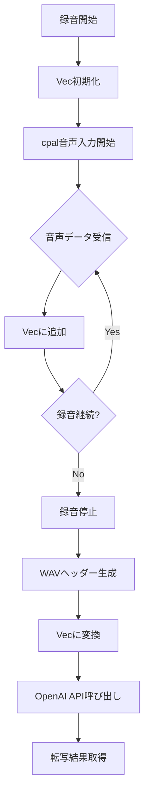

# ファイル保存方式削除 クリーンアップ計画書

## Why

### 概要
音声データのオンメモリ処理実装が完了し、ファイル保存方式（レガシーモード）は不要となった。レガシーモードを削除することで、コードベースの簡素化とメンテナンス性の向上を図る。

### 目的
1. **コードベースの簡素化**
   - 条件分岐の削除によるコードの可読性向上
   - テストケースの削減
   - メンテナンスコストの削減

2. **リソース管理の改善**
   - 一時ファイル管理の完全な排除
   - ファイルシステムへのアクセス削減
   - 潜在的なファイルリークの防止

3. **インターフェースの統一**
   - AudioData型をメモリモードのみに統一
   - APIの簡素化

## What

### アーキテクチャ図

```
┌─────────────────────────────────────────────────┐
│                  voice_inputd                   │
│                                                 │
│  ┌─────────────┐    ┌──────────────────────┐  │
│  │   cpal      │    │   CpalAudioBackend   │  │
│  │  (音声入力)  ├───▶│    (簡素化版)        │  │
│  └─────────────┘    │                      │  │
│                     │  ┌────────────────┐  │  │
│                     │  │ メモリバッファ  │  │  │
│                     │  │  Vec<i16>      │  │  │
│                     │  └───────┬────────┘  │  │
│                     │          ▼           │  │
│                     │  ┌────────────────┐  │  │
│                     │  │ WAVフォーマット│  │  │
│                     │  │ Vec<u8>生成    │  │  │
│                     │  └────────────────┘  │  │
│                     └──────────────────────┘  │
│                                                 │
│  ┌─────────────────────────────────────────┐  │
│  │         OpenAI API Client               │  │
│  │    multipart::Part::bytes(wav_data)     │  │
│  └─────────────────────────────────────────┘  │
└─────────────────────────────────────────────────┘

削除: cpal → WavWriter(File) → ファイル読込 → API
残留: cpal → Vec<i16> → WAV Vec<u8> → API
```

### ディレクトリ構成

```
src/
├── infrastructure/
│   ├── audio/
│   │   ├── mod.rs
│   │   └── cpal_backend.rs      # 簡素化（メモリモードのみ）
│   └── external/
│       └── openai.rs           # 簡素化（メモリデータのみ）
├── domain/
│   └── recorder.rs             # stop()メソッド削除
└── ipc.rs                      # AudioDataDto簡素化
```

### フロー図



### 成果物（機能、非機能）

#### 機能要件

1. **AudioData型の簡素化**
   ```rust
   // 現在
   pub enum AudioData {
       Memory(Vec<u8>),
       File(PathBuf),
   }
   
   // 削除後
   pub struct AudioData(pub Vec<u8>);
   ```

2. **CpalAudioBackendの簡素化**
   - RecordingState列挙型の削除
   - メモリモード専用の実装
   - is_legacy_mode()関数の削除
   - build_input_stream()関数の削除（ファイル書き込み用）

3. **OpenAI APIクライアントの簡素化**
   ```rust
   // 現在
   pub async fn transcribe_audio(&self, audio_data: AudioData) -> Result<String, String> {
       let wav_data = match audio_data {
           AudioData::Memory(data) => data,
           AudioData::File(path) => std::fs::read(&path)?,
       };
       // ...
   }
   
   // 削除後
   pub async fn transcribe_audio(&self, audio_data: AudioData) -> Result<String, String> {
       let wav_data = audio_data.0;
       // ...
   }
   ```

4. **Recorderインターフェースの改善**
   - stop()メソッドの削除（廃止予定API）
   - stop_raw()をstop()にリネーム

#### 非機能要件

1. **パフォーマンス**
   - デフォルトでメモリモードのパフォーマンスを享受
   - 条件分岐削除による若干の性能改善

2. **保守性**
   - コードの複雑性低減
   - テストケースの削減
   - デバッグの容易化

## How

### 内容

#### Phase 1: AudioData型とIPC層の簡素化
- **目的**: データ型を統一し、下位層から上位層への影響を最小化
- **成果物**:
  - `AudioData`型の簡素化（enumからstructへ）
  - `AudioDataDto`型の簡素化
  - IPC層の更新
- **完了条件**:
  - コンパイルエラーなし
  - 既存テストの修正完了
- **手動でのチェック項目**:
  - `cargo check`でコンパイルエラーがないこと
  - `cargo clippy`で警告がないこと
- **除外項目**:
  - 実際の動作確認（Phase 3で実施）

#### Phase 2: CpalAudioBackendの簡素化
- **目的**: 録音処理からファイルモード関連コードを削除
- **成果物**:
  - `RecordingState`列挙型の削除
  - ファイルモード関連メソッドの削除
  - メモリモード専用の実装
- **完了条件**:
  - ファイルモード関連コードの完全削除
  - メモリモードのみでの動作
- **手動でのチェック項目**:
  - hound依存関係の削除確認
  - 環境変数`LEGACY_TMP_WAV_FILE`への参照がないこと
- **除外項目**:
  - パフォーマンス最適化

#### Phase 3: OpenAIクライアントとRecorderの簡素化
- **目的**: 上位層のインターフェースを整理
- **成果物**:
  - OpenAIクライアントのファイルパス処理削除
  - Recorder::stop()メソッドの削除
  - stop_raw()のstop()へのリネーム
- **完了条件**:
  - 廃止予定APIの削除
  - インターフェースの統一
- **手動でのチェック項目**:
  - APIの後方互換性確認（必要に応じて移行ガイド作成）
- **除外項目**:
  - 他の音声認識APIへの対応

#### Phase 4: テストコードのクリーンアップ
- **目的**: ファイルモード関連のテストを削除し、テストスイートを簡素化
- **成果物**:
  - ファイルモードE2Eテストの削除
  - モード切替テストの削除
  - パフォーマンステストの更新
- **完了条件**:
  - 全テストがパス
  - テストカバレッジの維持
- **手動でのチェック項目**:
  - `cargo test`で全テストがパスすること
  - CI/CDパイプラインの成功
- **除外項目**:
  - 新規テストの追加

#### Phase 5: ドキュメントとクリーンアップ
- **目的**: プロジェクト全体の整合性確保
- **成果物**:
  - README.mdの更新
  - CLAUDE.mdの更新
  - 不要な依存関係の削除（hound）
  - デーモンのメタデータファイル処理削除
- **完了条件**:
  - ドキュメントの整合性
  - 依存関係の最小化
- **手動でのチェック項目**:
  - `cargo build --release`でのビルド成功
  - バイナリサイズの削減確認
- **除外項目**:
  - 機能追加

### タスク分割

#### Phase 1: AudioData型とIPC層の簡素化
- [x] `src/infrastructure/audio/cpal_backend.rs`の`AudioData`をenumからstructに変更
- [x] `src/ipc.rs`の`AudioDataDto`を同様に簡素化
- [x] AudioData/AudioDataDto間の変換実装を更新
- [x] 関連するuseステートメントの更新
- [x] コンパイルエラーの解消
- [x] 既存テストの修正

#### Phase 2: CpalAudioBackendの簡素化
- [x] `RecordingState`列挙型の削除
- [x] `is_legacy_mode()`関数の削除
- [x] `make_output_path()`関数の削除
- [x] `build_input_stream()`関数の削除
- [x] `start_recording()`からファイルモード分岐を削除
- [x] `stop_recording()`からファイルモード処理を削除
- [x] `output_path`フィールドの削除
- [x] `recording_state`フィールドの型変更
- [x] hound依存関係の削除（Cargo.toml）

#### Phase 3: OpenAIクライアントとRecorderの簡素化
- [x] OpenAIクライアントの`transcribe_audio()`からmatch文を削除
- [x] OpenAIクライアントの`transcribe()`と`transcribe_with_prompt()`の削除または更新
- [x] Recorderの`stop()`メソッド削除
- [x] Recorderの`stop_raw()`を`stop()`にリネーム
- [x] Recorderの`is_memory_mode()`削除
- [x] voice_inputdでのメタデータファイル処理削除

#### Phase 4: テストコードのクリーンアップ
- [x] `tests/e2e/file_mode_test.rs`の削除
- [x] `tests/e2e/mode_switch_test.rs`の削除
- [x] `tests/e2e/mod.rs`から`start_voice_inputd()`のlegacy_mode引数削除
- [x] `tests/performance_test.rs`からファイルモード関連テスト削除
- [x] `benches/recording.rs`からファイルモードベンチマーク削除
- [x] その他のテストファイルから`LEGACY_TMP_WAV_FILE`参照削除

#### Phase 5: ドキュメントとクリーンアップ
- [x] README.mdから環境変数`LEGACY_TMP_WAV_FILE`の説明削除
- [x] CLAUDE.mdの更新（該当する場合）
- [x] Cargo.tomlからhound依存関係削除
- [x] 不要なimport文の削除
- [x] `cargo fmt`の実行
- [x] `cargo clippy`の実行
- [x] 最終的な動作確認

### 手動でのチェック項目

#### 各Phase共通
- [x] `cargo check`でコンパイルエラーがないこと
- [x] `cargo clippy -- -D warnings`で警告がないこと
- [x] `cargo fmt`でフォーマットが整っていること

#### Phase 1完了時
- [x] AudioData型が正しく簡素化されていること
- [x] IPC通信が正常に動作すること

#### Phase 2完了時
- [x] 環境変数`LEGACY_TMP_WAV_FILE`を設定してもメモリモードで動作すること
- [x] `/tmp`ディレクトリにWAVファイルが作成されないこと

#### Phase 3完了時
- [x] 録音→転写の基本フローが動作すること
- [x] エラーハンドリングが適切に機能すること

#### Phase 4完了時
- [x] `cargo test`で全テストがパスすること
- [x] `cargo test --features ci-test`でCIテストがパスすること
- [x] テストカバレッジが大幅に低下していないこと

#### Phase 5完了時
- [x] `cargo build --release`でリリースビルドが成功すること
- [x] バイナリサイズが削減されていること
- [x] ドキュメントに矛盾がないこと
- [ ] 実機での動作確認（録音→転写→ペースト）