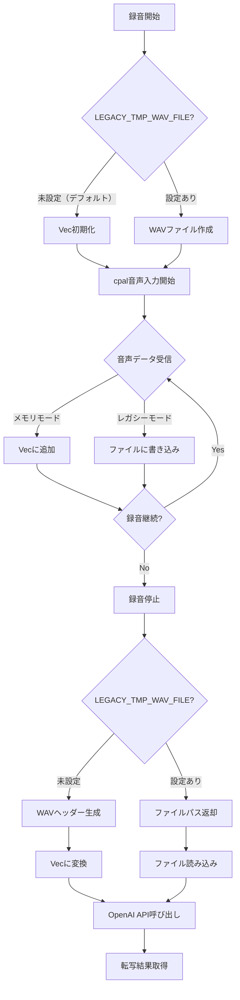

# オンメモリ音声データ処理 開発設計書

## Why

### 概要
現在の音声録音システムは一時ファイル（/tmp/voice_input_*.wav）を介してOpenAI APIに音声データを送信している。この処理をメモリ上で完結させることで、ディスクI/Oを削減し、処理を高速化する。

### 目的
1. **パフォーマンス向上**
   - ディスクI/Oの削除による処理時間短縮
   - ファイル作成・読み込み・削除のオーバーヘッド排除
   - システムコールの削減

2. **実装の簡素化**
   - 一時ファイル管理の不要化
   - エラーハンドリングの簡素化
   - クリーンアップ処理の削除

## What

### アーキテクチャ図

```
┌─────────────────────────────────────────────────┐
│                  voice_inputd                   │
│                                                 │
│  ┌─────────────┐    ┌──────────────────────┐  │
│  │   cpal      │    │   CpalAudioBackend   │  │
│  │  (音声入力)  ├───▶│    (修正版)          │  │
│  └─────────────┘    │                      │  │
│                     │  ┌────────────────┐  │  │
│                     │  │ メモリバッファ  │  │  │
│                     │  │  Vec<i16>      │  │  │
│                     │  └───────┬────────┘  │  │
│                     │          ▼           │  │
│                     │  ┌────────────────┐  │  │
│                     │  │ WAVフォーマット│  │  │
│                     │  │ Vec<u8>生成    │  │  │
│                     │  └────────────────┘  │  │
│                     └──────────────────────┘  │
│                                                 │
│  ┌─────────────────────────────────────────┐  │
│  │         OpenAI API Client (修正)         │  │
│  │    multipart::Part::bytes(wav_data)     │  │
│  └─────────────────────────────────────────┘  │
└─────────────────────────────────────────────────┘

レガシー: cpal → WavWriter(File) → ファイル読込 → API
デフォルト: cpal → Vec<i16> → WAV Vec<u8> → API
```

### ディレクトリ構成

```
src/
├── infrastructure/
│   ├── audio/
│   │   ├── mod.rs
│   │   └── cpal_backend.rs      # 修正（メモリ/ファイル両対応）
│   └── external/
│       └── openai.rs           # 修正（メモリデータ対応）
└── domain/
    └── recorder.rs             # 変更なし
```

### フロー図



### 成果物（機能、非機能）

#### 機能要件
1. **CpalAudioBackendの拡張**
   - メモリモードとファイルモードの切り替え機能
   - メモリモード時のPCMデータバッファリング
   - WAVフォーマットヘッダーの生成機能

2. **OpenAI APIクライアントの修正**
   - Vec<u8>からの直接送信対応
   - 既存のファイルパス入力との互換性維持

3. **モード切り替え**
   - 環境変数 `LEGACY_TMP_WAV_FILE` での切り替え
   - デフォルトはメモリモード（高速化優先）
   - レガシーモード（ファイル）はオプトイン

#### 非機能要件
1. **パフォーマンス**
   - ファイルI/O削減による処理時間短縮
   - メモリ使用量: 録音時間×48kHz×2ch×2byte以内

2. **互換性**
   - 既存のインターフェース変更なし
   - エラーハンドリングの維持

## How

| Phase | 目的 | 成果物 | 完了条件 | 除外項目 |
|-------|------|--------|----------|----------|
| Phase 1 | WAVヘッダー生成機能 | - cpal_backend.rs内にWAVヘッダー生成関数<br>- PCMデータとの結合処理<br>- 単体テスト | - 有効なWAVデータ生成<br>- 既存のhoundライブラリとの互換性<br>- Vec<u8>出力 | - ストリーミング対応<br>- 複雑なフォーマット対応 |
| Phase 2 | メモリバッファ実装 | - cpal_backend.rs内にメモリモード追加<br>- Vec<i16>でのデータ収集<br>- LEGACY_TMP_WAV_FILE環境変数判定 | - 音声データのメモリ収集成功<br>- レガシーモードとの共存<br>- stop_recording()でVec<u8>返却 | - パフォーマンス最適化<br>- メモリ上限管理 |
| Phase 3 | API統合 | - openai.rs修正<br>- Vec<u8>入力対応<br>- 既存インターフェース維持 | - メモリデータから直接送信<br>- ファイルパスからの送信も維持<br>- エラーハンドリング | - 他の音声認識API対応<br>- バッチ処理 |
| Phase 4 | 統合テスト | - E2Eテスト追加<br>- パフォーマンス測定<br>- ドキュメント更新<br>- CI/CD統合<br>- メモリ監視機能 | - メモリモードでの録音→転写成功<br>- ファイルモードとの比較完了<br>- README更新<br>- GitHub Actions統合完了 | - 実機での音声デバイステスト<br>- クロスプラットフォーム対応 |

### 実装時の技術詳細

#### WAVヘッダー構造（44バイト）
```rust
// 実装イメージ
fn create_wav_header(data_len: u32, sample_rate: u32, channels: u16) -> Vec<u8> {
    let mut header = Vec::with_capacity(44);
    // RIFF header
    header.extend(b"RIFF");
    header.extend((36 + data_len).to_le_bytes());
    header.extend(b"WAVE");
    // fmt chunk
    header.extend(b"fmt ");
    header.extend(16u32.to_le_bytes());
    // ... 以下省略
}
```

#### メモリ使用量
- 30秒録音時: 約5.5MB（48kHz×2ch×2byte×30秒）
- 環境変数 LEGACY_TMP_WAV_FILE=true でレガシーモード（ファイル）有効化
- デフォルトはメモリモード（環境変数未設定時）

### 設計上の決定事項

#### 確定事項
1. **メモリ不足時の動作**
   - エラーとして処理する
   - レガシーモードへの自動フォールバックは行わない
   - 明確なエラーメッセージを返す

2. **サンプルフォーマット対応**
   - i16とf32の両方をサポート
   - 現在のcpal実装と同等の柔軟性を維持
   - f32の場合はi16への変換処理を含む

#### 詳細設計で明確化する事項
1. **AudioBackendトレイトのインターフェース**
   - 戻り値の型設計（enum vs 別メソッド）
   - 既存コードとの互換性維持方法

2. **デーモンプロセスとの連携**
   - IPC通信プロトコルの変更要否
   - voice_inputdでのデータ受け渡し方法

3. **テスト戦略**
   - 環境変数切り替えのテスト方法
   - メモリ/ファイルモードの結果比較方法