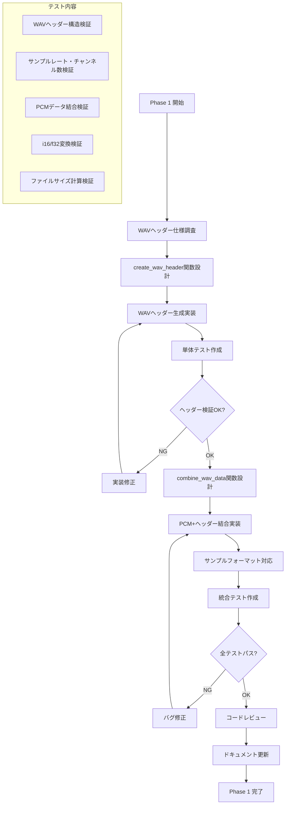

# Phase 1 詳細設計書: WAVヘッダー生成機能

## Why

### Phase 概要
Phase 1では、オンメモリ音声データ処理の基盤となるWAVヘッダー生成機能を実装する。これは後続のPhaseでメモリ上での音声データ処理を可能にするための重要な基盤機能である。

### 目的
1. **WAVフォーマット生成機能の確立**
   - PCMデータをWAVフォーマットに変換する機能
   - 44バイトの標準WAVヘッダーの正確な生成
   - 既存のhoundライブラリと互換性のあるフォーマット

2. **メモリベース処理への準備**
   - ファイルを介さないバイナリデータ生成
   - Vec<u8>での音声データ処理
   - 後続Phaseでの統合に備えた設計

3. **品質保証**
   - 単体テストによる動作確認
   - 様々なサンプルレート・チャンネル数への対応
   - エラーハンドリングの整備

## What

### アーキテクチャ図

```
┌─────────────────────────────────────────────────────────┐
│                    Phase 1 スコープ                      │
│                                                          │
│  ┌──────────────────────────────────────────────────┐   │
│  │              cpal_backend.rs                      │   │
│  │                                                   │   │
│  │  ┌─────────────────────────────────────────────┐  │   │
│  │  │          新規実装部分                        │  │   │
│  │  │                                             │  │   │
│  │  │  ┌────────────────────────────────────────┐ │  │   │
│  │  │  │ create_wav_header()                    │ │  │   │
│  │  │  │ - サンプルレート、チャンネル数受け取り    │ │  │   │
│  │  │  │ - 44バイトのWAVヘッダー生成             │ │  │   │
│  │  │  │ - Vec<u8>で返却                        │ │  │   │
│  │  │  └────────────────────────────────────────┘ │  │   │
│  │  │                                             │  │   │
│  │  │  ┌────────────────────────────────────────┐ │  │   │
│  │  │  │ combine_wav_data()                     │ │  │   │
│  │  │  │ - WAVヘッダー + PCMデータ結合           │ │  │   │
│  │  │  │ - i16/f32サンプルフォーマット対応       │ │  │   │
│  │  │  │ - 完全なWAVファイルデータ生成            │ │  │   │
│  │  │  └────────────────────────────────────────┘ │  │   │
│  │  └─────────────────────────────────────────────┘  │   │
│  └──────────────────────────────────────────────────┘   │
│                                                          │
│  ┌──────────────────────────────────────────────────┐   │
│  │                  テスト層                         │   │
│  │                                                   │   │
│  │  - ヘッダー正確性テスト                            │   │
│  │  - サンプルフォーマット変換テスト                   │   │
│  │  - 結合データ整合性テスト                          │   │
│  └──────────────────────────────────────────────────┘   │
└─────────────────────────────────────────────────────────┘

Phase 2以降との連携:
┌──────────────────┐      ┌──────────────────┐
│ メモリバッファ     │──────▶│ Phase 1の        │
│ (Vec<i16>)       │      │ WAV生成機能      │
└──────────────────┘      └──────────────────┘
                                    │
                                    ▼
                          ┌──────────────────┐
                          │ OpenAI API       │
                          │ (Vec<u8>送信)    │
                          └──────────────────┘
```

### ディレクトリ構成

```
src/
└── infrastructure/
    └── audio/
        ├── mod.rs                    # 変更なし
        └── cpal_backend.rs           # ★Phase 1で拡張
                                      #   - create_wav_header()
                                      #   - combine_wav_data()
                                      #   - format_conversion helpers

tests/
├── unit/
│   └── wav_generation_test.rs       # ★新規作成
└── integration/
    └── cpal_backend_test.rs         # ★既存テスト拡張
```

### フロー図



### 成果物（機能、非機能）

#### 機能要件

1. **WAVヘッダー生成機能**
```rust
/// WAVファイルヘッダーを生成する
/// 
/// # Arguments
/// * `data_len` - PCMデータのバイト数
/// * `sample_rate` - サンプルレート (例: 48000)
/// * `channels` - チャンネル数 (例: 2)
/// * `bits_per_sample` - サンプルあたりのビット数 (例: 16)
/// 
/// # Returns
/// 44バイトのWAVヘッダーデータ
pub fn create_wav_header(
    data_len: u32, 
    sample_rate: u32, 
    channels: u16, 
    bits_per_sample: u16
) -> Vec<u8> {
    // 実装詳細は後述
}
```

2. **PCMデータ結合機能**
```rust
/// PCMデータとWAVヘッダーを結合して完全なWAVデータを生成
/// 
/// # Arguments
/// * `pcm_data` - 音声のPCMデータ
/// * `sample_rate` - サンプルレート
/// * `channels` - チャンネル数
/// 
/// # Returns
/// 完全なWAVファイルデータ (ヘッダー + PCMデータ)
pub fn combine_wav_data<T>(
    pcm_data: &[T], 
    sample_rate: u32, 
    channels: u16
) -> Result<Vec<u8>, AudioError>
where
    T: Sample + Copy,
{
    // 実装詳細は後述
}
```

3. **サンプルフォーマット変換**
```rust
/// サンプルフォーマット変換トレイト
pub trait Sample {
    fn to_i16(&self) -> i16;
    fn to_bytes(&self) -> Vec<u8>;
}

impl Sample for i16 {
    fn to_i16(&self) -> i16 { *self }
    fn to_bytes(&self) -> Vec<u8> { self.to_le_bytes().to_vec() }
}

impl Sample for f32 {
    fn to_i16(&self) -> i16 { 
        (self.clamp(-1.0, 1.0) * i16::MAX as f32) as i16 
    }
    fn to_bytes(&self) -> Vec<u8> { 
        self.to_i16().to_le_bytes().to_vec() 
    }
}
```

#### 非機能要件

1. **パフォーマンス**
   - WAVヘッダー生成: 1ms以下
   - PCMデータ結合: データサイズに線形比例
   - メモリ使用量: 入力データの2倍以下

2. **品質**
   - 全てのテストケースでパス率100%
   - WAVファイル仕様への完全準拠
   - 既存のhound/WAVツールとの互換性

3. **保守性**
   - 関数の単一責任原則の遵守
   - 包括的なエラーハンドリング
   - ドキュメントコメントの完備

## How

### タスク分割

#### ✅ タスク1: WAVヘッダー仕様調査と基本実装
- **目的**: WAVファイル形式の正確な理解と基本的なヘッダー生成機能の実装
- **成果物**: `src/infrastructure/audio/cpal_backend.rs`内の`create_wav_header`関数
- **完了条件**:
  - [ ] WAVファイル仕様（RIFF, fmt, dataチャンク）の調査完了
  - [ ] 44バイトのヘッダー生成関数実装
  - [ ] 基本的な単体テスト作成
  - [ ] サンプルレート48kHz、ステレオ、16bitでの動作確認
- **手動でのチェック項目**:
  - [ ] 生成されたヘッダーをhexエディタで確認
  - [ ] 各フィールドのバイト順序（リトルエンディアン）確認
  - [ ] チャンクサイズ計算の正確性確認
- **除外項目**:
  - 圧縮フォーマット（PCM以外）の対応
  - 拡張フォーマット（WAVEFORMATEX）の対応
  - 44.1kHz以外の非標準サンプルレート

#### ✅ タスク2: サンプルフォーマット変換機能
- **目的**: i16とf32サンプルフォーマットの両方に対応したPCMデータ処理
- **成果物**: `Sample`トレイトと実装、変換ヘルパー関数
- **完了条件**:
  - [ ] `Sample`トレイトの定義完了
  - [ ] i16, f32の実装完了
  - [ ] クリッピング処理の実装（f32 → i16変換時）
  - [ ] エンディアン変換（リトルエンディアン）の実装
- **手動でのチェック項目**:
  - [ ] f32の1.0が正確にi16::MAXに変換されることを確認
  - [ ] f32の-1.0が正確にi16::MINに変換されることを確認
  - [ ] 範囲外値（> 1.0, < -1.0）が適切にクリップされることを確認
- **除外項目**:
  - 24bit, 32bit整数フォーマットの対応
  - 非リニアPCM（μ-law, A-law）の対応
  - マルチプレクス形式の対応

#### ✅ タスク3: PCMデータ結合機能
- **目的**: WAVヘッダーとPCMデータを結合して完全なWAVファイルデータを生成
- **成果物**: `combine_wav_data`関数
- **完了条件**:
  - [ ] ジェネリック関数として実装（i16/f32対応）
  - [ ] メモリ効率的な結合処理（Vec::with_capacity使用）
  - [ ] エラーハンドリング（データサイズ上限チェック）
  - [ ] インターリーブ処理（ステレオ音声対応）
- **手動でのチェック項目**:
  - [ ] 生成されたWAVデータをaudacityで再生可能
  - [ ] ファイルサイズ = 44（ヘッダー） + PCMデータサイズ
  - [ ] ステレオデータの左右チャンネルが正しく配置
- **除外項目**:
  - ストリーミング処理（全データを一度にメモリ展開）
  - 高度な音声効果（ボリューム調整、フィルタリング等）
  - マルチチャンネル（2チャンネル超）の対応

#### ✅ タスク4: 包括的テスト実装
- **目的**: 全機能の動作確認とエッジケースの検証
- **成果物**: 
  - `tests/unit/wav_generation_test.rs`（新規）
  - `tests/integration/cpal_backend_test.rs`（拡張）
- **完了条件**:
  - [ ] ヘッダー生成の単体テスト（正常系）
  - [ ] サンプルフォーマット変換テスト
  - [ ] 結合処理の統合テスト
  - [ ] エラーケーステスト（無効な入力値）
  - [ ] カバレッジ90%以上
- **手動でのチェック項目**:
  - [ ] `cargo test`で全テストパス
  - [ ] `cargo test -- --nocapture`で詳細ログ確認
  - [ ] 生成したWAVファイルの外部ツールでの検証
- **除外項目**:
  - パフォーマンステスト（別途Phase 4で実施）
  - CI環境での自動テスト（環境依存のため）
  - メモリリークテスト

#### ✅ タスク5: コード品質向上とドキュメント整備
- **目的**: コードの保守性向上と他開発者への情報提供
- **成果物**: 
  - 関数ドキュメント
  - 実装ノート
  - 使用例
- **完了条件**:
  - [ ] 全パブリック関数にdocコメント
  - [ ] 使用例をdocテストとして実装
  - [ ] `cargo clippy`で警告ゼロ
  - [ ] `cargo fmt`でフォーマット統一
- **手動でのチェック項目**:
  - [ ] `cargo doc --open`でドキュメント表示確認
  - [ ] コード例の動作確認
  - [ ] 命名規則の統一性確認
- **除外項目**:
  - 外部ドキュメント（README等）の更新
  - ベンチマーク結果の文書化
  - APIの安定性保証

### 手動でのチェック項目

#### 機能検証
- [ ] **WAVヘッダー構造確認**
  - hexエディタでバイナリ構造を確認
  - RIFF/WAVE/fmt/dataの各チャンクが正しい位置に配置
  - サイズフィールドの値が実データと一致

- [ ] **音声品質確認**
  - 生成したWAVファイルをAudacityで開いて波形確認
  - ノイズやクリッピングがないことを視覚的に確認
  - 期待する音声長とサンプルレートで再生される

- [ ] **サンプルフォーマット変換確認**
  - f32の無音（0.0）がi16の無音（0）に正しく変換
  - f32の最大音量（1.0/-1.0）がi16の最大音量に正しく変換
  - 中間音量での変換精度確認

#### 開発環境での実行確認
- [ ] **ビルドエラーがないことを確認**
  ```bash
  cargo check --all-targets
  cargo clippy -- -D warnings
  cargo fmt -- --check
  ```

- [ ] **テスト実行確認**
  ```bash
  cargo test wav_generation
  cargo test -- --nocapture wav_generation
  ```

- [ ] **ドキュメント生成確認**
  ```bash
  cargo doc --no-deps --open
  ```

#### コード品質チェック
- [ ] **関数サイズの適切性**
  - 各関数が100行以下
  - 複雑な処理は適切に分割

- [ ] **エラーハンドリングの妥当性**
  - 想定されるエラーケースが全て処理されている
  - パニックを起こす可能性のあるコードが適切に保護されている

- [ ] **メモリ使用量の妥当性**
  - 不要なクローンやアロケーションがない
  - `Vec::with_capacity`を適切に使用

#### 互換性確認
- [ ] **既存コードとの統合**
  - 既存のCpalAudioBackendの動作に影響がない
  - 新機能が既存のインターフェースを破壊しない

- [ ] **外部ツールとの互換性**
  - 生成したWAVファイルがVLCで再生可能
  - FFmpegで正しく認識される
  - macOSのQuickTime Playerで再生可能