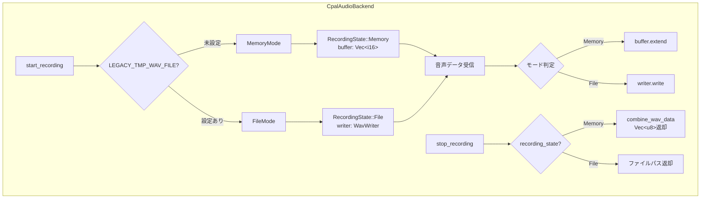
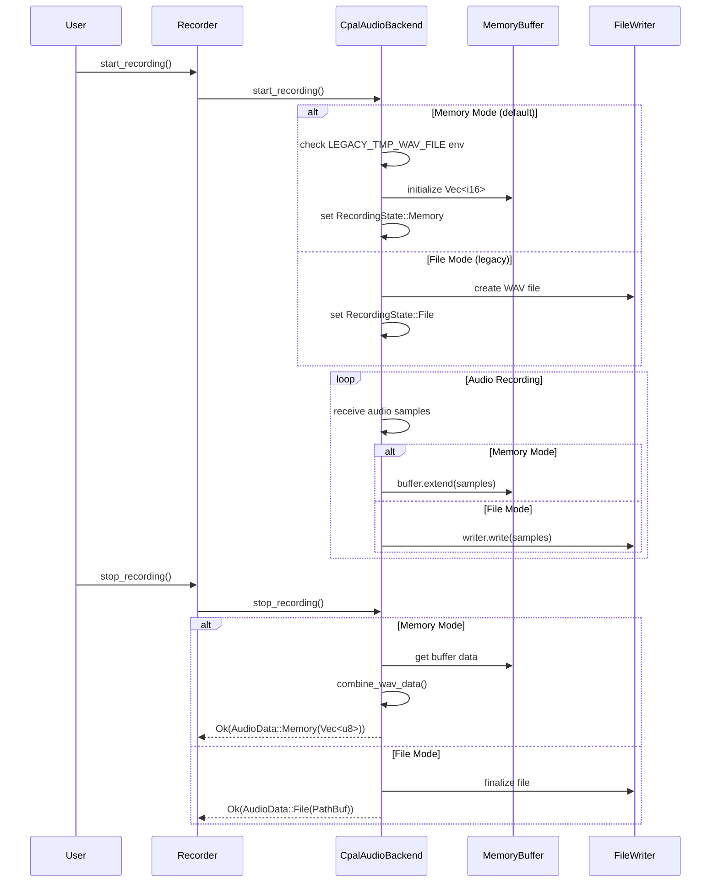

# Phase 2 詳細設計、手順書

## Why

### Phase 概要
Phase 2では、音声録音データをメモリ上で管理する機能を実装します。環境変数によってメモリモード（デフォルト）とレガシーモード（ファイル）を切り替え可能にし、メモリモードではディスクI/Oを完全に排除します。

### 目的
1. **パフォーマンス向上**: ファイルI/Oを排除し、メモリ上で音声データを管理
2. **後方互換性維持**: 既存のファイルベース処理も引き続きサポート
3. **スムーズな移行**: 環境変数による簡単なモード切り替え
4. **Phase 3への準備**: OpenAI APIへの直接データ送信基盤の構築

## What

### アーキテクチャ図



### ディレクトリ構成

```
src/
├── infrastructure/
│   ├── audio/
│   │   ├── mod.rs
│   │   └── cpal_backend.rs      # Phase 2で大幅修正
│   └── external/
│       └── openai.rs           # Phase 3で修正予定（AudioData::Memoryを直接送信対応）
└── domain/
    └── recorder.rs             # 変更なし
```

### フロー図



### 成果物（機能、非機能）

#### インターフェースと型定義

```rust
// 新しい列挙型：録音データの返却形式
#[derive(Debug, Clone)]
pub enum AudioData {
    Memory(Vec<u8>),    // WAVフォーマットのバイトデータ
    File(PathBuf),      // WAVファイルへのパス
}

// 録音状態を管理する内部列挙型
enum RecordingState {
    Memory {
        buffer: Arc<Mutex<Vec<i16>>>,
        sample_rate: u32,
        channels: u16,
    },
    File {
        writer: Arc<Mutex<Option<WavWriter<BufWriter<File>>>>>,
        path: PathBuf,
    },
}

// AudioBackendトレイトの修正
pub trait AudioBackend: Send + Sync {
    fn start_recording(&self) -> Result<(), Box<dyn Error>>;
    fn stop_recording(&self) -> Result<AudioData, Box<dyn Error>>;  // 戻り値を変更
    fn list_input_devices(&self) -> Result<Vec<String>, Box<dyn Error>>;
}

// CpalAudioBackendの主要メソッド
impl CpalAudioBackend {
    // 環境変数チェック用のヘルパー関数
    fn is_legacy_mode() -> bool {
        std::env::var("LEGACY_TMP_WAV_FILE").is_ok()
    }
    
    // メモリバッファのサイズ見積もり
    fn estimate_buffer_size(duration_secs: u32) -> usize {
        // sample_rate * channels * bytes_per_sample * duration
        48000 * 2 * 2 * duration_secs as usize
    }
}
```

#### 機能要件
1. **モード切り替え機能**
   - 環境変数 `LEGACY_TMP_WAV_FILE` による自動切り替え
   - 実行時の動的切り替えは不要（起動時固定）

2. **メモリモード機能**
   - Vec<i16>での音声データバッファリング
   - 録音停止時にWAVフォーマットのVec<u8>を生成
   - Phase 1で実装した`combine_wav_data`を活用

3. **レガシーモード維持**
   - 既存のファイルベース処理を完全維持
   - 一時ファイルの生成・管理ロジックは変更なし

#### 非機能要件
1. **性能要件**
   - メモリモード時: ファイルI/O時間をゼロに
   - バッファの事前確保による再アロケーション最小化

2. **メモリ要件**
   - 30秒録音: 約5.5MB（48kHz×2ch×2byte×30秒）
   - 最大録音時間: 30秒（現在の設定値）

3. **エラーハンドリング**
   - メモリ不足時は明確なエラーメッセージ
   - レガシーモードへの自動フォールバックなし

## How

### 内容

#### 目的
音声録音データをメモリ上で管理し、ディスクI/Oを排除することで高速化を実現する。同時に既存のファイルベース処理との互換性を維持する。

#### 成果物（モジュールorファイル）
- `src/infrastructure/audio/cpal_backend.rs` の修正版
  - AudioData列挙型の追加
  - RecordingState列挙型の追加
  - start_recording/stop_recordingメソッドの修正
  - メモリバッファ管理ロジックの追加

#### 完了条件
- [x] メモリモードでの録音→WAVデータ生成が成功
- [x] レガシーモードでの既存動作が維持される
- [x] 環境変数による自動切り替えが動作
- [x] 全テストがグリーン
- [x] cargo clippyで警告なし

#### 手動でのチェック項目
- [ ] メモリモード（環境変数未設定）で実際に録音してWAVデータが生成される
- [ ] レガシーモード（LEGACY_TMP_WAV_FILE=true）で既存通りファイルが生成される
- [ ] 最大録音時間（30秒）でメモリ使用量が適切
- [ ] 録音中断時のクリーンアップが正常

#### 除外項目（やらないこと）
- OpenAI APIクライアントの修正（Phase 3で実施）
- ストリーミング処理の実装
- メモリ使用量の上限管理
- 複数同時録音のサポート

### タスク分割

#### タスク1: AudioData型とRecordingState型の定義 [x]
- [x] AudioData列挙型の定義（Memory/File）
- [x] RecordingState列挙型の定義（内部状態管理用）
- [x] 必要なインポート文の追加
- [x] 単体テストの作成（型の基本動作確認）

#### タスク2: 環境変数判定とモード切り替えロジック [x]
- [x] is_legacy_mode()ヘルパー関数の実装
- [x] 環境変数読み取りのテスト作成
- [x] モード判定ロジックのテスト（TDD）

#### タスク3: CpalAudioBackend構造体の拡張 [x]
- [x] recording_stateフィールドの追加
- [x] 初期化処理の修正
- [x] 既存フィールドとの互換性確認

#### タスク4: start_recordingメソッドの修正 [x]
- [x] メモリモード用の初期化処理実装
- [x] Vec<i16>バッファの初期化（適切なcapacity設定）
- [x] レガシーモードの既存処理維持
- [x] コールバック内でのモード別処理分岐
- [x] エラーハンドリングの実装
- [x] 統合テストの作成

#### タスク5: 音声データ受信コールバックの修正 [x]
- [x] RecordingState::Memoryの場合のバッファ追加処理
- [x] RecordingState::Fileの場合の既存処理維持
- [x] スレッドセーフティの確保（Arc<Mutex>）
- [x] パフォーマンステストの作成

#### タスク6: stop_recordingメソッドの修正 [x]
- [x] AudioData型での返却値変更
- [x] メモリモード: combine_wav_dataを使用したWAVデータ生成
- [x] ファイルモード: ファイルパスの返却
- [x] リソースのクリーンアップ処理
- [x] エラーハンドリング
- [x] 統合テストの作成

#### タスク7: AudioBackendトレイトの更新 [x]
- [x] stop_recordingの戻り値をAudioData型に変更
- [x] ドキュメントコメントの更新
- [x] 破壊的変更の影響調査（Recorder、IPC、テストへの影響）

#### タスク8: 既存テストの修正 [x]
- [x] AudioData型対応のためのテスト修正
- [x] モック実装の更新
- [x] E2Eテストの更新

#### タスク9: 新規テストの追加 [x]
- [x] メモリモードの単体テスト
- [x] モード切り替えの統合テスト
- [x] メモリ使用量の確認テスト
- [x] 最大録音時間（30秒）のテスト

#### タスク10: ドキュメントとサンプルコード [ ]
- [ ] APIドキュメントの更新
- [ ] 使用例の追加（メモリモード/レガシーモード）
- [ ] CLAUDE.mdへの情報追加

### 手動でのチェック項目

1. **動作確認**
   - [ ] `cargo run`でデフォルト（メモリモード）動作確認
   - [ ] `LEGACY_TMP_WAV_FILE=true cargo run`でレガシーモード動作確認
   - [ ] 実際の音声録音と再生テスト

2. **パフォーマンス確認**
   - [ ] メモリモードとファイルモードの処理時間比較
   - [ ] メモリ使用量のモニタリング
   - [ ] CPU使用率の確認

3. **互換性確認**
   - [ ] 既存のvoice_inputコマンドが正常動作
   - [ ] デーモンプロセスとの連携確認
   - [ ] エラー時の挙動確認

## 実装上の注意点と懸念事項

### 注意点

1. **スレッドセーフティ**
   - 音声コールバックは別スレッドから呼ばれるため、Arc<Mutex>を適切に使用
   - デッドロックに注意（lockの保持時間を最小化）

2. **メモリ管理**
   - Vec::with_capacityで事前確保し、再アロケーションを最小化
   - 大きなバッファのコピーを避ける（可能な限り所有権の移動を使用）

3. **エラーハンドリング**
   - メモリ不足は明確にユーザーに通知
   - パニックを避け、Resultで適切にエラーを伝播

4. **テスト戦略**
   - TDDアプローチ: 先にテストを書いてから実装
   - モックを活用して単体テストを独立させる
   - 環境変数のテストは各テストで明示的に設定/解除

### 懸念事項と対応策

1. **AudioBackendトレイトの破壊的変更**
   - 懸念: stop_recordingの戻り値型変更により、Recorder、IPC、テストが影響を受ける
   - 対応: 影響範囲を事前に調査し、段階的に修正

2. **既存のファイルベース処理との統合**
   - 懸念: RecorderがファイルパスとVec<u8>の両方を扱う必要がある
   - 対応: AudioData列挙型で抽象化し、Recorder側で適切に処理

3. **メモリ使用量の監視**
   - 懸念: 長時間録音でのメモリ不足
   - 対応: 30秒制限があるので問題ないが、エラーハンドリングは必須

4. **デーモンプロセスとの連携**
   - 懸念: IPCメッセージの変更が必要になる可能性
   - 対応: Phase 3でOpenAI統合時に合わせて対応