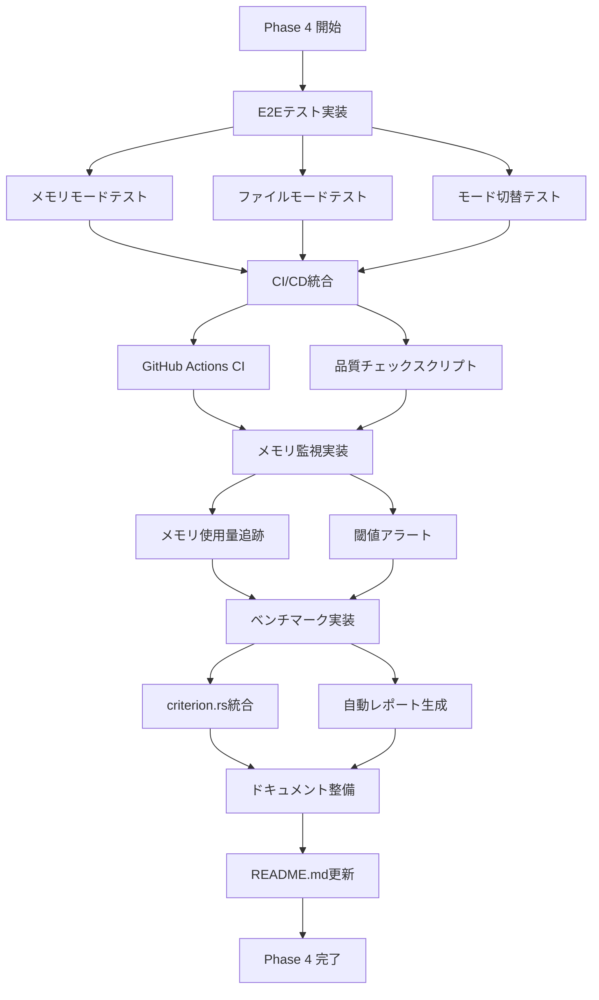

# Phase 4 詳細設計、手順書

- Why
  - Phase 概要、目的
- What
  - アーキテクチャ図
  - ディレクトリ構成
  - フロー図(mermaid)
  - 成果物(機能、非機能) インターフェースや型レベルでのサンプルコードを添えて
- How
  - 内容
    - 目的
    - 成果物(モジュールorファイル)
    - 完了条件
    - 手動でのチェック項目
    - 除外項目(やらないこと)
  - タスク分割してチェックボックス形式で記述して
  - なるべく TDD(テスト駆動開発) で実装すること
- 手動でのチェック項目

## Why

### Phase 概要

Phase 4「品質保証と運用基盤構築」では、Phase 1-3で実装したメモリモード音声処理システムの品質を保証し、継続的な改善のための運用基盤を構築します。E2Eテスト、CI/CD統合、パフォーマンス監視、ドキュメント整備を通じて、プロダクション環境での安定稼働を実現します。

### 目的

1. **品質保証**
   - E2Eテストによる全機能の動作保証
   - 自動テストによる継続的な品質確認
   - メモリ使用量の監視と制限

2. **運用基盤**
   - CI/CDパイプラインへの統合
   - パフォーマンスの自動測定と可視化
   - 問題の早期検出と通知

3. **保守性向上**
   - 包括的なドキュメント整備
   - トラブルシューティングガイド
   - パフォーマンスチューニングの指針

## What

### アーキテクチャ図

```
┌─────────────────────────────────────────────────────────────┐
│                    品質保証・運用基盤                         │
├─────────────────────────────────────────────────────────────┤
│                                                             │
│  ┌─────────────────┐  ┌─────────────────┐  ┌────────────┐│
│  │   E2E Tests     │  │  Performance    │  │   Memory   ││
│  │                 │  │   Benchmarks    │  │  Monitor   ││
│  │ ・メモリモード  │  │                 │  │            ││
│  │ ・ファイルモード│  │ ・処理時間測定  │  │ ・使用量   ││
│  │ ・モード切替    │  │ ・メモリ使用量  │  │ ・閾値監視 ││
│  │ ・エラー処理    │  │ ・比較レポート  │  │ ・アラート ││
│  └────────┬────────┘  └────────┬────────┘  └─────┬──────┘│
│           │                    │                   │        │
│           └────────────────────┴───────────────────┘        │
│                               │                             │
│                        ┌──────▼──────┐                     │
│                        │  CI/CD      │                     │
│                        │  Pipeline   │                     │
│                        │             │                     │
│                        │ ・自動テスト │                     │
│                        │ ・品質ゲート│                     │
│                        │ ・レポート  │                     │
│                        └─────────────┘                     │
│                                                             │
│  ┌─────────────────────────────────────────────────────┐   │
│  │                    README.md 更新                    │   │
│  │                                                      │   │
│  │  ・メモリモード説明    ・パフォーマンステスト手順  │   │
│  │  ・環境変数設定        ・メモリ使用量の目安        │   │
│  └─────────────────────────────────────────────────────┘   │
└─────────────────────────────────────────────────────────────┘
```

### ディレクトリ構成

```
voice_input/
├── tests/
│   ├── e2e/
│   │   ├── mod.rs
│   │   ├── memory_mode_test.rs      # 新規: メモリモードE2Eテスト
│   │   ├── file_mode_test.rs        # 新規: ファイルモードE2Eテスト
│   │   └── mode_switch_test.rs      # 新規: モード切替テスト
│   ├── benchmarks/
│   │   ├── mod.rs                   # 新規
│   │   └── recording_bench.rs       # 新規: パフォーマンスベンチマーク
│   └── performance_test.rs          # 既存（拡張）
├── src/
│   ├── monitoring/                  # 新規
│   │   ├── mod.rs
│   │   ├── memory_monitor.rs        # 新規: メモリ監視
│   │   └── metrics.rs               # 新規: メトリクス収集
│   └── ...
├── .github/
│   └── workflows/
│       ├── ci.yml                   # 既存（拡張）
│       └── benchmark.yml            # 新規: ベンチマーク測定
├── scripts/
│   └── quality-check.sh             # 新規: ローカル品質チェック
└── benches/                         # 新規
    └── recording.rs                 # 新規: criterion.rsベンチマーク
```

### フロー図



### 成果物（機能、非機能）

#### 機能要件

1. **E2Eテストスイート**
```rust
// tests/e2e/memory_mode_test.rs
#[tokio::test]
async fn test_memory_mode_end_to_end() -> Result<(), Box<dyn std::error::Error>> {
    // デーモン起動
    let mut daemon = start_voice_inputd(false)?;
    
    // 録音開始
    let result = voice_input_cli(&["toggle"]).await?;
    assert!(result.contains("Recording started"));
    
    // 音声シミュレーション
    simulate_audio_input(Duration::from_secs(3)).await?;
    
    // 録音停止と転写
    let result = voice_input_cli(&["toggle"]).await?;
    assert!(result.contains("Transcription:"));
    
    daemon.kill()?;
    Ok(())
}
```

2. **メモリ監視機能**
```rust
// src/monitoring/memory_monitor.rs
#[derive(Debug, Clone)]
pub struct MemoryMonitor {
    threshold_mb: usize,
    current_usage: Arc<AtomicUsize>,
}

impl MemoryMonitor {
    pub fn new(threshold_mb: usize) -> Self {
        Self {
            threshold_mb,
            current_usage: Arc::new(AtomicUsize::new(0)),
        }
    }
    
    pub fn update_usage(&self, bytes: usize) {
        self.current_usage.store(bytes, Ordering::SeqCst);
        if bytes > self.threshold_mb * 1024 * 1024 {
            self.trigger_alert(bytes);
        }
    }
    
    pub fn get_metrics(&self) -> MemoryMetrics {
        MemoryMetrics {
            current_mb: self.current_usage.load(Ordering::SeqCst) / 1024 / 1024,
            threshold_mb: self.threshold_mb,
            usage_percent: self.calculate_usage_percent(),
        }
    }
}
```

3. **パフォーマンスベンチマーク**
```rust
// benches/recording.rs
use criterion::{criterion_group, criterion_main, Criterion, BenchmarkId};

fn benchmark_recording_modes(c: &mut Criterion) {
    let mut group = c.benchmark_group("recording_modes");
    
    for duration in [1, 5, 10, 30].iter() {
        group.bench_with_input(
            BenchmarkId::new("memory_mode", duration),
            duration,
            |b, &duration| {
                b.iter(|| {
                    record_and_transcribe(false, Duration::from_secs(duration))
                });
            },
        );
        
        group.bench_with_input(
            BenchmarkId::new("file_mode", duration),
            duration,
            |b, &duration| {
                b.iter(|| {
                    record_and_transcribe(true, Duration::from_secs(duration))
                });
            },
        );
    }
    group.finish();
}
```

4. **CI/CDパイプライン**
```yaml
# .github/workflows/benchmark.yml
name: Benchmark

on:
  push:
    branches: [main]
  pull_request:
    branches: [main]

jobs:
  benchmark:
    runs-on: ubuntu-latest
    steps:
      - uses: actions/checkout@v4
      
      - name: Install Rust
        uses: dtolnay/rust-toolchain@stable
        
      - name: Run benchmarks
        run: cargo bench --features ci-test -- --output-format bencher | tee output.txt
        
      - name: Store benchmark result
        uses: benchmark-action/github-action-benchmark@v1
        with:
          tool: 'cargo'
          output-file-path: output.txt
          github-token: ${{ secrets.GITHUB_TOKEN }}
          auto-push: true
          comment-on-alert: true
          alert-threshold: '110%'
```

#### 非機能要件

1. **信頼性**
   - E2Eテストカバレッジ: 主要シナリオの90%以上
   - エラーシナリオの網羅的テスト
   - 長時間録音でのメモリリーク検出

2. **パフォーマンス**
   - ベンチマーク実行時間: 5分以内
   - CI/CDパイプライン: 10分以内で完了
   - メモリ監視オーバーヘッド: 1%未満

3. **運用性**
   - メトリクスの自動収集と可視化
   - 問題発生時のアラート通知
   - トラブルシューティング時間: 30分以内

## How

### Step 1: E2Eテスト基盤構築

**目的**: メモリモードとファイルモードの完全な動作検証

**成果物**:
- `tests/e2e/mod.rs`: E2Eテストモジュール
- `tests/e2e/memory_mode_test.rs`: メモリモードテスト
- `tests/e2e/file_mode_test.rs`: ファイルモードテスト
- `tests/e2e/mode_switch_test.rs`: モード切替テスト

**完了条件**:
- [ ] デーモンプロセスの起動・停止が自動化されている
- [ ] 音声入力のシミュレーションが実装されている
- [ ] メモリモード・ファイルモードの両方で録音→転写が成功する
- [ ] 環境変数によるモード切替が正しく動作する

**手動でのチェック項目**:
- `cargo test --test e2e_memory_mode_test -- --ignored`で実行確認
- `LEGACY_TMP_WAV_FILE=true`でファイルモードテスト確認

**除外項目**:
- 実際の音声デバイスを使用したテスト（シミュレーションで代替）
- ネットワークエラーのシミュレーション

### Step 2: メモリ監視機能実装

**目的**: メモリ使用量の追跡と異常検出

**成果物**:
- `src/monitoring/mod.rs`: 監視モジュール
- `src/monitoring/memory_monitor.rs`: メモリ監視実装
- `src/monitoring/metrics.rs`: メトリクス収集

**完了条件**:
- [ ] リアルタイムでメモリ使用量を追跡できる
- [ ] 設定可能な閾値でアラートを発生させる
- [ ] メトリクスをログ出力できる
- [ ] 既存のRecorderと統合されている

**手動でのチェック項目**:
- 長時間録音（5分以上）でメモリ使用量が正しく報告される
- 閾値超過時にログにアラートが出力される

**除外項目**:
- 外部監視システムへの統合（Prometheus等）
- メモリ使用量の可視化UI

### Step 3: パフォーマンスベンチマーク実装

**目的**: 性能測定の自動化と継続的な監視

**成果物**:
- `benches/recording.rs`: criterion.rsベンチマーク
- `tests/benchmarks/mod.rs`: ベンチマークモジュール
- `tests/benchmarks/recording_bench.rs`: 録音性能測定

**完了条件**:
- [ ] criterion.rsを使用したベンチマークが実装されている
- [ ] 1秒、5秒、10秒、30秒の録音でベンチマークが実行される
- [ ] メモリモードとファイルモードの比較が自動化されている
- [ ] ベンチマーク結果がJSON形式で出力される

**手動でのチェック項目**:
- `cargo bench`でベンチマークが実行される
- `target/criterion/`にレポートが生成される
- メモリモードがファイルモードより高速であることを確認

**除外項目**:
- リアルタイムストリーミングのベンチマーク
- 並行録音のベンチマーク

### Step 4: CI/CD統合と品質チェック自動化

**目的**: 継続的な品質確認とパフォーマンス監視の自動化

**成果物**:
- `.github/workflows/ci.yml`: 既存CI拡張（E2Eテスト追加）
- `.github/workflows/benchmark.yml`: パフォーマンス測定CI
- `scripts/quality-check.sh`: ローカル品質チェックスクリプト
- CI用のモック実装とfeatureフラグ設定

**完了条件**:
- [ ] E2EテストがCIで実行される（音声デバイス不要）
- [ ] パフォーマンスベンチマークがPR/mainブランチで実行される
- [ ] ベンチマーク結果がGitHub上で可視化される
- [ ] 性能劣化時にPRコメントで通知される
- [ ] ローカルでも同じチェックが実行できる

**手動でのチェック項目**:
- PRを作成してCIが正常に動作することを確認
- GitHub Actionsでベンチマークが実行される
- ベンチマーク結果がPRにコメントされる
- `./scripts/quality-check.sh`でローカルチェックが通る

**除外項目**:
- 実機での音声デバイステスト
- クロスプラットフォーム対応

### Step 5: README更新

**目的**: メモリモード機能の説明と使用方法の明確化

**成果物**:
- `README.md`: メモリモード関連の説明追加

**完了条件**:
- [ ] メモリモードの概要が記載されている
- [ ] 環境変数による切り替え方法が明記されている
- [ ] パフォーマンステストの実行方法が記載されている
- [ ] メモリ使用量の目安が記載されている

**手動でのチェック項目**:
- README.mdを読んでメモリモードが理解できる
- 記載通りの手順でモード切替ができる

**除外項目**:
- 詳細な設計ドキュメント
- 別ファイルでのドキュメント作成

### Step 6: 統合確認とリリース準備

**目的**: Phase 4の成果物の統合確認とリリース準備

**成果物**:
- Phase 4完了レポート
- リリースノート案
- 今後の改善提案

**完了条件**:
- [ ] 全てのテストが成功する
- [ ] CI/CDパイプラインが正常動作する
- [ ] ドキュメントが完成している
- [ ] パフォーマンスベンチマークが実行可能
- [ ] メモリ監視が動作している

**手動でのチェック項目**:
- フルビルドとテスト実行（`cargo test && cargo bench`）
- ドキュメントのレビュー
- メモリモードでの1時間連続録音テスト

**除外項目**:
- プロダクションへのデプロイ
- ユーザー向けリリース

## 手動でのチェック項目

### 開発環境での確認

1. **E2Eテスト実行**
```bash
# メモリモードE2E
cargo test --test e2e_memory_mode_test -- --ignored --nocapture

# ファイルモードE2E
LEGACY_TMP_WAV_FILE=true cargo test --test e2e_file_mode_test -- --ignored --nocapture

# モード切替テスト
cargo test --test e2e_mode_switch_test -- --ignored --nocapture
```

2. **メモリ監視確認**
```bash
# 長時間録音でメモリ使用量を確認
RUST_LOG=debug cargo run --bin voice_inputd &
# 別ターミナルで
cargo run --bin voice_input -- toggle
sleep 300  # 5分録音
cargo run --bin voice_input -- toggle
# ログでメモリ使用量を確認
```

3. **ベンチマーク実行**
```bash
# ベンチマーク実行
cargo bench

# レポート確認
open target/criterion/index.html
```

4. **CI/CD動作確認**
```bash
# ローカルでCI相当のコマンド実行
cargo fmt -- --check
cargo clippy -- -D warnings
cargo test --features ci-test
cargo bench --features ci-test

# 品質チェックスクリプトの実行
chmod +x scripts/quality-check.sh
./scripts/quality-check.sh
```

### リリース前の最終確認

- [ ] README.mdが最新化されている
- [ ] CHANGELOG.mdにPhase 4の変更が記載されている
- [ ] 全ドキュメントのリンクが有効
- [ ] パフォーマンステストで劣化がない
- [ ] メモリリークがない（長時間テスト）

## まとめ

Phase 4では、メモリモード音声処理システムの品質保証と運用基盤を構築します。E2Eテスト、メモリ監視、パフォーマンスベンチマーク、CI/CD統合、README.mdの更新を通じて、プロダクション環境での安定稼働を実現します。

実装はTDD（テスト駆動開発）で進め、各ステップで動作確認を行いながら進めることで、高品質なシステムを構築します。GitHub Actionsでの継続的な品質監視により、将来の機能追加や改善においても性能劣化を早期に検出できる体制を整えます。