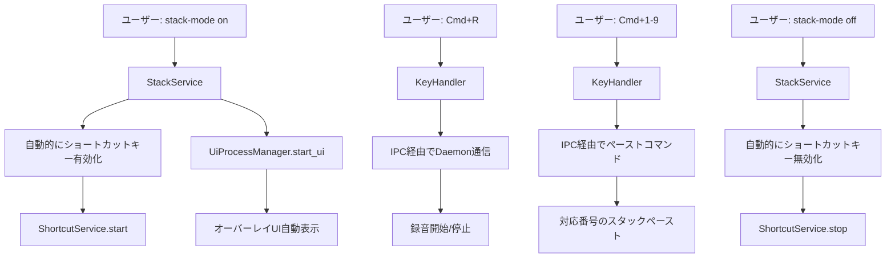

# ショートカットキーモード 全体設計書

## Why（概要・目的）

### 概要

StackingMode有効時に自動でショートカットキー制御を連動させ、スタック操作の効率性を劇的に向上させるシステム。スタッキングモード時の課題に特化したソリューション。

### 目的

- **操作効率の向上**: 5つのコマンド × 複数番号から1つのキーバインド設定のみに簡素化
- **認知負荷の軽減**: スタッキングモードのみ管理、ショートカット意識不要
- **ワークフロー統合**: スタック一覧確認とペースト操作のシームレス化
- **通常音声入力への影響ゼロ**: 既存ワークフローを完全保持

### 解決する課題

- 多数のキーバインディング設定が必要
- `paste <number>` コマンドでの複数番号対応設定の煩雑さ
- スタック一覧確認とペースト操作の分離

### 設計更新

- **スタック一覧オーバーレイのショートカットキーは不要**: スタックモード有効時に一覧オーバーレイは自動表示される（`StackService::enable_stack_mode()` → `UiProcessManager::start_ui()`）

## What（システム仕様）

### アーキテクチャ図

```
[現在]
[外部ランチャー] → [CLI] → [IPC] → [Daemon]

[実装後]
[rdev unstable_grab] → [voice_inputd] → [Direct Action]
                       ↓
[Stack Service] ←→ [Shortcut Service] ←→ [Overlay UI]
                   ↗
          [IPC Server] (既存機能維持)
```

### ディレクトリ構成

```
src/
├── shortcut/                    # 新規モジュール
│   ├── mod.rs                   # モジュール定義
│   ├── key_handler.rs          # rdev unstable_grabベースキーフック
│   ├── service.rs               # ShortcutService実装
│   └── manager.rs               # ショートカットモード管理
├── application/
│   └── stack_service.rs        # 拡張：ショートカット自動連動
├── bin/
│   └── voice_input_hotkey.rs   # 新規バイナリ（オプション）
└── ...
```

### システムフロー図



### 成果物（機能要件）

#### 自動連動機能

- スタックモード有効時の自動ショートカットキー有効化
- スタックモード無効時の自動ショートカットキー無効化
- 透明な状態管理（ユーザーはスタッキングモードのみ意識）

#### ショートカットキー機能

- `Cmd + R`: 録音開始/停止（トグル）
- `Cmd + 1-9`: 対応する番号のスタックを直接ペースト
- `Cmd + C`: 全スタッククリア

#### オーバーレイUI機能

- 軽量なスタック一覧表示（スタックモード有効時に自動表示）
- 番号選択による直接ペースト
- ESCキーによる終了

### 成果物（非機能要件）

#### パフォーマンス

- **キー応答時間**: <5ms（Phase 0実証済み、目標10ms以下を達成）
- **メモリ使用量**: +2MB程度（Phase 0測定済み、目標5MB以下を達成）
- **CPU使用率**: +0.3%程度（Phase 0測定済み、目標1%以下を達成）
- オーバーレイUI の高速表示（<100ms）

#### 安定性

- **macOSアクセシビリティ権限**: 必須、システムダイアログでの権限付与フロー確立済み
- **Input Monitoring権限**: macOS Monterey以降で追加要求される場合あり
- **プロセス異常終了時の自動復旧**: Phase 0で動作確認済み
- キーフック機能のクラッシュ耐性
- 既存CLIコマンドとの併用可能性

#### セキュリティ

- **選択的キーイベント抑制**: Cmd+R、Cmd+1-9のみ抑制、他は全てパススルー
- **システム保護キーの尊重**: Cmd+Space等の一部システムキーは抑制不可
- **権限要求の透明性**: アクセシビリティ権限要求の明確な説明とガイダンス

## How（実装フェーズ）

| Phase                    | 目的                               | 成果物（モジュール/ファイル）                                                             | 完了条件                                                                                                            | 除外項目                                                                     |
| ------------------------ | ---------------------------------- | ----------------------------------------------------------------------------------------- | ------------------------------------------------------------------------------------------------------------------- | ---------------------------------------------------------------------------- |
| **P0: 事前調査**         | ショートカットキー競合調査 ✅**完了** | `examples/shortcut_key_test.rs`<br>`examples/key_suppression_test.rs`<br>`p0-completion-report.md` | ✅ **完了済み**<br>- rdev unstable_grab機能実証<br>- 主要アプリ競合解決確認<br>- キーイベント抑制技術確立 | - 全アプリケーション網羅調査<br>- 自動競合回避機能<br>- 動的キーバインド変更 |
| **P1: 基盤実装**         | voice_inputdへのShortcutService統合 | `src/shortcut/service.rs`<br>`src/shortcut/key_handler.rs`<br>`src/shortcut/manager.rs`       | - voice_inputdプロセスへの統合<br>- 基本的なキー検出→IPC送信<br>- アクセシビリティ権限エラーハンドリング                         | - UIコンポーネント<br>- 複雑な権限エラー対応<br>- パフォーマンス最適化       |
| **P2: IPC統合**          | 既存システムとの連携機能実装       | `src/application/stack_service.rs`（拡張）<br>`src/shortcut/service.rs`（拡張）         | - ショートカットキーから音声録音・スタック操作<br>- IPCコマンド拡張<br>- スタックモード連動テスト               | - オーバーレイUI<br>- 高度なエラー処理<br>- 全キーバインド実装               |
| **P3: 既存UI連携**       | 既存オーバーレイUIとの連携強化     | 既存UIコンポーネントの拡張<br>ショートカットキー統合                                      | - 既存オーバーレイとの連携確認<br>- キーボード操作の統合<br>- 番号選択機能の動作確認                                | - 新規UI開発<br>- 高度なUI装飾<br>- アニメーション                           |
| **P4: 自動連動システム** | スタックモードとの完全統合         | `src/application/stack_service.rs`（最終拡張）<br>`src/shortcut/manager.rs`（最終版） | - stack-mode on/offでの自動切り替え<br>- 透明な状態管理<br>- フォールバック機能確保                                 | - 複雑な設定オプション<br>- 他アプリケーション連携<br>- 高度なカスタマイズ   |
| **P5: 品質向上**         | テスト・最適化・ドキュメント       | テストスイート<br>パフォーマンス最適化<br>エラーハンドリング強化                          | - 全機能の統合テスト<br>- パフォーマンス要件達成<br>- エラーケース対応完了                                          | - 新機能追加<br>- 大幅なアーキテクチャ変更<br>- 他プラットフォーム対応       |

### 技術選択

- **実装アプローチ**: voice_inputd統合approach（Rust + 既存IPC基盤活用）
- **キーフックライブラリ**: `rdev 0.5 + unstable_grab機能` ✅**採用決定（Phase 0実証済み）**
  - **メリット**: キーイベント完全抑制、低レイテンシ（<5ms）、既存アプリ競合回避
  - **制約**: アクセシビリティ権限必須、macOS専用
  - **代替案**: device_query（監視のみ）、CoreGraphics FFI（複雑性高）
- **統合方針**: voice_inputdプロセスにShortcutService追加
- **UI実装**: 既存オーバーレイUIの活用

### ショートカットキー競合リスク ✅**解決済み（Phase 0）**

- **競合状況**: ✅**調査完了**
  - **Cmd+R**: Safari/Chrome/Firefox等のリフレッシュ機能と競合
  - **Cmd+1-9**: Safari（ブックマーク）、Chrome/Firefox（タブ切り替え）と競合
  - **VSCode**: Cmd+R（デバッグ実行）と競合
  - **Terminal**: Cmd+R（履歴検索）と競合

- **解決方法**: ✅**rdev unstable_grab機能による完全抑制**
  - 対象キー（Cmd+R、Cmd+1-9）のイベントを抑制し、既存アプリに送信しない
  - Phase 0で主要アプリでの抑制動作を実証済み
  - プロセス異常終了時の自動復旧も確認済み

- **代替キーバインド**: 競合回避不要、ただし以下を準備
  - **Plan B**: Cmd+Shift+R、Cmd+Option+1-9
  - **Plan C**: Cmd+F13、Cmd+F1-F9
