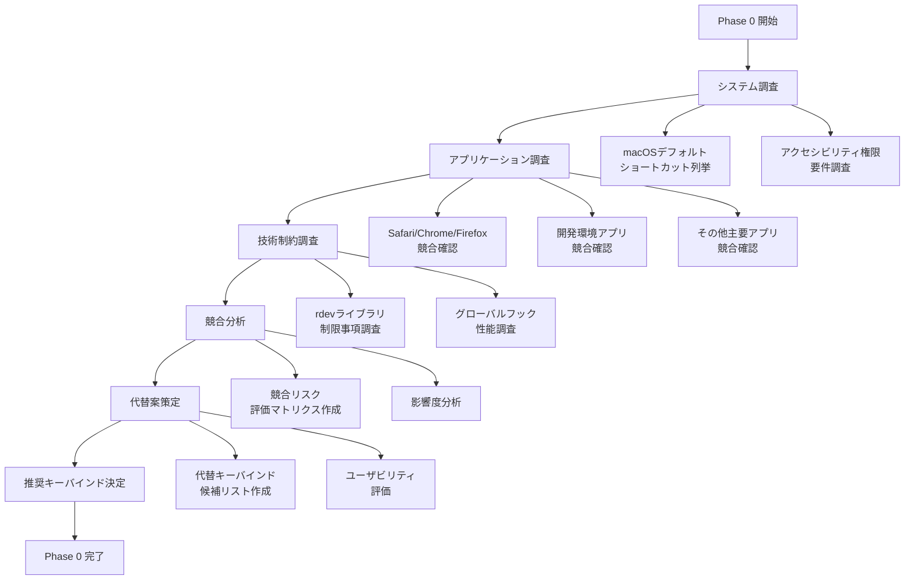

# Phase 0: ショートカットキー競合調査 詳細設計書

## Why（概要・目的）

### Phase 概要
ショートカットキーモード実装前の事前調査フェーズ。macOS環境における既存アプリケーションとのキーバインド競合を包括的に調査し、ユーザビリティとシステム安定性を両立する最適なキーバインド設計を策定する。

### 目的
- **競合リスク最小化**: 主要アプリケーションとの競合を事前特定し、ユーザーの既存ワークフローを阻害しない
- **技術制約把握**: macOSアクセシビリティ権限、グローバルフック制限事項の詳細調査
- **代替案策定**: 競合回避のための複数代替キーバインド案を設計し、優先順位付け
- **実装戦略決定**: 技術調査結果に基づく具体的な実装アプローチの選定

## What（システム仕様）

### 調査対象アーキテクチャ

```
[調査領域]
├── macOSシステムショートカット
│   ├── Mission Control (Cmd+F3等)
│   ├── Spotlight (Cmd+Space)
│   └── システム環境設定系
├── 主要ブラウザ
│   ├── Safari (Cmd+R, Cmd+1-9)
│   ├── Chrome (Cmd+R, Cmd+1-9)
│   └── Firefox (Cmd+R, Cmd+1-9)
├── 開発環境
│   ├── VSCode (Cmd+R)
│   ├── Xcode (Cmd+R)
│   └── Terminal系
└── 音声入力システム
    ├── 既存IPCコマンド構造
    ├── UiProcessManager連携
    └── StackService統合点
```

### 調査フロー図



### 成果物（機能要件）

#### 競合調査レポート

```markdown
# 競合調査レポート構造
## 1. システムレベル競合
### 1.1 macOSデフォルトショートカット
- Mission Control: Cmd+F3, Ctrl+↑
- Spotlight: Cmd+Space
- システム環境設定: Cmd+,

### 1.2 アクセシビリティ機能
- VoiceOver: Cmd+F5
- 拡大/縮小: Cmd+Option+=

## 2. アプリケーション競合マトリクス
| キー | Safari | Chrome | VSCode | Terminal | Slack | Zoom | Mail | Pages | メモ |
|------|--------|--------|---------|----------|-------|------|------|-------|------|
| Cmd+R | 🔴 | 🔴 | 🔴 | 🟡 | ⚪ | ⚪ | 🔴 | ⚪ | ⚪ |
| Cmd+1 | 🔴 | 🔴 | 🟡 | ⚪ | ⚪ | ⚪ | ⚪ | ⚪ | ⚪ |
| ... | ... | ... | ... | ... | ... | ... | ... | ... | ... |
```

#### 技術制約ドキュメント

```rust
// アクセシビリティ権限チェック例
pub fn check_accessibility_permissions() -> Result<bool, String> {
    // macOSアクセシビリティ権限の確認
    // AXIsProcessTrusted() を使用した実装例
}

// グローバルキーフック制約
pub struct GlobalKeyHookConstraints {
    pub requires_accessibility: bool,
    pub blocked_system_keys: Vec<String>,
    pub performance_impact: KeyHookPerformance,
}
```

#### 代替キーバインド候補

```rust
// 推奨キーバインド設定
pub struct ShortcutConfig {
    pub primary_option: KeyBindingSet,
    pub fallback_options: Vec<KeyBindingSet>,
    pub conflict_risk: RiskLevel,
}

pub struct KeyBindingSet {
    pub record_toggle: String,    // "Cmd+R" -> "Cmd+Shift+R"
    pub stack_access: Vec<String>, // ["Cmd+1-9"] -> ["Cmd+Opt+1-9"]
    pub stack_clear: String,      // "Cmd+C" -> "Cmd+Shift+C"
}
```

### 成果物（非機能要件）

#### パフォーマンス調査
- グローバルキーフック応答時間測定（目標: <10ms）
- メモリ使用量調査（目標: <5MB追加）
- CPU使用率影響調査（目標: <1%追加）

#### 安定性調査
- 長時間稼働テスト設計
- 権限エラー時のフォールバック動作定義
- システムスリープ/復帰時の動作確認項目

## How（実装手順）

### 目的
事前調査により、ショートカットキーモード実装時の技術的・ユーザビリティ的リスクを最小化し、最適な実装戦略を策定する

### 成果物（モジュール/ファイル）
- `dev-docs/shortcut_mode/conflict_analysis.md`
- `dev-docs/shortcut_mode/technical_constraints.md`
- `dev-docs/shortcut_mode/keybinding_recommendations.md`
- `dev-docs/shortcut_mode/implementation_strategy.md`

### 完了条件
- [ ] 主要9アプリケーションとの競合調査完了
- [ ] 技術制約ドキュメント作成完了
- [ ] 代替キーバインド候補3案以上策定
- [ ] 推奨実装戦略決定
- [ ] 競合リスク評価マトリクス作成完了

### タスク分割

#### 🤖 自動調査タスク（AI実行）

- [ ] **macOSデフォルトショートカット調査**
  - [ ] システム環境設定で定義されているショートカット一覧
  - [ ] Mission Control、Spotlight等システム機能のキーバインド
  - [ ] アクセシビリティ機能のショートカット

- [ ] **ブラウザショートカット調査**
  - [ ] Safari: Cmd+R（リロード）、Cmd+1-9（ブックマーク）詳細
  - [ ] Chrome: Cmd+R（リロード）、Cmd+1-9（タブ切り替え）詳細

- [ ] **開発環境ショートカット調査**
  - [ ] VSCode: Cmd+R（リロード）、その他開発関連ショートカット
  - [ ] Terminal: Cmd+R の動作確認

- [ ] **コミュニケーションアプリ調査**
  - [ ] Slack: ショートカット競合確認
  - [ ] Zoom: ショートカット競合確認

- [ ] **生産性アプリ調査**
  - [ ] Mail: Cmd+R（返信）の動作
  - [ ] Pages: ショートカット競合確認
  - [ ] メモ（Apple純正）: ショートカット競合確認

- [ ] **技術制約調査**
  - [ ] rdevライブラリのmacOS制限事項
  - [ ] アクセシビリティ権限要件の詳細
  - [ ] グローバルキーフック時のシステム負荷
  - [ ] サンドボックス環境での制約

- [ ] **既存コードベース分析**
  - [ ] 現在のIPCコマンド構造分析（voice_inputd.rs:208-398）
  - [ ] StackServiceとの統合ポイント特定
  - [ ] UiProcessManager連携方法調査
  - [ ] 既存のキーボード入力処理確認

#### 👤 手動調査タスク（ユーザー実行）

- [ ] **実機競合テスト**
  - [ ] Safari・ChromeでCmd+R実行し、実際の動作確認
  - [ ] Safari・ChromeでCmd+1-9実行し、実際の動作確認
  - [ ] VSCodeでCmd+R実行し、デバッグ動作確認
  - [ ] Terminal・Slack・Zoom・Mail・Pages・メモでCmd+R動作確認

- [ ] **ユーザビリティ評価**
  - [ ] 代替キーバインド案の押しやすさ評価
  - [ ] 既存ワークフローへの影響度評価
  - [ ] 覚えやすさの主観評価

- [ ] **環境固有テスト**
  - [ ] 使用中のアプリケーション固有ショートカット確認
  - [ ] カスタマイズされたキーバインドの有無確認
  - [ ] 他の音声入力ツールとの競合確認

#### 🔄 協調調査タスク（AI + ユーザー）

- [ ] **代替キーバインド策定**
  - [ ] AI: 技術的制約を考慮した候補案作成
  - [ ] ユーザー: 実用性・使いやすさの評価
  - [ ] AI: フィードバックを反映した最終案作成

- [ ] **競合リスク分析**
  - [ ] AI: 調査結果の定量的分析
  - [ ] ユーザー: 実際の使用頻度・重要度評価
  - [ ] AI: 総合的なリスク評価マトリクス作成

### 手動チェック項目

#### 機能確認
- [ ] 各ブラウザで実際にCmd+Rを押してリロード動作確認
- [ ] 各ブラウザで実際にCmd+1-9を押してタブ/ブックマーク動作確認
- [ ] VSCodeで実際にCmd+Rを押してデバッグ実行確認
- [ ] 代替キーバインド案の実際の押しやすさ確認

#### ユーザビリティ確認
- [ ] 提案されたキーバインドの直感性評価
- [ ] 既存ワークフローとの親和性評価
- [ ] 学習コストの妥当性評価

#### 環境依存確認
- [ ] 個人設定でカスタマイズされたショートカットの確認
- [ ] 業務で使用するアプリケーション固有の競合確認
- [ ] 他の生産性ツールとの競合確認

### 除外項目（やらないこと）

#### Phase 0では実装しない項目
- [ ] 実際のグローバルキーフック実装
- [ ] rdevライブラリの詳細統合
- [ ] UI コンポーネントの実装
- [ ] IPCコマンドの拡張実装

#### Phase 0では調査しない項目
- [ ] Windows/Linux環境での競合調査
- [ ] 全アプリケーションの網羅的調査（主要アプリのみ）
- [ ] 動的キーバインド変更機能の設計
- [ ] 自動競合回避機能の設計

#### Phase 0では決定しない項目
- [ ] 最終的なライブラリ選択（rdev vs device_query）
- [ ] 詳細なUI設計
- [ ] 具体的な実装スケジュール
- [ ] 複雑なフォールバック機能の仕様

### 成功基準
- 競合リスクが明確に定量化されている
- 技術的制約が具体的に文書化されている
- 実用的な代替案が複数提示されている
- Phase 1以降の実装方針が明確になっている