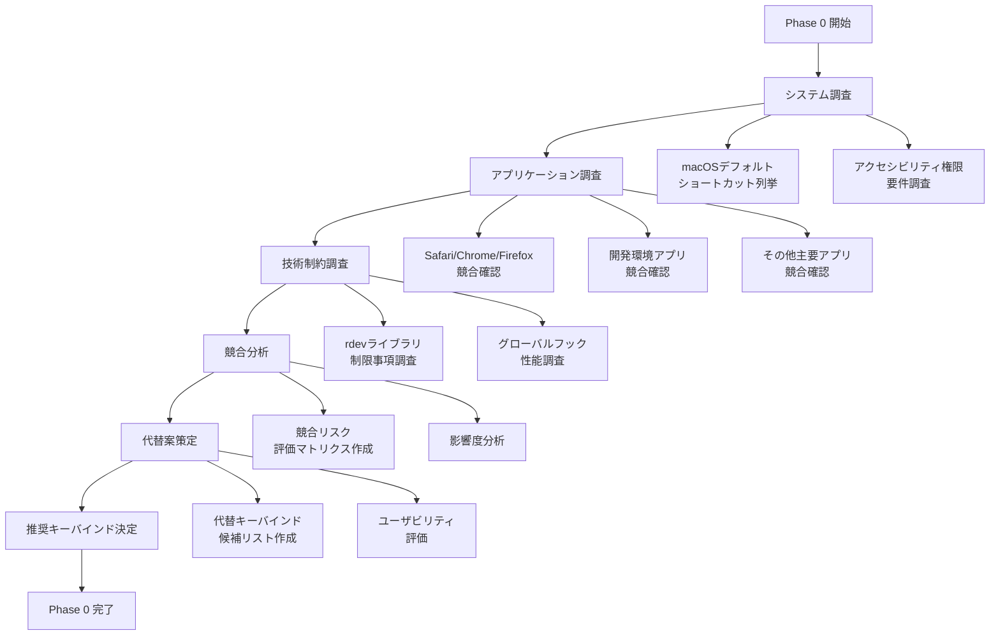

# Phase 0: ショートカットキー競合調査 詳細設計書

## Why（概要・目的）

### Phase 概要
ショートカットキーモード実装前の事前調査フェーズ。macOS環境における既存アプリケーションとのキーバインド競合を包括的に調査し、ユーザビリティとシステム安定性を両立する最適なキーバインド設計を策定する。

### 目的
- **競合リスク最小化**: 主要アプリケーションとの競合を事前特定し、ユーザーの既存ワークフローを阻害しない
- **技術制約把握**: macOSアクセシビリティ権限、グローバルフック制限事項の詳細調査
- **代替案策定**: 競合回避のための複数代替キーバインド案を設計し、優先順位付け
- **実装戦略決定**: 技術調査結果に基づく具体的な実装アプローチの選定

## What（システム仕様）

### 調査対象アーキテクチャ

```
[調査領域]
├── macOSシステムショートカット
│   ├── Mission Control (Cmd+F3等)
│   ├── Spotlight (Cmd+Space)
│   └── システム環境設定系
├── 主要ブラウザ
│   ├── Safari (Cmd+R, Cmd+1-9)
│   ├── Chrome (Cmd+R, Cmd+1-9)
│   └── Firefox (Cmd+R, Cmd+1-9)
├── 開発環境
│   ├── VSCode (Cmd+R)
│   ├── Xcode (Cmd+R)
│   └── Terminal系
└── 音声入力システム
    ├── 既存IPCコマンド構造
    ├── UiProcessManager連携
    └── StackService統合点
```

### 調査フロー図



### 成果物（機能要件）

#### 競合調査レポート

```markdown
# 競合調査レポート構造
## 1. システムレベル競合
### 1.1 macOSデフォルトショートカット
- Mission Control: Cmd+F3, Ctrl+↑
- Spotlight: Cmd+Space
- システム環境設定: Cmd+,

### 1.2 アクセシビリティ機能
- VoiceOver: Cmd+F5
- 拡大/縮小: Cmd+Option+=

## 2. アプリケーション競合マトリクス
| キー | Safari | Chrome | VSCode | Terminal | Slack | Zoom | Mail | Pages | メモ |
|------|--------|--------|---------|----------|-------|------|------|-------|------|
| Cmd+R | 🔴 | 🔴 | 🔴 | 🟡 | ⚪ | ⚪ | 🔴 | ⚪ | ⚪ |
| Cmd+1 | 🔴 | 🔴 | 🟡 | ⚪ | ⚪ | ⚪ | ⚪ | ⚪ | ⚪ |
| ... | ... | ... | ... | ... | ... | ... | ... | ... | ... |
```

#### 技術制約ドキュメント

```rust
// アクセシビリティ権限チェック例
pub fn check_accessibility_permissions() -> Result<bool, String> {
    // macOSアクセシビリティ権限の確認
    // AXIsProcessTrusted() を使用した実装例
}

// グローバルキーフック制約
pub struct GlobalKeyHookConstraints {
    pub requires_accessibility: bool,
    pub blocked_system_keys: Vec<String>,
    pub performance_impact: KeyHookPerformance,
}
```

#### 代替キーバインド候補

```rust
// 推奨キーバインド設定
pub struct ShortcutConfig {
    pub primary_option: KeyBindingSet,
    pub fallback_options: Vec<KeyBindingSet>,
    pub conflict_risk: RiskLevel,
}

pub struct KeyBindingSet {
    pub record_toggle: String,    // "Cmd+R" -> "Cmd+Shift+R"
    pub stack_access: Vec<String>, // ["Cmd+1-9"] -> ["Cmd+Opt+1-9"]
    pub stack_clear: String,      // "Cmd+C" -> "Cmd+Shift+C"
}
```

### 成果物（非機能要件）

#### パフォーマンス調査
- グローバルキーフック応答時間測定（目標: <10ms）
- メモリ使用量調査（目標: <5MB追加）
- CPU使用率影響調査（目標: <1%追加）

#### 安定性調査
- 長時間稼働テスト設計
- 権限エラー時のフォールバック動作定義
- システムスリープ/復帰時の動作確認項目

## How（実装手順）

### 目的
事前調査により、ショートカットキーモード実装時の技術的・ユーザビリティ的リスクを最小化し、最適な実装戦略を策定する。さらに、ショートカットキー動作確認プログラムを作成し、実機での基本的なキー検出動作を確認する。

### 成果物（モジュール/ファイル）
- `examples/shortcut_key_test.rs` （既存：基本キー検出プログラム）
- `examples/key_suppression_test.rs` （新規：unstable_grab抑制テストプログラム）
- `Cargo.toml` （rdev 0.5 + unstable_grab機能依存関係追加）
- `dev-docs/shortcut_mode/keybinding_recommendations.md` （実際のテスト結果に基づく代替案）

### 完了条件
- [ ] **ショートカットキー動作確認プログラム実装完了**
- [ ] **rdev unstable_grab機能でのキーイベント抑制プロトタイプ実装完了**
- [ ] **実機でのキー検出・抑制動作確認完了**
- [ ] **アクセシビリティ権限要求の動作確認完了**
- [ ] **主要アプリケーションとの競合動作確認完了**
- [ ] **プロセス異常終了時の復旧機能検証完了**
- [ ] **代替キーバインド候補策定完了**

### タスク分割

#### 🤖 実装タスク（AI実行）

- [x] **基本キー動作確認プログラム実装**
  - [x] rdev依存関係をCargo.tomlに追加
  - [x] 基本的なキー検出プログラム実装（examples/shortcut_key_test.rs）
  - [x] Cmd+R、Cmd+1-9の検出とコンソール出力
  - [x] アクセシビリティ権限チェック機能実装
  - [x] 基本的なエラーハンドリング実装

- [ ] **unstable_grab抑制プログラム実装**
  - [ ] rdev 0.5 + unstable_grab機能依存関係をCargo.tomlに追加
  - [ ] キーイベント抑制プログラム実装（examples/key_suppression_test.rs）
  - [ ] Cmd+R、Cmd+1-9の検出と抑制機能
  - [ ] イベント抑制（None返却）とパススルー（Some返却）の実装
  - [ ] アクセシビリティ権限エラー時の適切なエラーハンドリング
  - [ ] プロセス異常終了時の復旧テスト機能

#### 👤 手動検証タスク（ユーザー実行）

- [x] **基本キー動作確認テスト**
  - [x] キー動作確認プログラムを実際に実行してキー検出動作確認
  - [x] アクセシビリティ権限の要求プロセス確認
  - [x] 各種アプリケーション使用中のキー検出動作確認
  - [x] システム負荷・応答性の体感確認
  - [x] 権限なし状態でのエラーハンドリング確認

- [ ] **unstable_grab抑制機能テスト**
  - [ ] キーイベント抑制プログラムを実際に実行して抑制動作確認
  - [ ] Cmd+R抑制時にブラウザリロードが発生しないことを確認
  - [ ] Cmd+1-9抑制時にタブ切り替えが発生しないことを確認
  - [ ] 抑制対象外キーの正常なパススルー動作確認
  - [ ] プロセス異常終了（kill -9）後のシステム状態確認

- [ ] **実機競合・抑制テスト**
  - [ ] Safari・ChromeでCmd+R実行し、抑制 vs パススルー動作確認
  - [ ] Safari・ChromeでCmd+1-9実行し、抑制 vs パススルー動作確認
  - [ ] VSCodeでCmd+R実行し、抑制 vs デバッグ動作確認
  - [ ] Terminal・Slack・Zoom・Mail・Pages・メモでCmd+R抑制動作確認
  - [ ] 長時間稼働時のメモリリーク・パフォーマンス影響確認

#### 🔄 協調タスク（AI + ユーザー）

- [x] **基本キー動作確認プログラム改善**
  - [x] ユーザー: キー動作確認テスト結果フィードバック
  - [x] AI: フィードバックに基づくプログラム改善（Cmd状態追跡修正）
  - [x] ユーザー: 改善版の再テスト・評価

- [ ] **unstable_grab抑制プログラム改善**
  - [ ] ユーザー: unstable_grab抑制テスト結果フィードバック
  - [ ] AI: フィードバックに基づく抑制プログラム改善
  - [ ] ユーザー: 改善版の再テスト・評価

- [ ] **競合分析とキーバインド策定**
  - [ ] ユーザー: 実際の抑制・競合状況・使用頻度報告
  - [ ] AI: 報告に基づく代替キーバインド案作成
  - [ ] ユーザー: 代替案の実用性・使いやすさ評価

### 手動チェック項目

#### 基本キー動作確認プログラム確認
- [x] プログラムが正常にビルド・実行できることを確認
- [x] Cmd+R検出時のコンソール出力確認
- [x] Cmd+1-9検出時のコンソール出力確認
- [x] アクセシビリティ権限要求ダイアログの表示確認
- [x] 権限取得後のキー検出動作確認

#### unstable_grab抑制プログラム確認
- [ ] プログラムが正常にビルド・実行できることを確認
- [ ] Cmd+R抑制時のコンソール出力確認
- [ ] Cmd+1-9抑制時のコンソール出力確認
- [ ] アクセシビリティ権限要求ダイアログの表示確認
- [ ] 権限取得後のキーイベント抑制動作確認
- [ ] 抑制対象外キーの正常なパススルー確認

#### アプリケーション抑制・競合確認
- [ ] 各ブラウザで実際にCmd+Rを押して抑制 vs リロード動作確認
- [ ] 各ブラウザで実際にCmd+1-9を押して抑制 vs タブ/ブックマーク動作確認
- [ ] VSCodeで実際にCmd+Rを押して抑制 vs デバッグ実行確認
- [ ] 個人設定でカスタマイズされたショートカットの抑制確認
- [ ] 業務で使用するアプリケーション固有の抑制動作確認
- [ ] プロセス異常終了後のキーボード入力正常復旧確認

### 除外項目（やらないこと）

#### Phase 0では実装しない項目
- [ ] IPCコマンドの拡張実装（抑制テストプログラムは独立動作）
- [ ] UI コンポーネントの実装
- [ ] StackServiceとの統合
- [ ] voice_inputdプロセスへの統合実装
- [ ] 本格的なエラーハンドリングとリカバリ機能

#### Phase 0では調査しない項目
- [ ] Windows/Linux環境での競合調査
- [ ] 全アプリケーションの網羅的調査（主要アプリのみ）
- [ ] ✅ Web検索による技術調査（完了済み）
- [ ] ドキュメント作成

#### Phase 0では決定しない項目
- [ ] ✅ 最終的なライブラリ選択（rdev unstable_grab採用決定）
- [ ] 詳細なUI設計
- [ ] 具体的な実装スケジュール
- [ ] 複雑なフォールバック機能の仕様

### 成功基準
- **✅ キー動作確認プログラムが実機で動作し、基本的なキー検出機能が確認できている**
- **✅ アクセシビリティ権限要求から取得までのプロセスが明確になっている**
- **rdev unstable_grab機能でのキーイベント抑制が実機で動作確認できている**
- **実際の抑制シナリオでのアプリケーション動作抑制が確認できている**
- **プロセス異常終了時の適切な復旧動作が確認できている**
- **実用的な代替キーバインド案が策定されている**
- **Phase 1以降の実装方針（voice_inputd統合戦略）が明確になっている**