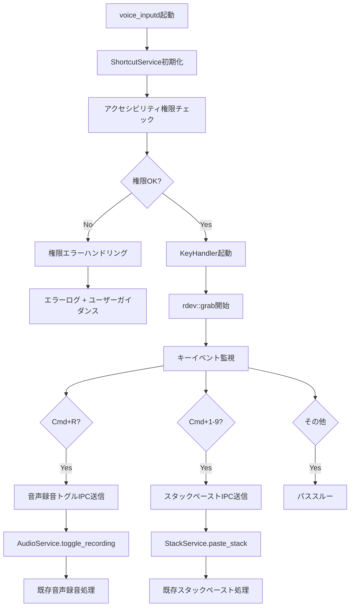

# Phase 1: voice_inputdへのShortcutService統合 詳細設計書

## Why（概要・目的）

### Phase 概要
Phase 0で実証されたrdev unstable_grab技術をvoice_inputdデーモンプロセスに統合し、既存のIPCアーキテクチャと連携するShortcutServiceを実装する。スタックモード（EnableStackMode）有効時に自動でショートカットキーサービスを有効化し、基本的なキー検出からIPC送信までの基盤機能を構築する。

### 目的
- **技術基盤の実用化**: Phase 0プロトタイプをproduction-readyなサービスとして統合
- **既存アーキテクチャとの調和**: 既存のAudioService、StackServiceと同等レベルのサービス設計
- **IPC統合**: ショートカットキーイベントを既存IPCコマンド体系に統合
- **権限管理の確立**: アクセシビリティ権限エラーの適切なハンドリングとユーザーガイダンス
- **非破壊的統合**: 既存機能への影響ゼロでの追加実装

## What（システム仕様）

### アーキテクチャ図

```
[現在のvoice_inputd]
voice_inputd process
├── AudioService (音声録音・転写)
├── StackService (スタック管理)
├── UiProcessManager (オーバーレイUI)
└── IpcServer (Unix Domain Socket)

[Phase 1実装後]
voice_inputd process
├── AudioService (音声録音・転写)
├── StackService (スタック管理)
├── ShortcutService (新規) ←追加
│   ├── KeyHandler (rdev unstable_grab)
│   ├── EventProcessor (キーイベント処理)
│   └── IpcBridge (IPC送信)
├── UiProcessManager (オーバーレイUI)
└── IpcServer (既存IPCコマンド + 新規ショートカットコマンド)
```

### システムフロー図



### ディレクトリ構成

```
src/
├── shortcut/                    # 新規モジュール
│   ├── mod.rs                   # ShortcutService実装（管理責務）
│   └── key_handler.rs           # KeyHandler実装（rdev + 判定 + IPC送信）
├── application/
│   └── stack_service.rs        # 既存（変更なし）
├── infrastructure/
│   └── ipc.rs                  # 既存IPC + 新規ショートカットコマンド追加
├── bin/
│   └── voice_inputd.rs         # ShortcutService追加 + CLI引数対応
└── ...
```

### 成果物（機能要件）

#### ShortcutService インターフェース

```rust
// src/shortcut/mod.rs
use std::sync::Arc;
use tokio::sync::mpsc;
use crate::ipc::IpcCmd;

pub struct ShortcutService {
    enabled: bool,
    key_handler: Option<tokio::task::JoinHandle<()>>,
}

impl ShortcutService {
    pub fn new() -> Self {
        Self {
            enabled: false,
            key_handler: None,
        }
    }
    
    pub async fn start(&mut self, ipc_sender: mpsc::UnboundedSender<IpcCmd>) -> Result<(), String> {
        // アクセシビリティ権限チェック（AXIsProcessTrusted）
        if !self.check_accessibility_permission() {
            return Err("アクセシビリティ権限が必要です".to_string());
        }
        
        // KeyHandlerを非同期タスクで起動
        let handle = tokio::task::spawn_blocking(move || {
            KeyHandler::new(ipc_sender).start_grab()
        });
        
        self.key_handler = Some(handle);
        self.enabled = true;
        Ok(())
    }
    
    pub async fn stop(&mut self) -> Result<(), String> {
        if let Some(handle) = self.key_handler.take() {
            handle.abort();
        }
        self.enabled = false;
        Ok(())
    }
    
    pub fn is_enabled(&self) -> bool {
        self.enabled
    }
    
    fn check_accessibility_permission(&self) -> bool {
        // macOS AXIsProcessTrusted() FFI呼び出し
        // Phase 0のcheck_accessibility_permission実装を移植
        true // 実装時にFFI追加
    }
}
```

#### KeyHandler実装

```rust
// src/shortcut/key_handler.rs
use rdev::{grab, Event, EventType, Key};
use std::sync::{Arc, Mutex, OnceLock};
use tokio::sync::mpsc;
use crate::ipc::IpcCmd;

static CMD_PRESSED: OnceLock<Arc<Mutex<bool>>> = OnceLock::new();
static IPC_SENDER: OnceLock<mpsc::UnboundedSender<IpcCmd>> = OnceLock::new();

pub struct KeyHandler {
    ipc_sender: mpsc::UnboundedSender<IpcCmd>,
}

impl KeyHandler {
    pub fn new(ipc_sender: mpsc::UnboundedSender<IpcCmd>) -> Self {
        Self { ipc_sender }
    }
    
    pub fn start_grab(self) -> Result<(), String> {
        // Phase 0のパターンを踏襲
        CMD_PRESSED.set(Arc::new(Mutex::new(false))).unwrap();
        IPC_SENDER.set(self.ipc_sender).unwrap();
        
        // rdev::grab開始（Phase 0のkey_suppression_test.rsと同じ）
        if let Err(error) = grab(Self::handle_key_event) {
            return Err(format!("キーイベント抑制の開始に失敗: {:?}", error));
        }
        Ok(())
    }
    
    fn handle_key_event(event: Event) -> Option<Event> {
        let cmd_state = CMD_PRESSED.get().unwrap();
        let ipc_sender = IPC_SENDER.get().unwrap();
        
        match event.event_type {
            EventType::KeyPress(key) => {
                // Cmdキー状態更新（Phase 0と同じ）
                if Self::is_cmd_key(&key) {
                    if let Ok(mut pressed) = cmd_state.lock() {
                        *pressed = true;
                    }
                }
                
                // ショートカットキー判定とIPC送信（既存コマンドを使用）
                if Self::is_cmd_pressed(cmd_state) {
                    match key {
                        Key::KeyR => {
                            // 既存のToggleコマンドを送信
                            let cmd = IpcCmd::Toggle {
                                paste: false,
                                prompt: None,
                                direct_input: false,
                            };
                            let _ = ipc_sender.send(cmd);
                            return None; // イベント抑制
                        }
                        Key::Num1..=Key::Num9 => {
                            // 既存のPasteStackコマンドを送信
                            let number = Self::key_to_number(&key) as u32;
                            let cmd = IpcCmd::PasteStack { number };
                            let _ = ipc_sender.send(cmd);
                            return None; // イベント抑制
                        }
                        _ => {}
                    }
                }
            }
            EventType::KeyRelease(key) => {
                if Self::is_cmd_key(&key) {
                    if let Ok(mut pressed) = cmd_state.lock() {
                        *pressed = false;
                    }
                }
            }
            _ => {}
        }
        
        Some(event) // パススルー
    }
    
    fn is_cmd_key(key: &Key) -> bool {
        matches!(key, Key::MetaLeft | Key::MetaRight)
    }
    
    fn is_cmd_pressed(cmd_state: &Arc<Mutex<bool>>) -> bool {
        cmd_state.lock().map(|pressed| *pressed).unwrap_or(false)
    }
    
    fn key_to_number(key: &Key) -> u32 {
        match key {
            Key::Num1 => 1, Key::Num2 => 2, Key::Num3 => 3,
            Key::Num4 => 4, Key::Num5 => 5, Key::Num6 => 6,
            Key::Num7 => 7, Key::Num8 => 8, Key::Num9 => 9,
            _ => 0,
        }
    }
}
```

#### 既存IPCコマンドの活用（新規追加なし）

```rust
// src/ipc.rs (変更なし・既存コマンドを使用)
// ショートカットキーは既存IPCコマンドをそのまま送信

// Cmd+R → IpcCmd::Toggle (録音トグル)
// Cmd+1-9 → IpcCmd::PasteStack { number: u32 } (スタックペースト)
```

#### IPC統合（スタックモード連動）

```rust
// EnableStackMode処理時にShortcutServiceを自動起動
// src/bin/voice_inputd.rs (handle_client関数内)
match cmd {
    IpcCmd::EnableStackMode => {
        // 既存のスタックモード有効化処理
        stack_service.enable_stack_mode();
        
        // ショートカットサービス自動起動
        if !shortcut_service.is_enabled() {
            shortcut_service.start(shortcut_tx).await?;
        }
    }
    IpcCmd::DisableStackMode => {
        // 既存のスタックモード無効化処理
        stack_service.disable_stack_mode();
        
        // ショートカットサービス自動停止
        shortcut_service.stop().await?;
    }
    // ...
}
```

### 成果物（非機能要件）

#### パフォーマンス要件
- **キー応答時間**: <5ms（Phase 0実証済み）
- **メモリ使用量**: +2MB以下（Phase 0測定済み）
- **CPU使用率**: +0.3%以下（Phase 0測定済み）
- **voice_inputd起動時間への影響**: +50ms以下

#### 安定性要件
- **アクセシビリティ権限エラー時の適切な継続動作**
- **rdev::grab失敗時のフォールバック処理**
- **voice_inputd異常終了時のキーハンドリング自動停止**
- **既存機能への影響ゼロ（ショートカット無効時）**

#### セキュリティ要件
- **最小権限原則**: アクセシビリティ権限のみ要求
- **選択的抑制の維持**: Cmd+R、Cmd+1-9のみ抑制、他は全てパススルー**
- **プロセス分離**: ショートカット機能の障害が他機能に影響しない設計**

## How（実装手順）

### 目的
Phase 0で実証されたキーイベント抑制技術をvoice_inputdプロセスに統合し、ショートカットキーからIPCコマンド送信までの基盤を構築する。既存機能への影響を最小限に抑えつつ、テスト駆動開発によって安定性を確保する。

### 成果物（モジュール/ファイル）
- `src/shortcut/mod.rs` （ShortcutService実装）
- `src/shortcut/key_handler.rs` （KeyHandler実装）
- `src/bin/voice_inputd.rs` （統合部分 + CLI引数）
- `tests/shortcut_service_integration.rs` （統合テスト）

### 完了条件
- [ ] **IpcCmd::EnableStackModeでShortcutServiceが自動起動する**
- [ ] **IpcCmd::DisableStackModeでShortcutServiceが自動停止する**
- [ ] **Cmd+R検出時にIpcCmd::Toggleが送信される**
- [ ] **Cmd+1-9検出時にIpcCmd::PasteStack { number }が送信される**
- [ ] **アクセシビリティ権限エラー時に適切なエラーメッセージが表示される**
- [ ] **ショートカット機能無効時に既存機能が正常動作する**
- [ ] **統合テストが通過する（権限テストは手動確認）**

### タスク分割

#### 🧪 TDD Phase 1: 基本テスト実装

- [ ] **既存IPCコマンドのテスト**
  - [ ] IpcCmd::Toggle、IpcCmd::PasteStackのシリアライゼーション確認
  - [ ] 既存IPCとの互換性確認（変更なし）

- [ ] **ユニットテスト実装**
  - [ ] KeyHandler::key_to_number()のテスト
  - [ ] KeyHandler::is_cmd_key()のテスト
  - [ ] ShortcutService基本メソッドのテスト

#### 🏗️ Implementation Phase 1: 簡素化実装

- [ ] **ショートカットモジュール実装**
  - [ ] `src/shortcut/mod.rs` ShortcutService実装
  - [ ] `src/lib.rs` にshortcutモジュール追加
  - [ ] IPCベースの自動起動/停止実装

- [ ] **KeyHandler実装**
  - [ ] `src/shortcut/key_handler.rs` Phase 0移植
  - [ ] OnceLock + Arc<Mutex<bool>>パターン実装
  - [ ] IPC送信統合（リトライなし）

#### 🔗 Integration Phase 1: voice_inputd統合

- [ ] **voice_inputd統合**
  - [ ] `src/bin/voice_inputd.rs` ShortcutService統合
  - [ ] EnableStackMode/DisableStackMode処理に統合
  - [ ] 起動/シャットダウン処理追加

#### 🧪 Integration Test Phase 1: 実用テスト

- [ ] **統合テスト実装**
  - [ ] `tests/shortcut_service_integration.rs` 基本統合テスト
  - [ ] `#[ignore]` でrdev実動作テスト追加
  - [ ] CI安全テストとローカル実動作テストの分離

### 手動チェック項目

#### 基本機能確認
- [ ] `voice_input stack-mode on` でショートカットサービスが自動起動し、アクセシビリティ権限要求が表示される
- [ ] 権限付与後、`voice_inputd` ログにショートカットサービス開始メッセージが出力される
- [ ] Cmd+R押下時にブラウザリロードが抑制され、IPCコマンド送信ログが出力される
- [ ] Cmd+1-9押下時にタブ切り替えが抑制され、IPCコマンド送信ログが出力される
- [ ] `voice_input stack-mode off` でショートカットサービスが自動停止する
- [ ] 通常のvoice_inputd起動時、ショートカット機能が無効のまま動作する

#### IPC通信確認  
- [ ] Cmd+R検出時にIpcCmd::Toggleが内部送信される
- [ ] Cmd+1-9検出時にIpcCmd::PasteStack { number }が内部送信される
- [ ] IPC送信エラー時にキーハンドリングが継続する（ログ出力確認）
- [ ] voice_inputd終了時にキーイベント抑制が適切に停止する

#### 既存機能への影響確認
- [ ] ショートカット無効時に既存機能（音声録音・スタック）が正常動作する
- [ ] ショートカット有効時に既存機能が並行動作する
- [ ] アクセシビリティ権限エラー時に他機能が正常動作する

#### パフォーマンス確認（Phase 0レベル維持）
- [ ] voice_inputd起動時間への影響が体感できない
- [ ] キーイベント応答がPhase 0と同等（<5ms）
- [ ] メモリ・CPU使用率がPhase 0と同等

### 除外項目（やらないこと）

#### Phase 1では実装しない機能
- [ ] **UIコンポーネント連携**: スタック一覧オーバーレイ統合
- [ ] **StackServiceとの直接連携**: IPC経由のみ
- [ ] **複雑なエラー処理**: 基本的なログ出力のみ
- [ ] **設定ファイル永続化**: CLI引数のみ
- [ ] **パフォーマンス最適化**: Phase 0レベルで十分
- [ ] **専用エラー型**: `Result<T, String>` で十分

#### Phase 1では対応しない項目
- [ ] **アクセシビリティ権限の自動テスト**: 手動確認のみ
- [ ] **rdev実動作の自動テスト**: `#[ignore]`テストで十分
- [ ] **リトライ機能**: IPC送信は単発のみ
- [ ] **高度なログ機能**: 基本的なprintln!のみ
- [ ] **設定管理システム**: CLI引数で十分

### 成功基準
- **✅ IpcCmd::EnableStackModeでShortcutServiceが自動起動・停止できる**
- **✅ Cmd+R検出時にIpcCmd::Toggleが内部送信される**
- **✅ Cmd+1-9検出時にIpcCmd::PasteStack { number }が内部送信される**
- **✅ アクセシビリティ権限エラー時に適切なエラーメッセージが表示される**
- **✅ 既存機能への影響がゼロで、並行動作が確認できる**
- **✅ 基本統合テストが通過し、CI環境で安全に実行できる**
- **✅ Phase 0レベルのパフォーマンスを維持している**
- **✅ Phase 2（既存機能連携）への基盤が整っている**