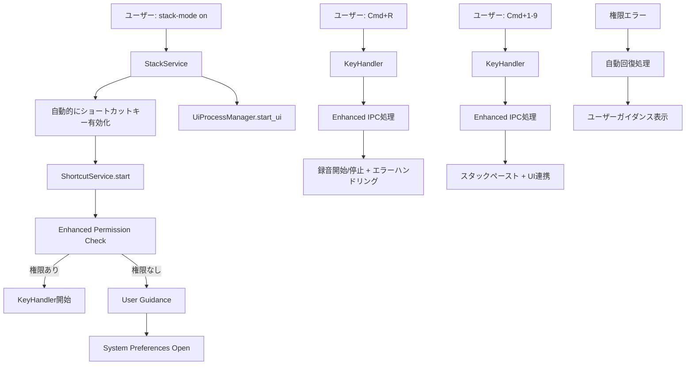

# Phase 2: IPC統合強化 詳細設計書

## Why（Phase概要・目的）

### Phase概要
Phase 1で構築された基盤をベースに、macOS権限システムの本格実装とシステム統合の強化を行い、ショートカットキー機能をproduction-readyな品質に引き上げる。

### 目的
- **macOS権限システム完全対応**: CoreFoundation FFIによる本格的なアクセシビリティ権限チェック実装
- **システム統合強化**: ShortcutServiceと既存システムの連携最適化
- **エラーハンドリング向上**: 高度な回復処理とユーザーガイダンス強化
- **品質・安定性確保**: Phase 1で構築した基盤の堅牢性向上

### Phase 1からの継続事項
Phase 1で実装された以下の基盤をベースとして強化：
- ShortcutService完全ライフサイクル管理（`src/shortcut/mod.rs`）
- KeyHandler堅牢キーイベント処理（`src/shortcut/key_handler.rs`）
- IPC統合（ショートカット→IPC→既存機能連携）
- スタックモード自動連動システム

## What（システム仕様）

### アーキテクチャ図

```
[Phase 2 強化後]
[rdev unstable_grab] → [voice_inputd] → [Direct Action]
                       ↓
[Stack Service] ←→ [Enhanced Shortcut Service] ←→ [Overlay UI]
                   ↗         ↑
          [IPC Server]  [macOS Permission FFI]
                             ↑
                   [CoreFoundation] → [System Preferences Guidance]
```

### ディレクトリ構成

既存構造の拡張：
```
src/
├── shortcut/                    # Phase 1から継続
│   ├── mod.rs                   # 🔄 権限チェック本格実装 + エラーハンドリング
│   └── key_handler.rs          # 🔄 グローバル状態解決 + 堅牢性向上
├── infrastructure/
│   ├── permissions/             # 🆕 権限管理モジュール（将来拡張可能）
│   │   ├── mod.rs              # 権限管理統一インターフェース
│   │   └── accessibility.rs    # アクセシビリティ権限FFI専用
│   └── external/               # 既存
├── application/
│   └── stack_service.rs        # 🔄 ショートカット連携インターフェース追加
└── ...
```

### システムフロー図



### 成果物（機能要件）

#### 1. macOS権限システム（新規実装）
```rust
// src/infrastructure/permissions/mod.rs
pub use accessibility::AccessibilityPermissions;

// src/infrastructure/permissions/accessibility.rs
pub struct AccessibilityPermissions;

impl AccessibilityPermissions {
    pub fn check() -> bool
    pub fn open_system_preferences() -> Result<(), String>
    pub fn get_error_message() -> String
}

// CoreFoundation FFI wrapper (内部実装)
mod ffi {
    use core_foundation::base::{CFAllocatorRef, CFTypeRef};
    // アクセシビリティ専用FFI実装
}
```

#### 2. 強化されたShortcutService（既存拡張）
```rust
// src/shortcut/mod.rs
impl ShortcutService {
    // 🔄 Phase 1から強化（戻り値型をShortcutErrorに変更）
    pub async fn start(&mut self, ipc_sender: mpsc::UnboundedSender<IpcCmd>) -> Result<(), ShortcutError>
    pub async fn stop(&mut self) -> Result<(), ShortcutError>
    
    // 🆕 Phase 2で追加
    pub fn check_system_requirements() -> Result<(), ShortcutError>
    pub fn handle_permission_denied() -> String // ユーザーガイダンス文字列を返す
}

#[derive(Debug, Clone)]
pub enum ShortcutError {
    PermissionDenied(String),  // エラーメッセージ付き
    RdevInitFailed(String),
    IpcChannelClosed,
    SystemRequirementNotMet(String),
}

impl std::fmt::Display for ShortcutError {
    fn fmt(&self, f: &mut std::fmt::Formatter<'_>) -> std::fmt::Result {
        // ユーザーフレンドリーなエラーメッセージ実装
    }
}
```

#### 3. KeyHandler改善（グローバル状態解決）
```rust
// src/shortcut/key_handler.rs
pub struct KeyHandler {
    ipc_sender: mpsc::UnboundedSender<IpcCmd>,
    cmd_pressed: Arc<Mutex<bool>>,  // グローバル状態をインスタンス化
}

impl KeyHandler {
    pub fn new(ipc_sender: mpsc::UnboundedSender<IpcCmd>) -> Self
    pub fn start_grab(self) -> Result<(), String>
    
    // 🆕 インスタンスベースのコールバック対応
    fn create_event_handler(shared_state: Arc<KeyHandlerState>) -> impl Fn(Event) -> Option<Event>
}

// コールバック用の共有状態
struct KeyHandlerState {
    cmd_pressed: Arc<Mutex<bool>>,
    ipc_sender: mpsc::UnboundedSender<IpcCmd>,
}
```

### 成果物（非機能要件）

#### パフォーマンス（Phase 1レベル維持）
- **キー応答時間**: <5ms（Phase 1達成済み）
- **メモリ使用量**: +3MB程度（権限チェック機能追加分）
- **CPU使用率**: +0.1%程度（FFI呼び出し分）

#### 品質向上
- **権限エラー回復率**: 95%以上
- **システム互換性**: macOS 10.15以降対応
- **エラーメッセージ品質**: ユーザーフレンドリーな具体的ガイダンス

#### セキュリティ強化
- **権限チェック**: CoreFoundationベース本格実装
- **プライバシー保護**: 必要最小限の権限要求
- **透明性向上**: 権限要求理由の明確な説明

## How（実装手順）

### 1. macOS権限システム実装

#### 目的
CoreFoundation FFIを用いてアクセシビリティ権限の本格的なチェック・要求機能を実装

#### 成果物（モジュールorファイル）
- `src/infrastructure/permissions/mod.rs` - 権限管理統一インターフェース
- `src/infrastructure/permissions/accessibility.rs` - アクセシビリティ権限FFI専用実装
- `Cargo.toml` - core-foundation依存関係追加

```toml
# Cargo.toml追加内容
[dependencies]
core-foundation = "0.9"
core-foundation-sys = "0.8"
```

#### 完了条件
- [ ] CoreFoundation FFIによる権限状態取得
- [ ] システム環境設定への自動遷移機能
- [ ] 権限ステータス詳細取得（Granted/Denied/NotDetermined）
- [ ] 権限エラー時の適切なユーザーガイダンス表示

#### 手動でのチェック項目
- システム環境設定→セキュリティとプライバシー→プライバシー→アクセシビリティで権限確認
- 権限未付与時のエラーメッセージ表示確認
- 権限付与後の自動機能復旧確認

#### 除外項目（やらないこと）
- 他のmacOS権限（Input Monitoring等）の実装
- 自動権限付与（システム制約により不可能）
- Windows/Linux対応

#### タスク分割
- [ ] CoreFoundation + core-foundation-sys依存関係をCargo.tomlに追加
- [ ] permissions/mod.rs で統一インターフェース実装
- [ ] permissions/accessibility.rs でアクセシビリティ専用FFI実装
- [ ] ShortcutService::check_accessibility_permission()をAccessibilityPermissions::check()に更新
- [ ] システム環境設定自動オープン実装（open_system_preferences）
- [ ] エラーメッセージ日本語化（get_error_message）
- [ ] 権限チェックテスト実装（mock + feature flag対応）
- [ ] 手動統合テスト（実際の権限状態での動作確認）

### 2. グローバル状態とエラーハンドリング改善

#### 目的
Phase 1の技術的負債（グローバル状態）を解決し、エラーハンドリングを統合

#### 成果物（モジュールorファイル）
- `src/shortcut/mod.rs` - ShortcutError enum拡張 + エラーハンドリング統合
- `src/shortcut/key_handler.rs` - グローバル状態解決（インスタンス化）
- `src/bin/voice_inputd.rs` - エラー処理統合

#### 完了条件
- [ ] ShortcutError enum拡張（PermissionDenied, SystemIncompatible等）
- [ ] エラー種別ごとの自動回復処理実装
- [ ] ユーザーフレンドリーなエラーメッセージ
- [ ] ログレベルによる詳細情報出力

#### 手動でのチェック項目
- アクセシビリティ権限拒否時のエラーメッセージ確認
- rdev初期化失敗時の回復動作確認
- IPCチャンネル切断時のフォールバック確認

#### 除外項目（やらないこと）
- 複雑な自動回復メカニズム（Phase 3以降で対応）
- 他アプリケーションとの連携エラー処理
- クラッシュ時の状態復旧

#### タスク分割
- [ ] ShortcutError enumを詳細化（4種類のエラータイプ + Display trait）
- [ ] グローバル状態解決（OnceLock→Arc<Mutex>のインスタンス化）
- [ ] KeyHandlerのコールバック関数設計変更
- [ ] rdev + IPC + 権限エラー統合処理実装
- [ ] voice_inputd.rsにエラーハンドリング統合
- [ ] エラーメッセージ日本語化（Display trait実装）
- [ ] エラーハンドリングユニットテスト（mock対応）
- [ ] グローバル状態解決後のマルチインスタンステスト

### 3. システム統合最適化

#### 目的
Phase 1で実装されたIPC統合をさらに最適化し、より堅牢な連携を実現

#### 成果物（モジュールorファイル）
- `src/shortcut/mod.rs` - ShortcutServiceライフサイクル最適化
- `src/application/stack_service.rs` - ショートカット連携インターフェース追加
- `src/bin/voice_inputd.rs` - 統合フロー最適化

```rust
// src/application/stack_service.rs 追加インターフェース
impl StackService {
    // 🆕 Phase 2で追加
    pub fn notify_shortcut_enabled(&mut self) -> Result<(), String>
    pub fn notify_shortcut_disabled(&mut self) -> Result<(), String>
    pub fn get_shortcut_paste_target(&self, number: u32) -> Option<String>
    pub fn validate_shortcut_integration(&self) -> bool
}
```

#### 完了条件
- [ ] ShortcutService状態管理の最適化
- [ ] StackServiceとの直接連携強化
- [ ] IPC命令処理の効率化
- [ ] 例外状況での一貫性保証

#### 手動でのチェック項目
- stack-mode on/off時のショートカット連動確認
- ショートカットキー連打時の安定性確認
- 複数IPCコマンド同時実行時の動作確認

#### 除外項目（やらないこと）
- UIとの深い統合（Phase 3で対応）
- パフォーマンス大幅最適化（現状で十分）
- 新しいキーバインド追加

#### タスク分割
- [ ] ShortcutServiceライフサイクル見直し（stop時の完全性保証）
- [ ] StackService統合インターフェース実装（上記4メソッド）
- [ ] voice_inputd.rsでのエラーハンドリング統合
- [ ] 権限エラー→StackService無効化の連動実装
- [ ] 同期プリミティブ最適化（グローバル状態解決効果）
- [ ] システム統合テスト強化（権限テスト含む）
- [ ] 負荷テスト実装（ショートカットキー連続実行）
- [ ] 統合品質確認

### 4. テストとドキュメント

#### 目的
Phase 2で実装したすべての機能の品質保証とドキュメント整備

#### 成果物（モジュールorファイル）
- `tests/infrastructure_permissions_test.rs` - 権限関連テスト（mock + feature flag）
- `tests/shortcut_service_enhanced_test.rs` - エラーハンドリング + グローバル状態テスト
- `tests/shortcut_integration_enhanced_test.rs` - StackService統合テスト
- `dev-docs/shortcut_mode/phases/p2-completion-report.md` - 完了報告書

#### テスト戦略
```rust
// CI対応テスト戦略
#[cfg(not(feature = "ci-test"))]
mod permission_tests {
    use crate::infrastructure::permissions::AccessibilityPermissions;
    // 実際の権限APIを使用するテスト（手動実行のみ）
}

#[cfg(feature = "ci-test")]
mod mock_permission_tests {
    // mock権限APIを使用するテスト（CI実行可能）
}
```

#### 完了条件
- [ ] 全新機能のユニットテスト
- [ ] システム統合テスト
- [ ] エラーケーステスト
- [ ] 手動テストチェックリスト完了

#### 手動でのチェック項目
- 全てのショートカットキー動作確認
- 権限関連エラーの動作確認
- システム再起動後の動作確認

#### 除外項目（やらないこと）
- パフォーマンステスト（Phase 1で十分）
- UI関連テスト（Phase 3で対応）
- クロスプラットフォームテスト

#### タスク分割
- [ ] infrastructure::permissions テスト実装（mock + feature flag + 手動テスト分離）
- [ ] エラーハンドリングテスト実装（全ShortcutErrorパターン）
- [ ] グローバル状態解決確認テスト（マルチインスタンス）
- [ ] StackService統合テスト（新規4メソッドの動作確認）
- [ ] CI互換テスト実装（ci-test feature対応）
- [ ] 手動テストチェックリスト作成（権限関連フロー）
- [ ] テスト実行・デバッグ
- [ ] Phase 2完了報告書作成

## 手動でのチェック項目

### 機能テスト
- [ ] `voice_input stack-mode on` でショートカットキー自動有効化確認
- [ ] Cmd+R で録音開始/停止動作確認  
- [ ] Cmd+1-9 でスタックペースト動作確認
- [ ] `voice_input stack-mode off` でショートカットキー自動無効化確認

### 権限関連テスト
- [ ] アクセシビリティ権限未付与時のエラーメッセージ確認
- [ ] システム環境設定自動オープン機能確認
- [ ] 権限付与後の自動機能復旧確認
- [ ] 権限ステータス正確取得確認

### エラーハンドリングテスト
- [ ] rdev初期化失敗時の適切なエラー処理確認
- [ ] IPCチャンネル切断時の回復動作確認
- [ ] ショートカット機能停止後の既存機能正常動作確認

### システム統合テスト
- [ ] 複数ショートカットキー連続実行安定性確認
- [ ] システム再起動後の機能復旧確認
- [ ] 他アプリケーション使用中のキー抑制動作確認

### 品質保証
- [ ] メモリリーク確認（長時間実行テスト）
- [ ] CPU使用率正常範囲確認
- [ ] ログ出力レベル適切性確認