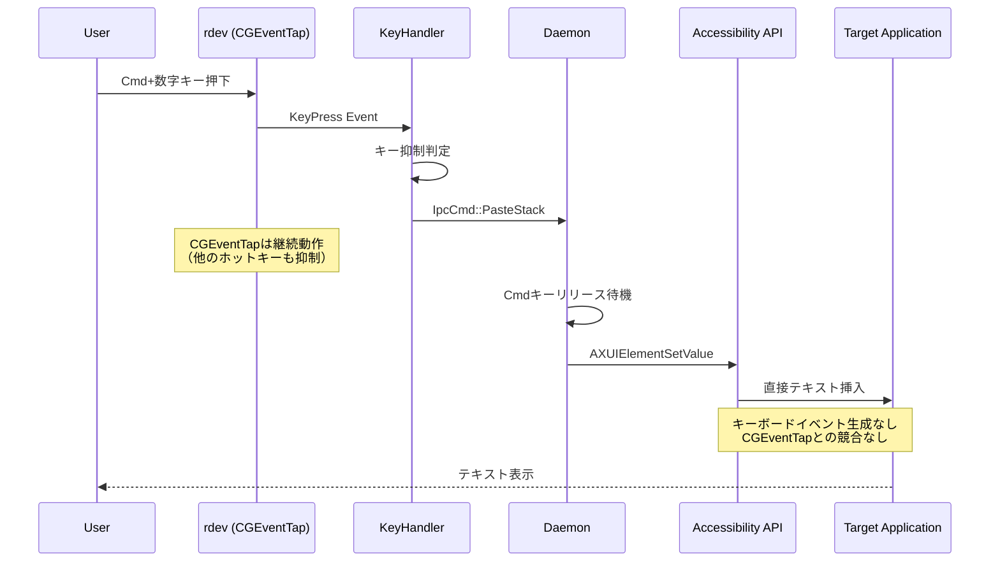

# Phase 3 Fix: Accessibility API直接制御による競合回避

## Why

### Phase 概要
Phase 3で実装したショートカットキー機能において、連続入力時の抑制失敗が発生している。特に文字入力を挟んだ後の次の1回目のキーイベントが失敗する問題の根本的解決を目指す。

### 目的
- **問題**: rdevのCGEventTapとEnigoのCGEventPostがmacOSカーネルレベルで競合
- **現象**: `cmd+1 -> 文字入力 -> cmd+2(失敗) -> cmd+2(成功)`のパターン
- **目標**: キーボードイベント生成を避け、Accessibility APIによる直接テキスト挿入で競合を完全回避
- **効果**: 既存アプリケーションのホットキー無効化を維持しつつ、安定したペースト機能を実現

## What

### アーキテクチャ図

```
現在のアーキテクチャ（競合あり）:
┌─────────────┐    ┌──────────────┐    ┌─────────────┐
│   rdev      │    │  Subprocess  │    │   macOS     │
│ CGEventTap  │◄──►│    Enigo     │◄──►│ Event       │
│ (Key Hook)  │    │ CGEventPost  │    │ System      │
└─────────────┘    └──────────────┘    └─────────────┘
        ▲                   ▲                   ▲
        └─────── 競合発生 ──────┘                │
                                              │
                                         優先度競合

新アーキテクチャ（競合回避）:
┌─────────────┐    ┌──────────────┐    ┌─────────────┐
│   rdev      │    │Accessibility │    │   Target    │
│ CGEventTap  │    │   API        │    │Application  │
│ (Key Hook)  │    │(Direct Text) │───►│Text Field   │
└─────────────┘    └──────────────┘    └─────────────┘
        │                   │
        └─── 独立動作 ────────┘
```

### ディレクトリ構成

```
src/
├── infrastructure/
│   └── external/
│       ├── text_input.rs                    # 既存（エントリポイント）
│       ├── text_input_enigo.rs             # 既存（移行期間後に廃止）
│       ├── text_input_subprocess.rs        # 既存（移行期間後に廃止）
│       └── text_input_accessibility.rs     # 新規追加
├── shortcut/
│   ├── cmd_release_detector.rs             # 既存（実装時に簡素化可否を判断）
│   └── key_handler.rs                      # 既存（変更最小）
└── bin/
    ├── voice_inputd.rs                     # 既存（設定変更のみ）
    └── enigo_helper.rs                     # 既存（移行期間後に廃止）
```

### フロー図



### 成果物

#### 機能要件
- **安定したショートカット処理**: 連続入力、文字入力後でも100%成功
- **互換性維持**: 既存のstack機能、UI連携は変更なし
- **エラーハンドリング**: Accessibility API失敗時は操作を中止し、ユーザーに通知

#### 非機能要件
- **信頼性**: CGEventTap競合による失敗率0%
- **レスポンス性**: キーイベント生成のオーバーヘッド削除
- **セキュリティ**: アクセシビリティ権限の適切な管理

#### インターフェース設計

```rust
// src/infrastructure/external/text_input_accessibility.rs

use core_foundation::base::TCFType;
use core_foundation::string::{CFString, CFStringRef};
use std::error::Error;
use std::fmt;

/// テキスト入力エラー型（統一）
#[derive(Debug)]
pub enum TextInputError {
    /// フォーカス中の要素が見つからない
    NoFocusedElement,
    /// テキストフィールドではない
    NotTextElement,
    /// API呼び出し失敗
    ApiCallFailed(String),
    /// 権限不足
    PermissionDenied,
    /// カーソル位置の取得失敗
    CursorPositionError(String),
}

impl fmt::Display for TextInputError {
    fn fmt(&self, f: &mut fmt::Formatter<'_>) -> fmt::Result {
        match self {
            TextInputError::NoFocusedElement => {
                write!(f, "No focused element found")
            }
            TextInputError::NotTextElement => {
                write!(f, "Focused element is not a text field")
            }
            TextInputError::ApiCallFailed(msg) => {
                write!(f, "Accessibility API call failed: {}", msg)
            }
            TextInputError::PermissionDenied => {
                write!(f, "Accessibility permission denied. Please grant accessibility access in System Settings.")
            }
            TextInputError::CursorPositionError(msg) => {
                write!(f, "Failed to get cursor position: {}", msg)
            }
        }
    }
}

impl Error for TextInputError {}

// FFI bindings
// 注: 以下の型定義とFFI宣言は実装時に詳細を決定する
// - c_void, CFTypeRef, CFDictionaryRef, AXError等の正確な定義
// - core-foundation-sysクレートの使用検討
// - メモリ管理（CFRelease）の実装方針
#[repr(C)]
struct AXUIElementRef(*mut c_void);

#[link(name = "ApplicationServices", kind = "framework")]
extern "C" {
    fn AXIsProcessTrusted() -> bool;
    fn AXIsProcessTrustedWithOptions(options: CFDictionaryRef) -> bool;
    fn AXUIElementCopySystemWide() -> AXUIElementRef;
    fn AXUIElementCopyAttributeValue(
        element: AXUIElementRef,
        attribute: CFStringRef,
        value: *mut CFTypeRef,
    ) -> AXError;
    fn AXUIElementSetAttributeValue(
        element: AXUIElementRef,
        attribute: CFStringRef,
        value: CFTypeRef,
    ) -> AXError;
}

/// 権限チェックと要求
pub fn check_accessibility_permission() -> Result<(), TextInputError> {
    unsafe {
        if AXIsProcessTrusted() {
            Ok(())
        } else {
            // 権限ダイアログを表示するオプション
            // 注: create_ax_options_dict()の実装は実装時に決定
            let options = create_ax_options_dict();
            AXIsProcessTrustedWithOptions(options);
            Err(TextInputError::PermissionDenied)
        }
    }
}

/// フォーカス中のテキストフィールドに直接テキストを挿入
///
/// カーソル位置に挿入（既存テキストを保持）
pub async fn insert_text_at_cursor(text: &str) -> Result<(), TextInputError> {
    tokio::task::spawn_blocking({
        let text = text.to_string();
        move || insert_text_sync(&text)
    })
    .await
    .map_err(|e| TextInputError::ApiCallFailed(e.to_string()))?
}

/// 同期版テキスト挿入（内部実装）
fn insert_text_sync(text: &str) -> Result<(), TextInputError> {
    // 1. 権限チェック
    check_accessibility_permission()?;
    
    // 2. システム全体のフォーカス中要素を取得
    let focused_element = get_focused_element()?;
    
    // 3. テキストフィールドかどうか確認
    // 注: validate_text_element()で許可するRole（AXTextField等）は実装時に調査して決定
    validate_text_element(&focused_element)?;
    
    // 4. カーソル位置に挿入
    insert_at_cursor_position(&focused_element, text)?;
    
    Ok(())
}

/// フォーカス中の要素を取得
fn get_focused_element() -> Result<AXUIElementRef, TextInputError> {
    unsafe {
        let system_wide = AXUIElementCopySystemWide();
        let mut focused_element: CFTypeRef = std::ptr::null_mut();
        
        // 注: kAXFocusedUIElementAttribute等の定数は実装時に定義
        let result = AXUIElementCopyAttributeValue(
            system_wide,
            kAXFocusedUIElementAttribute,
            &mut focused_element,
        );
        
        if result == kAXErrorSuccess && !focused_element.is_null() {
            Ok(focused_element as AXUIElementRef)
        } else {
            Err(TextInputError::NoFocusedElement)
        }
    }
}

/// カーソル位置にテキストを挿入
fn insert_at_cursor_position(element: &AXUIElementRef, text: &str) -> Result<(), TextInputError> {
    unsafe {
        // 1. 既存のテキストを取得
        let mut current_value: CFTypeRef = std::ptr::null_mut();
        AXUIElementCopyAttributeValue(
            *element,
            kAXValueAttribute,
            &mut current_value,
        );
        
        let current_text = if !current_value.is_null() {
            // 注: cfstring_to_string()の実装は実装時に決定
            cfstring_to_string(current_value as CFStringRef)
        } else {
            String::new()
        };
        
        // 2. カーソル位置を取得
        let mut range_value: CFTypeRef = std::ptr::null_mut();
        let range_result = AXUIElementCopyAttributeValue(
            *element,
            kAXSelectedTextRangeAttribute,
            &mut range_value,
        );
        
        let cursor_position = if range_result == kAXErrorSuccess && !range_value.is_null() {
            // CFRange から位置を取得
            // 注: extract_cursor_position()の実装は実装時に決定
            extract_cursor_position(range_value)?
        } else {
            // カーソル位置が取得できない場合は末尾に追加
            current_text.len()
        };
        
        // 3. 新しいテキストを構築
        let mut new_text = String::with_capacity(current_text.len() + text.len());
        new_text.push_str(&current_text[..cursor_position]);
        new_text.push_str(text);
        new_text.push_str(&current_text[cursor_position..]);
        
        // 4. 新しいテキストを設定
        // 注: create_cfstring()の実装は実装時に決定
        let new_value = create_cfstring(&new_text);
        let result = AXUIElementSetAttributeValue(
            *element,
            kAXValueAttribute,
            new_value as CFTypeRef,
        );
        
        if result == kAXErrorSuccess {
            Ok(())
        } else {
            Err(TextInputError::ApiCallFailed(format!("Failed to set value: {:?}", result)))
        }
    }
}
```

#### 実装ステップ（削除）

当初の段階的実装は削除し、以下のタスク分割に従って実装する。

```rust
// src/infrastructure/external/text_input.rs (修正版)

use crate::infrastructure::external::text_input_accessibility;
use std::error::Error;

/// メイン入力関数（Accessibility APIのみ使用）
/// 
/// 注: subprocess方式はEnigoを使用するため同じ競合問題が発生。
/// そのため、フォールバックは行わず、失敗時はエラーを返す。
pub async fn type_text(text: &str) -> Result<(), Box<dyn Error>> {
    match text_input_accessibility::insert_text_at_cursor(text).await {
        Ok(_) => {
            println!("✓ Text inserted via Accessibility API");
            Ok(())
        }
        Err(e) => {
            eprintln!("Text insertion failed: {}", e);
            
            // 権限エラーの場合は特別なメッセージ
            if matches!(e, text_input_accessibility::TextInputError::PermissionDenied) {
                eprintln!("\nPlease grant accessibility permission:");
                eprintln!("System Settings > Privacy & Security > Accessibility");
            }
            
            Err(Box::new(e))
        }
    }
}
```


## 詳細設計項目

### Task 1: Accessibility API基盤実装

- **How**
  - 内容
    - 目的: macOS Accessibility APIへの低レベルアクセスを可能にする基盤を構築
    - 成果物: 
      - `src/infrastructure/external/text_input_accessibility.rs`（基本構造）
      - CoreFoundation bindingsの追加（Cargo.tomlの更新）
    - 完了条件:
      - AXUIElement型の定義が完了
      - 基本的なAPIコールのFFI bindingsが実装済み
      - エラー型が定義され、適切なエラーハンドリングが可能
    - 手動でのチェック項目:
      - `cargo check`でコンパイルエラーがないこと
      - 単体テストで基本的なAPI呼び出しが成功すること
    - 除外項目:
      - 実際のテキスト挿入機能（Task 2で実装）
      - UIとの統合（Task 4で実装）

- タスク分割:
  - [ ] CoreFoundation依存関係をCargo.tomlに追加
  - [ ] AXUIElement型とその関連型の定義
  - [ ] AccessibilityError型の実装とError traitの実装
  - [ ] 基本的なFFI関数の宣言（extern block）
  - [ ] 単体テストの作成（モック使用）

### Task 2: フォーカス要素検出機能実装

- **How**
  - 内容
    - 目的: システム全体でフォーカスされている要素を検出し、テキスト入力可能か判定
    - 成果物:
      - `get_focused_element()`関数の実装
      - `validate_text_element()`関数の実装
    - 完了条件:
      - 各種アプリケーション（Chrome, VS Code, Terminal）でフォーカス要素を正しく検出
      - テキストフィールド以外（ボタンなど）を適切に判別
      - 権限エラーを適切にハンドリング
    - 手動でのチェック項目:
      - Chrome, Safari, VS Code, Terminal.appでの動作確認
      - アクセシビリティ権限なしでの適切なエラー表示
      - フォーカスなし状態での適切なエラー表示
    - 除外項目:
      - 実際のテキスト挿入（Task 3で実装）
      - パフォーマンス最適化

- タスク分割:
  - [ ] AXUIElementCopySystemWideの実装とテスト
  - [ ] AXUIElementCopyAttributeValueの実装（kAXFocusedUIElementAttribute）
  - [ ] Role属性の取得と判定ロジック実装
  - [ ] 権限チェック機能の実装
  - [ ] 統合テストの作成（実際のアプリケーションでのテスト）

### Task 3: テキスト挿入機能実装

- **How**
  - 内容
    - 目的: フォーカスされたテキストフィールドに直接テキストを挿入
    - 成果物:
      - `set_element_value()`関数の実装
      - `insert_text()`の完全実装
    - 完了条件:
      - 各種アプリケーションで正しくテキストが挿入される
      - 日本語・絵文字を含む多言語テキストが正しく処理される
      - 既存のテキストを上書きではなく挿入位置に追加
    - 手動でのチェック項目:
      - 単一行テキストフィールドでの動作
      - 複数行テキストエリアでの動作
      - 日本語入力での動作確認
      - 絵文字（🎉など）の挿入確認
    - 除外項目:
      - フォールバック機能（Task 4で実装）
      - ショートカットキーとの統合（Task 5で実装）

- タスク分割:
  - [ ] AXUIElementSetAttributeValueの実装
  - [ ] カーソル位置の取得と挿入位置の計算
  - [ ] テキスト挿入のテスト（ASCII文字）
  - [ ] マルチバイト文字対応とテスト
  - [ ] エラーケースのテストとハンドリング

### Task 4: エラーハンドリングと統合

- **How**
  - 内容
    - 目的: Accessibility API失敗時の適切なエラーハンドリングと既存システムとの統合
    - 成果物:
      - `text_input.rs`の更新（エラーハンドリング強化）
      - 環境変数による一時的な切り替え機能（移行期間のみ）
    - 完了条件:
      - Accessibility API失敗時に適切なエラーメッセージを表示
      - ログで使用された方式が明確に分かる
      - 既存のテストが全てパス
    - 手動でのチェック項目:
      - アクセシビリティ権限なしでの適切なエラー表示
      - 各種エラーケースでの明確なユーザー通知
      - パフォーマンスの測定（切り替えオーバーヘッド）
    - 除外項目:
      - UIの変更
      - 設定ファイルの追加（環境変数で制御）

- タスク分割:
  - [ ] TextInputError型の統一（Box<dyn Error>からの変更）
  - [ ] type_text()関数のエラーハンドリング実装
  - [ ] ログ出力の追加（どの方式が使われたか）
  - [ ] 既存テストの更新と動作確認
  - [ ] エラー時のユーザー向けガイダンス実装

### Task 5: ショートカットキー統合とstacking mode統一

- **How**
  - 内容
    - 目的: ショートカットキー機能とstacking mode off時の入力を全てAccessibility APIに統一
    - 成果物:
      - `key_handler.rs`の更新
      - `voice_inputd.rs`の設定変更
      - 不要なsubprocessコードの削除
    - 完了条件:
      - Cmd+数字での連続入力が100%成功
      - stacking mode off時もAccessibility APIを使用
      - 既存の全機能が正常動作
    - 手動でのチェック項目:
      - Cmd+1→文字入力→Cmd+2の連続動作
      - 10回連続でのCmd+数字入力
      - stacking mode on/offの切り替え動作
      - 各種アプリケーションでの動作確認
    - 除外項目:
      - 新機能の追加
      - UIの変更

- タスク分割:
  - [ ] key_handler.rsでAccessibility APIの使用
  - [ ] daemon設定の更新（常にAccessibility使用）
  - [ ] cmd_release_detector.rsの動作確認（簡素化可能か実装時に判断）
  - [ ] 統合テストの実行と修正
  - [ ] 環境変数での旧実装切り替え機能（移行期間のみ）

### Task 6: 実環境テストとドキュメント化

- **How**
  - 内容
    - 目的: 各種アプリケーションでの動作確認と使用方法のドキュメント化
    - 成果物:
      - 動作確認済みアプリケーションリスト
      - トラブルシューティングガイド
      - 性能測定結果（参考値）
    - 完了条件:
      - 主要アプリケーション10種類以上での動作確認
      - 既知の問題と回避策のドキュメント化
      - 基本的な性能測定の完了
    - 手動でのチェック項目:
      - 各アプリケーションでの10回連続成功
      - エラーケースの再現と対処法確認
      - 長時間動作の安定性確認
    - 除外項目:
      - 性能最適化（将来のタスク）
      - 詳細なメトリクス収集システム

- タスク分割:
  - [ ] 主要アプリケーションでの動作テスト
  - [ ] アプリケーション固有の挙動調査
  - [ ] トラブルシューティングガイド作成
  - [ ] 基本的な性能測定（レスポンス時間）
  - [ ] 使用方法とFAQのドキュメント化

## 手動でのチェック項目

### 全体的な動作確認

1. **基本動作テスト**
   - [ ] Chrome でのテキスト入力
   - [ ] VS Code でのテキスト入力  
   - [ ] Terminal.app でのテキスト入力
   - [ ] Safari でのテキスト入力
   - [ ] Notes.app でのテキスト入力

2. **ショートカットキー動作**
   - [ ] Cmd+1 でstack 1の内容がペースト
   - [ ] Cmd+2 でstack 2の内容がペースト
   - [ ] Cmd+1→入力→Cmd+2 の連続動作（10回連続成功）
   - [ ] 高速連打での安定性（Cmd+1を10回連続）

3. **エラーケーステスト**
   - [ ] アクセシビリティ権限なしでの動作
   - [ ] フォーカスなし状態での動作
   - [ ] 非テキストフィールドでの動作
   - [ ] アプリケーション切り替え中の動作

4. **多言語対応テスト**
   - [ ] 日本語テキストの挿入
   - [ ] 絵文字の挿入
   - [ ] 特殊文字の挿入
   - [ ] 長文（1000文字以上）の挿入

5. **パフォーマンステスト**
   - [ ] 挿入レイテンシ測定（目標: 50ms以下）
   - [ ] CPU使用率の確認
   - [ ] メモリ使用量の確認
   - [ ] 長時間動作での安定性