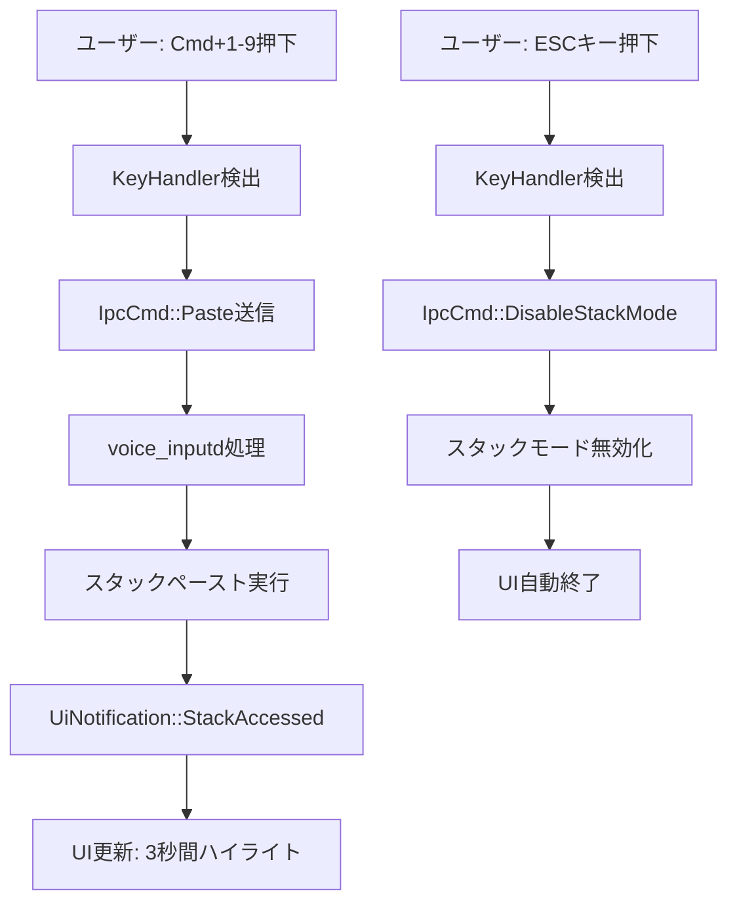

# Phase 3: 既存UI連携 詳細設計書

## Why（概要・目的）

### Phase 概要
既存のスタックオーバーレイUI（StackManagerUI）とショートカットキー機能を統合し、視覚的フィードバックによる直感的な操作体験を実現します。Phase 2で構築した基盤の上に、シンプルで一貫性のあるUI連携機能を追加します。

### 目的
- **視覚的フィードバック**: ショートカットキー操作の結果を即座にUI表示
- **操作の可視化**: 利用可能なショートカットキーの常時表示
- **一貫性のある操作**: すべてCmd+キーで統一されたインターフェース
- **学習曲線の緩和**: 視覚的ガイドによる操作方法の明確化

## What（アーキテクチャ図・フロー図・成果物）

### アーキテクチャ図

```
[Phase 3 完了後のアーキテクチャ]

[KeyHandler] → [IpcCmd] → [voice_inputd] → [Stack操作]
                              ↓
                          [UI通知]
                              ↓
[UI Process] ← [Unix Socket] ← [UiNotification::StackAccessed]
     ↓
[StackManagerUI]
     ↓
[視覚的フィードバック]
- アクティブスタック強調表示（3秒間）
- ショートカットキーガイド常時表示
- ESCキーでの終了案内
```

### ディレクトリ構成

```
src/
├── infrastructure/
│   └── ui/
│       └── stack_manager_ui.rs    # 拡張: タイマー管理とフィードバック表示
└── shortcut/
    └── key_handler.rs            # 拡張: ESCキー処理追加
```

### フロー図



### 成果物（機能）

#### 1. ESCキー処理機能
```rust
// key_handler.rs
impl KeyHandler {
    fn handle_key_event(&mut self, event: Event) {
        match event.name {
            Some(Key::Escape) => {
                // ESCキーでスタックモード終了
                self.send_command(IpcCmd::DisableStackMode);
            }
            // ... 既存のCmd+キー処理
        }
    }
}
```

#### 2. 視覚的フィードバック機能
```rust
// stack_manager_ui.rs
pub struct StackManagerApp {
    // ... 既存のフィールド
    last_accessed_stack: Option<u32>,
    highlight_until: Option<std::time::Instant>, // ハイライト解除タイマー
}

impl StackManagerApp {
    const HIGHLIGHT_DURATION_SECS: u64 = 3; // ハイライト表示時間

    /// スタックアイテムの描画（キー操作は1-9のみ表示）
    fn draw_stack_item(&self, ui: &mut egui::Ui, stack: &StackDisplayInfo, index: usize) {
        let is_active = self.is_stack_highlighted(stack.number);
        
        // キーボードヒントは最初の9個のみ
        let keyboard_hint = if index < 9 {
            Some(format!("Cmd+{}", index + 1))
        } else {
            None // 10番目以降はキーボード操作不可
        };
        
        // アクティブスタックの強調表示
        if is_active {
            ui.visuals_mut().override_text_color = Some(Color32::from_rgb(100, 200, 100));
        }
        
        // キーボードヒントとスタック情報の表示
        ui.horizontal(|ui| {
            if let Some(hint) = keyboard_hint {
                ui.label(hint);
            } else {
                ui.label(format!("   {}", stack.number)); // Cmd+キーなしスタック
            }
            ui.label(&stack.preview);
        });
    }

    /// ハイライト状態の確認（タイマー管理）
    fn is_stack_highlighted(&self, stack_number: u32) -> bool {
        if self.last_accessed_stack == Some(stack_number) {
            if let Some(until) = self.highlight_until {
                return std::time::Instant::now() < until;
            }
        }
        false
    }

    /// スタックアクセス時の処理
    pub fn on_stack_accessed(&mut self, stack_number: u32) {
        self.last_accessed_stack = Some(stack_number);
        self.highlight_until = Some(
            std::time::Instant::now() + std::time::Duration::from_secs(Self::HIGHLIGHT_DURATION_SECS)
        );
    }
}
```

#### 3. ショートカットキーガイド表示
```rust
// stack_manager_ui.rs
impl StackManagerApp {
    fn draw_keyboard_guide(&self, ui: &mut egui::Ui) {
        ui.separator();
        ui.label("キーボードショートカット:");
        ui.label("• Cmd+R: 録音開始/停止");
        ui.label("• Cmd+1-9: スタックペースト（最初の9個）");
        ui.label("• Cmd+C: 全スタッククリア");
        ui.label("• ESC: スタックモード終了");
        
        // 10個以上のスタックがある場合の注意表示
        if self.total_stacks > 9 {
            ui.colored_label(
                Color32::from_rgb(255, 200, 100),
                format!("※ スタック10以降はCmd+キーで操作できません（全{}個）", self.total_stacks)
            );
        }
    }
}
```


### 成果物（非機能）

#### パフォーマンス
- **UI更新レスポンス**: <16ms（60fps維持）
- **ハイライト処理**: タイマー処理による最小限のCPU使用
- **メモリ使用量増加**: 最小限（タイマー管理のみ）

#### 安定性
- **UI通知の確実な処理**: UiNotification経由での状態同期
- **ESCキーの確実な検出**: unstable_grabによる確実なキー捕捉

#### ユーザビリティ
- **視覚的フィードバック**: ペースト実行の3秒間ハイライト
- **一貫した操作体系**: すべてのショートカットキーを常時表示
- **日本語完全対応**: 全UIテキストの日本語化

## How（実装詳細）

### 内容

#### 目的
既存UIにショートカットキー操作の視覚的フィードバックを追加し、ユーザーが操作結果と利用可能なコマンドを直感的に理解できるようにする。

#### 成果物（モジュール/ファイル）
- `src/infrastructure/ui/stack_manager_ui.rs` - タイマー管理とフィードバック表示の実装
- `src/shortcut/key_handler.rs` - ESCキー処理の追加

#### 完了条件
- [ ] ESCキーによるスタックモード終了動作
- [ ] アクティブスタックの3秒間ハイライト表示
- [ ] キーボードショートカットガイドの常時表示（10個以上時の注意表示含む）
- [ ] Cmd+1-9操作時のUI即時反映

#### 手動でのチェック項目
- [ ] Cmd+1でスタック1がペーストされ、UIで3秒間ハイライト
- [ ] ESCキーでUIが閉じ、スタックモードが無効化
- [ ] 10個以上のスタック時、スタック10はCmd+キーで操作不可の表示
- [ ] 複数回の連続キー操作での安定動作
- [ ] ハイライトが3秒後に自動解除

#### 除外項目（やらないこと）
- UI内でのキーボード操作機能
- フォーカス管理機能
- キー重複防止機能
- 新規UIコンポーネントの開発
- 高度なアニメーション効果

### タスク分割

#### 1. ESCキー処理実装（TDD）
- [x] key_handler.rsにESCキー検出テスト作成
- [x] ESCキーでDisableStackMode送信の実装
- [x] 既存のCmd+キー処理との統合

#### 2. タイマー管理とハイライト実装
- [ ] `highlight_until`フィールドとタイマーロジック追加
- [ ] `is_stack_highlighted`メソッドの実装
- [ ] `on_stack_accessed`メソッドの実装
- [ ] 3秒後の自動ハイライト解除確認

#### 3. 視覚的フィードバック実装
- [ ] `draw_stack_item`メソッドの拡張
- [ ] Cmd+1-9のキーボードヒント表示
- [ ] 10以上のスタックは番号のみ表示
- [ ] アクティブスタックの色変更実装

#### 4. ショートカットガイド表示
- [ ] `draw_keyboard_guide`メソッドの実装
- [ ] UIレイアウトへの組み込み
- [ ] 10個以上のスタック時の警告表示実装
- [ ] ESCキーガイドの追加

#### 5. 統合テスト
- [ ] ESCキーでのスタックモード終了テスト
- [ ] ハイライトタイマー動作テスト
- [ ] 10個以上のスタック時の表示テスト

#### 6. 手動テスト・調整
- [ ] 実機での動作確認
- [ ] パフォーマンス測定（タイマー処理の影響）
- [ ] ユーザビリティ確認

### 手動でのチェック項目

#### 基本動作確認
- [ ] `voice_input stack-mode on`でUIが表示される
- [ ] UIにキーボードショートカットガイドが表示される
- [ ] スタックリストにCmd+1-9の表示がある

#### ESCキー操作確認
- [ ] ESCキーでUIが閉じる
- [ ] ESCキーでスタックモードが無効化される
- [ ] ESCキー押下時の即座の反応

#### 視覚的フィードバック確認
- [ ] Cmd+1でペースト後、該当スタックがハイライトされる
- [ ] ハイライトが3秒後に自動的に解除される
- [ ] 複数回の操作でハイライトが正しく更新される

#### 10個以上のスタック確認
- [ ] 10個以上のスタック時に警告メッセージ表示
- [ ] スタック10以降はCmd+番号が表示されない
- [ ] スタック1-9は正常にCmd+番号で操作可能

#### エラー処理確認
- [ ] 存在しないスタック番号のCmd+キー押下時の適切な処理
- [ ] UI表示エラー時も基本機能が継続

#### パフォーマンス確認
- [ ] UI更新のスムーズさ（60fps維持）
- [ ] タイマー処理によるCPU負荷が最小限
- [ ] 連続Cmd+キー入力での安定性